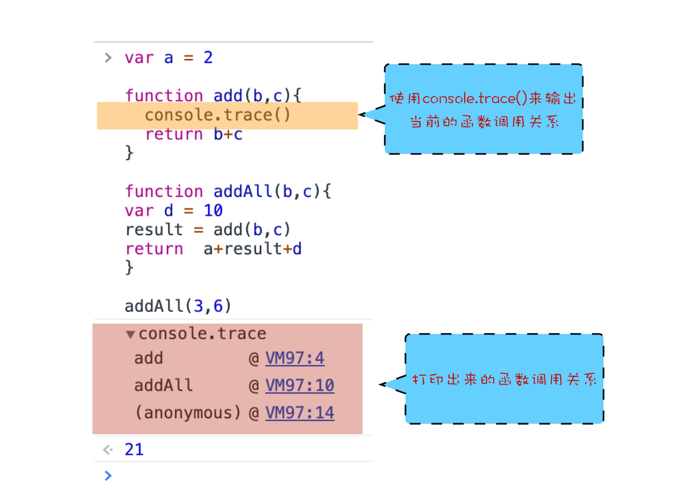

# 查看调用栈

从图中可以看出，右边的“call stack”下面显示出来了函数的调用关系：栈的最底部是 anonymous，也就是全局的函数入口；中间是 addAll 函数；顶部是 add 函数。这就清晰地反映了函数的调用关系，所以在分析复杂结构代码，或者检查 Bug 时，调用栈都是非常有用的。

 
除了通过断点来查看调用栈，你还可以使用 console.trace() 来输出当前的函数调用关系，比如在示例代码中的 add 函数里面加上了 console.trace()，你就可以看到控制台输出的结果。
