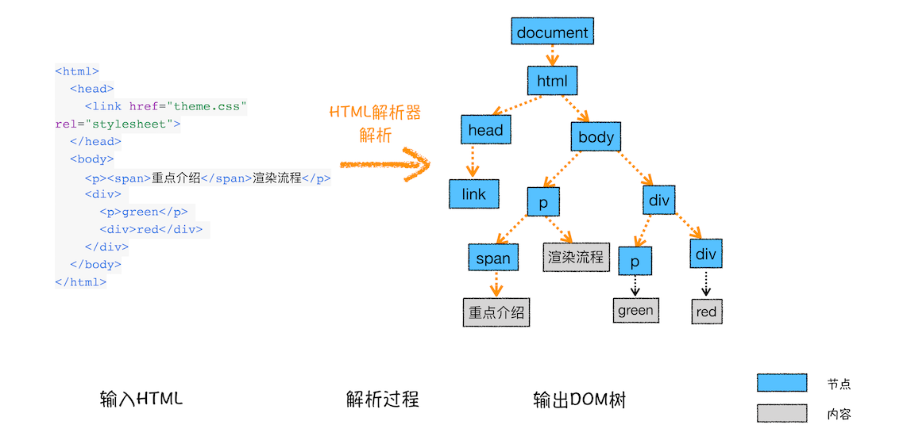
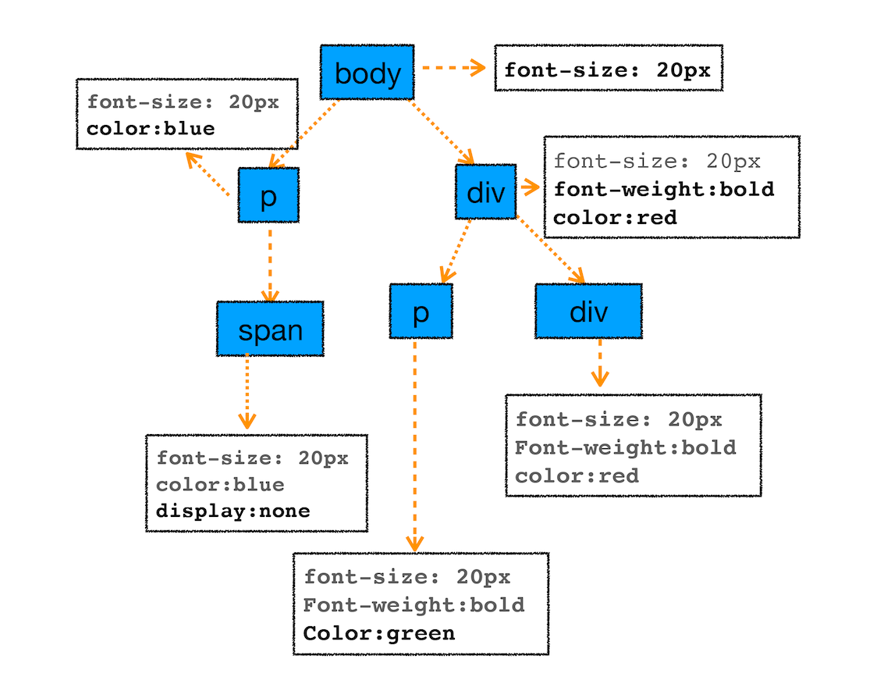
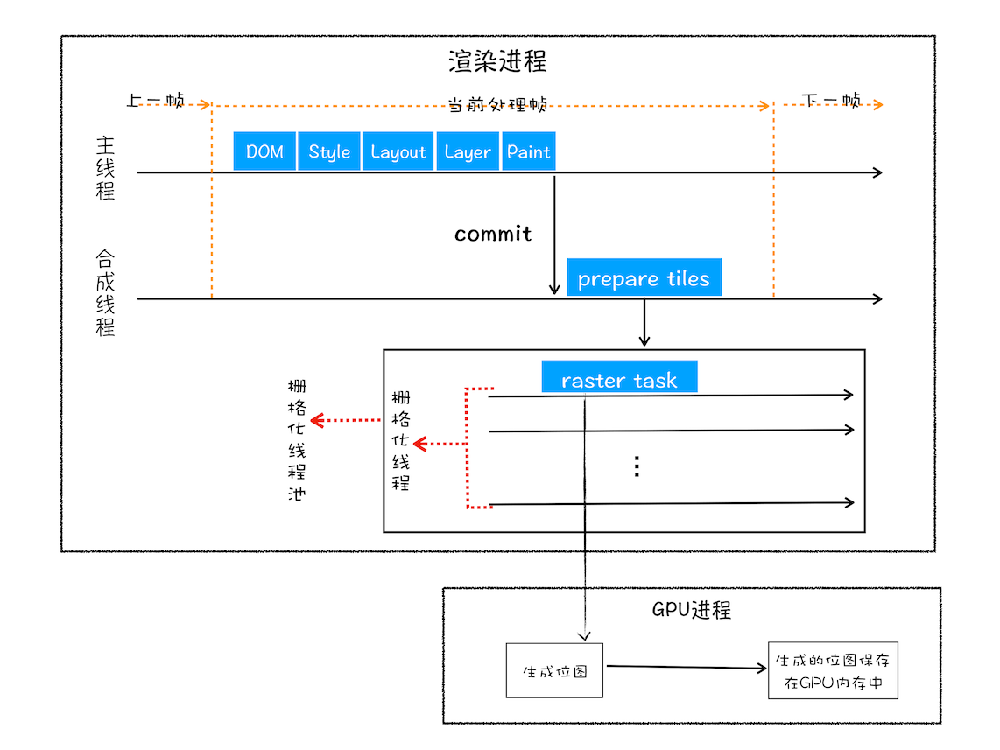

# 浏览器渲染流程
## 完整的渲染流程


- 渲染进程将 HTML 内容转换为能够读懂的 DOM 树结构。
- 渲染引擎将 CSS 样式表转化为浏览器可以理解的 styleSheets，计算出 DOM 节点的样式。
- 创建布局树，并计算元素的布局信息。
- 对布局树进行分层，并生成分层树。
- 为每个图层生成绘制列表，并将其提交到合成线程。
- 合成线程将图层分成图块，并在光栅化线程池中将图块转换成位图。
- 合成线程发送绘制图块命令 DrawQuad 给浏览器进程。
- 浏览器进程根据 DrawQuad 消息生成页面，并显示到显示器上。

<br>

## 三个和渲染流水线相关的概念
- 重排：如果你通过 JavaScript 或者 CSS 修改元素的几何位置属性，例如改变元素的宽度、高度等，那么浏览器会触发重新布局，解析之后的一系列子阶段，这个过程就叫重排。无疑，重排需要更新完整的渲染流水线，所以开销也是最大的。
- 重绘：如果修改了元素的背景颜色，那么布局阶段将不会被执行，因为并没有引起几何位置的变换，所以就直接进入了绘制阶段，然后执行之后的一系列子阶段，这个过程就叫重绘。相较于重排操作，重绘省去了布局和分层阶段，所以执行效率会比重排操作要高一些。
- 合成：那如果你更改一个既不要布局也不要绘制的属性，会发生什么变化呢？渲染引擎将跳过布局和绘制，只执行后续的合成操作，我们把这个过程叫做合成。使用了 CSS 的 transform 来实现动画效果，这可以避开重排和重绘阶段，直接在非主线程上执行合成动画操作。这样的效率是最高的，因为是在非主线程上合成，并没有占用主线程的资源，另外也避开了布局和绘制两个子阶段，所以相对于重绘和重排，合成能大大提升绘制效率,如下图所示。


### 所以现实中要尽量减少重排，方法列举：
- 使用 class 操作样式，而不是频繁操作 style
- 避免使用 table 布局
- 批量 dom 操作，例如 createDocumentFragment，或者使用框架，例如 React、Vue（使用虚拟dom）
- Debounce window resize 事件
- 对 dom 属性的读写要分离 
- 对于使用transform的元素，要事先定义好will-change:transform; 才能避免重排和重绘。

<br>

## 构建DOM树
- 为什么要构建 DOM 树呢？这是因为浏览器无法直接理解和使用 HTML，所以需要将 HTML 转换为浏览器能够理解的结构——DOM 树。
- 构建 DOM 树的输入内容是一个非常简单的 HTML 文件，然后经由 HTML 解析器解析，最终输出树状结构的 DOM，如下图所示。

在Chome浏览器的控制台（Conosole）里面输入“document”后回车，这样你就能看到一个完整的 DOM 树结构。
DOM 和 HTML 内容几乎是一样的，但是和 HTML 不同的是，DOM 是保存在内存中树状结构，可以通过 JavaScript 来查询或修改其内容。比如：
```
document.getElementsByTagName("p")[0].innerText = "black"
```

在渲染引擎中，DOM 有三个层面的作用：
- 从页面的视角来看，DOM 是生成页面的基础数据结构。
- 从 JavaScript 脚本视角来看，DOM 提供给 JavaScript 脚本操作的接口，通过这套接口，JavaScript 可以对 DOM 结构进行访问，从而改变文档的结构、样式和内容。
- 从安全视角来看，DOM 是一道安全防护线，一些不安全的内容在 DOM 解析阶段就被拒之门外了。

在渲染引擎内部，有一个叫 HTML 解析器（HTMLParser）的模块，它的职责就是负责将 HTML 字节流转换为 DOM 结构。

HTML 解析器并不是等整个文档加载完成之后再解析的，而是网络进程加载了多少数据，HTML 解析器便解析多少数据。

## 样式计算（Recalculate Style）
样式计算的目的是为了计算出 DOM 节点中每个元素的具体样式，这个阶段大体可分为三步来完成。
1. 把 CSS 转换为浏览器能够理解的结构
- CSS 样式来源主要有三种：
  - 通过 link 引用的外部 CSS 文件
  - ```<style>```标记内的 CSS
  - 元素的 style 属性内嵌的 CSS
<br>
- 和 HTML 文件一样，浏览器也是无法直接理解这些纯文本的 CSS 样式，所以当渲染引擎接收到 CSS 文本时，会执行一个转换操作，将 CSS 文本转换为浏览器可以理解的结构——styleSheets。
- 你可以在 Chrome 控制台中查看styleSheets结构，只需要在控制台中输入 document.styleSheets
- CSS全部转化为 styleSheets 结构中的数据，并且该结构同时具备了查询和修改功能，这会为后面的样式操作提供基础。
  
2. 转换样式表中的属性值，使其标准化
已经把现有的 CSS 文本转化为浏览器可以理解的结构了，那么接下来就要对其进行属性值的标准化操作。
那么什么是标准化？
```
body { font-size: 2em }
p {color:blue;}
span  {display: none}
div {font-weight: bold}
div  p {color:green;}
div {color:red; }
```
可以看到上面的 CSS 文本中有很多属性值，如 2em、blue、bold，这些类型数值不容易被渲染引擎理解，所以需要将所有值转换为渲染引擎容易理解的、标准化的计算值，这个过程就是属性值标准化。如下图所示：


3. 计算出 DOM 树中每个节点的具体样式
<br>
首先是 CSS 继承。CSS 继承就是每个 DOM 节点都包含有父节点的样式。看下面这样一张样式表是如何应用到 DOM 节点上的:
```
body { font-size: 20px }
p {color:blue;}
span  {display: none}
div {font-weight: bold;color:red}
div  p {color:green;}
```

- 从图中可以看出，所有子节点都继承了父节点样式。比如 body 节点的 font-size 属性是 20，那 body 节点下面的所有节点的 font-size 都等于 20。
- 为了加深你对 CSS 继承的理解，你可以打开 Chrome 的“开发者工具”，选择第一个“element”标签，再选择“style”子标签。这里可以看到各个元素的样式以及样式的来源。这里需要特别提下 UserAgent 样式，它是浏览器提供的一组默认样式，如果你不提供任何样式，默认使用的就是 UserAgent 样式。

<br>
样式计算过程中的第二个规则是样式层叠。层叠是 CSS 的一个基本特征，它是一个定义了如何合并来自多个源的属性值的算法。它在 CSS 处于核心地位，CSS 的全称“层叠样式表”正是强调了这一点。
<br>

总之，样式计算阶段的目的是为了计算出 DOM 节点中每个元素的具体样式，在计算过程中需要遵守 CSS 的继承和层叠两个规则。这个阶段最终输出的内容是每个 DOM 节点的样式，并被保存在 ComputedStyle 的结构内。如果你想了解每个 DOM 元素最终的计算样式，可以打开 Chrome 的“开发者工具”，选择第一个“element”标签，然后再选择“Computed”子标签。

<br>

## 布局阶段
Chrome 在布局阶段需要完成两个任务：创建布局树和布局计算

### 创建布局树

DOM 树还含有很多不可见的元素，比如 head 标签，还有使用了 display:none 属性的元素。所以在显示之前，我们还要额外地构建一棵只包含可见元素布局树。
<br>
为了构建布局树，浏览器大体上完成了下面这些工作：
- 遍历 DOM 树中的所有可见节点，并把这些节点加到布局树中；
- 而不可见的节点会被布局树忽略掉，如 head 标签下面的全部内容，再比如 body.p.span 这个元素，因为它的属性包含 dispaly:none，所以这个元素也没有被包进布局树。

### 布局计算
有了一棵完整的布局树。那么接下来，就要计算布局树节点的坐标位置了。布局的计算过程非常复杂，这里先跳过。
在执行布局操作的时候，会把布局运算的结果重新写回布局树中，所以布局树既是输入内容也是输出内容，这是布局阶段一个不合理的地方，因为在布局阶段并没有清晰地将输入内容和输出内容区分开来。针对这个问题，Chrome 团队正在重构布局代码，下一代布局系统叫 LayoutNG，试图更清晰地分离输入和输出，从而让新设计的布局算法更加简单。


## 分层
- 因为页面中有很多复杂的效果，如一些复杂的 3D 变换、页面滚动，或者使用 z-indexing 做 z 轴排序等，为了更加方便地实现这些效果，渲染引擎还需要为特定的节点生成专用的图层，并生成一棵对应的图层树（LayerTree）。
- 你可以打开 Chrome 的“开发者工具”，选择“Layers”（3D视图）标签，就可以可视化页面的分层情况。
- 现在你知道了浏览器的页面实际上被分成了很多图层，这些图层叠加后合成了最终的页面。

如图所示，并不一定是布局树的每个节点都包含一个图层，如果一个节点没有对应的层，那么这个节点就从属于父节点的图层。如上图中的 span 标签没有专属图层，那么它们就从属于它们的父节点图层。但不管怎样，最终每一个节点都会直接或者间接地从属于一个层。

### 那么需要满足什么条件，渲染引擎才会为特定的节点创建新的图层呢？
通常满足下面两点中任意一点的元素就可以被提升为单独的一个图层：
- 第一点，拥有层叠上下文属性的元素会被提升为单独的一层。明确定位属性的元素、定义透明属性的元素、使用 CSS 滤镜的元素等，都拥有层叠上下文属性。细节可参考：<a href="https://developer.mozilla.org/zh-CN/docs/web/css/css_positioning/understanding_z_index/the_stacking_context">这里</a>
- 第二点，需要剪裁（clip）的地方也会被创建为图层
```
<style>
      div {
            width: 200;
            height: 200;
            overflow:auto;
            background: gray;
        } 
</style>
<body>
    <div >
        <p>所以元素有了层叠上下文的属性或者需要被剪裁，那么就会被提升成为单独一层，你可以参看下图：</p>
        <p>从上图我们可以看到，document层上有A和B层，而B层之上又有两个图层。这些图层组织在一起也是一颗树状结构。</p>
        <p>图层树是基于布局树来创建的，为了找出哪些元素需要在哪些层中，渲染引擎会遍历布局树来创建层树（Update LayerTree）。</p> 
    </div>
</body>
```
在这里我们把 div 的大小限定为 200 * 200 像素，而 div 里面的文字内容比较多，文字所显示的区域肯定会超出 200 * 200 的面积，这时候就产生了剪裁，渲染引擎会把裁剪文字内容的一部分用于显示在 div 区域。
出现这种裁剪情况的时候，渲染引擎会为文字部分单独创建一个层，如果出现滚动条，滚动条也会被提升为单独的层。

## 图层绘制
- 渲染引擎实现图层的绘制，会把一个图层的绘制拆分成很多小的绘制指令，然后再把这些指令按照顺序组成一个待绘制列表。
- 绘制列表中的指令其实非常简单，就是让其执行一个简单的绘制操作，比如绘制粉色矩形或者黑色的线等。而绘制一个元素通常需要好几条绘制指令，因为每个元素的背景、前景、边框都需要单独的指令去绘制。所以在图层绘制阶段，输出的内容就是这些待绘制列表。
- canvas绘制流程很简单，就是调用api直接在画布上绘制，没有DOM，也没有太多套路！所有的绘制都是自己程序控制的

## 栅格化（raster）操作
- 绘制列表只是用来记录绘制顺序和绘制指令的列表，而实际上绘制操作是由渲染引擎中的合成线程来完成的。
- 当图层的绘制列表准备好之后，主线程会把该绘制列表提交（commit）给合成线程。
- 但是通过视口，用户只能看到页面的很小一部分，所以在这种情况下，要绘制出所有图层内容的话，就会产生太大的开销，而且也没有必要。基于这个原因：
  - 合成线程会将图层划分为图块（tile），这些图块的大小通常是 256x256 或者 512x512。
  - 合成线程会按照视口附近的图块来优先生成位图，实际生成位图的操作是由栅格化来执行的。所谓栅格化，是指将图块转换为位图。而图块是栅格化执行的最小单位。渲染进程维护了一个栅格化的线程池，所有的图块栅格化都是在线程池内执行的。
  - 栅格化过程都会使用 GPU 来加速生成，使用 GPU 生成位图的过程叫快速栅格化，或者 GPU 栅格化，生成的位图被保存在 GPU 内存中


## 合成和显示
- 一旦所有图块都被光栅化，合成线程就会生成一个绘制图块的命令——“DrawQuad”，然后将该命令提交给浏览器进程。
- 浏览器进程里面有一个叫 viz 的组件，用来接收合成线程发过来的 DrawQuad 命令，然后根据 DrawQuad 命令，将其页面内容绘制到内存中，最后再将内存显示在屏幕上。

## 补充：DOM 的具体生成流程了
代码从网络传输过来是字节流的形式，后续字节流再转化为dom树。

字节流转换为 DOM 需要三个阶段：

### 第一个阶段，通过分词器将字节流转换为 Token

我们知道 V8 编译 JavaScript 过程中的第一步是做词法分析，将 JavaScript 先分解为一个个 Token。
解析 HTML 也是一样的，需要通过分词器先将字节流转换为一个个 Token，分为 Tag Token 和文本 Token。
Tag Token 又分 StartTag 和 EndTag，比如<body>就是 StartTag ，</body>就是EndTag。

### 第二个和第三个阶段是同步进行的，需要将 Token 解析为 DOM 节点，并将 DOM 节点添加到 DOM 树中。
HTML 解析器维护了一个 Token 栈结构，该 Token 栈主要用来计算节点之间的父子关系，在第一个阶段中生成的 Token 会被按照顺序压到这个栈中：

- 如果压入到栈中的是 StartTag Token，HTML 解析器会为该 Token 创建一个 DOM 节点，然后将该节点加入到 DOM 树中，它的父节点就是栈中相邻的那个元素生成的节点。
- 如果分词器解析出来是文本 Token，那么会生成一个文本节点，然后将该节点加入到 DOM 树中，文本 Token 是不需要压入到栈中，它的父节点就是当前栈顶 Token 所对应的 DOM 节点。
- 如果分词器解析出来的是 EndTag 标签，比如是 EndTag div，HTML 解析器会查看 Token 栈顶的元素是否是 StarTag div，如果是，就将 StartTag  div 从栈中弹出，表示该 div 元素解析完成。