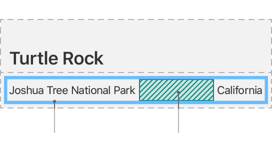

# SwiftUI常用布局
SwiftUI 提供了多种布局方式，使得开发者可以轻松地创建响应式和自适应的用户界面。以下是一些常用的 SwiftUI 布局组件：

1. **Stacks（堆栈）**:
   - `HStack`: 水平堆栈，将视图从左到右排列。
   - `VStack`: 垂直堆栈，将视图从上到下排列。
   - `ZStack`: 重叠堆栈，将视图叠加在一起。



引用swiftUI官方教程里的话：
```
You can combine and embed multiple views in stacks, which group views together horizontally, vertically, or back-to-front.
```

2. **Spacer（间隔器）**:
   - 用于在堆栈中添加空白空间，可以帮助对齐视图或分配剩余的空间。

3. **Grid（网格）**:
   - `LazyVGrid` 和 `LazyHGrid` 允许你创建一个灵活的网格布局，其中的项目只会在需要时被创建。

4. **Alignment Guides（对齐指南）**:
   - 通过设置对齐指南，你可以控制视图在父容器中的对齐方式。

5. **Geometry Reader（几何读取器）**:
   - `GeometryReader` 可以让你访问可用空间的尺寸，并根据这些尺寸来调整你的布局。

6. **Frame Modifier（框架修饰符）**:
   - 使用 `.frame()` 修饰符来指定视图的具体大小，或者让视图填充其父容器的可用空间。

7. **Padding and Edge Insets（内边距与边缘间距）**:
   - 使用 `.padding()` 来增加视图周围的空白区域，或是使用 `.inset(by:)` 来减少视图的大小。

8. **Overlay and Background（覆盖层与背景）**:
   - `.overlay()` 可以用来在视图之上添加额外的内容，而 `.background()` 则用来设置视图的背景。

9. **Group（组）**:
   - `Group` 可以帮助组织多个视图，并且可以作为一个整体应用某些属性或行为。

10. **ScrollView（滚动视图）**:
    - 当内容超出屏幕时，使用 `ScrollView` 或者更具体的 `List`、`LazyVStack`/`LazyHStack` 来创建可滚动的视图。

这些布局工具提供了构建复杂用户界面所需的基础。通过组合使用它们，你可以创建出既美观又功能丰富的应用程序界面。随着 SwiftUI 的不断发展，苹果公司也在持续引入新的布局特性，因此保持更新并探索最新的文档总是很重要的。