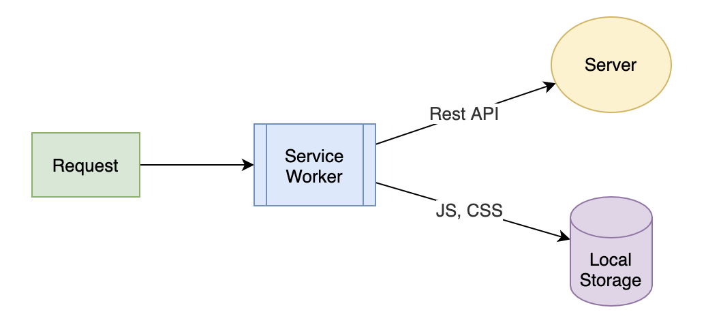
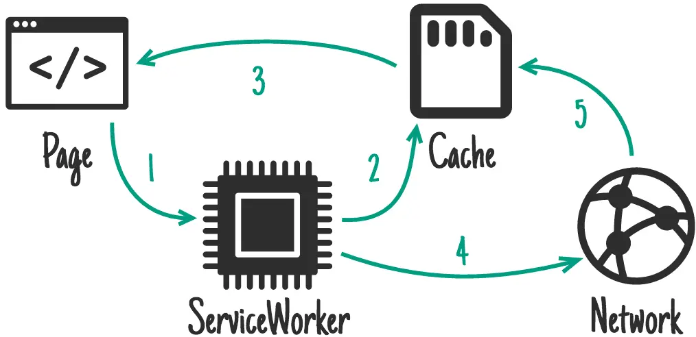

# ServiceWorker
Service Worker 其实是很容易被大家忽视的一种缓存机制，因为它通常是和 PWA （Progressive Web Application）联系在一起的，用于开发离线的 Web 应用。



Service Worker 还提供了拦截前端请求的能力，使得它能够结合 Local Storage，成为一个独立的缓存方案。所以它不仅可以用于实现前端静态资源的缓存，还能用来开发离线的 Web 应用。

我们可以把 Service Worker 看作一种前端的资源请求代理。每一个前端页面发出的请求都会先由这个代理进行处理，然后你再决定请求是直接发送到服务器端，还是从本地的 Local Storage 读取内容返回。

Service Worker 是一段独立于页面之外的 JavaScript 脚本，它并不在 Web 页面中运行，但是会在 Web 页面加载时，由一段代码去触发注册、下载和激活。一旦安装完成之后，Service Worker 就会拦截所有当前域名下的所有请求，由代码逻辑决定应该如何处理.

## Workbox
其实围绕Workbox的还有一些列工具，如 workbox-cli、gulp-workbox、webpack-workbox-plugin 等等，不过他们都不是今天的重点，今天想聊的就是 Workbox 本身。

可以把 Workbox 理解为 Google 官方的 PWA 框架，它解决的就是用底层 API 写 PWA 太过复杂的问题。这里说的底层 API，指的就是去监听 SW 的 install、active、 fetch 事件做相应逻辑处理等。Workbox使用起来是这样的：
```
/ 首先引入 Workbox 框架
// importScripts('https://g.alicdn.com/kg/workbox/3.3.0/workbox-sw.js'); 
importScripts('https://storage.googleapis.com/workbox-cdn/releases/3.3.0/workbox-sw.js');
workbox.precaching([
  // 注册成功后要立即缓存的资源列表
]);

// html的缓存策略
workbox.routing.registerRoute(
  new RegExp(''.*\.html'),
  workbox.strategies.networkFirst()
);

workbox.routing.registerRoute(
  new RegExp('.*\.(?:js|css)'),
  workbox.strategies.cacheFirst()
);

workbox.routing.registerRoute(
  new RegExp('https://your\.cdn\.com/'),
  workbox.strategies.staleWhileRevalidate()
);

workbox.routing.registerRoute(
  new RegExp('https://your\.img\.cdn\.com/'),
  workbox.strategies.cacheFirst({
    cacheName: 'example:img'
  })
);
```
上面的代码，通过 workbox.precaching 中的是 install 以后要塞进 caches 中的内容，workbox.routing.registerRoute 中第一个参数是一个正则，匹配经过 fetch 事件的所有请求，如果匹配上了，就走相应的缓存策略 workbox.strategies 对象为我们提供了几种最常用的策略，如下：

Stale-While-Revalidate


Stale While Revalidate 加载策略。这个策略会稍微复杂一点。在第一次请求时，没有 Cache，会先从服务端请求返回值，并将资源存放在 Cache 中。在第二次有 Cache 时，会先读取 Cache 并进行返回，在读取 Cache 的同时，会发起一个异步请求去更新 Cache。

Cache First


Network First


Network Only
 

Cache Only


## 经验之谈
在经过一段时间的使用和思考以后，给出我认为最为合理，最为保守的缓存策略。

HTML，如果你想让页面离线可以访问，使用 NetworkFirst，如果不需要离线访问，使用 NetworkOnly，其他策略均不建议对 HTML 使用。

CSS 和 JS，情况比较复杂，因为一般站点的 CSS，JS 都在 CDN 上，SW 并没有办法判断从 CDN 上请求下来的资源是否正确（HTTP 200），如果缓存了失败的结果，问题就大了。这种我建议使用 Stale-While-Revalidate 策略，既保证了页面速度，即便失败，用户刷新一下就更新了。

如果你的 CSS，JS 与站点在同一个域下，并且文件名中带了 Hash 版本号，那可以直接使用 Cache First 策略。

图片建议使用 Cache First，并设置一定的失效时间，请求一次就不会再变动了。

上面这些只是普适性的策略，见仁见智。

还有，要牢记，对于不在同一域下的任何资源，绝对不能使用 Cache only 和 Cache first。

## reference
https://zhuanlan.zhihu.com/p/41652314