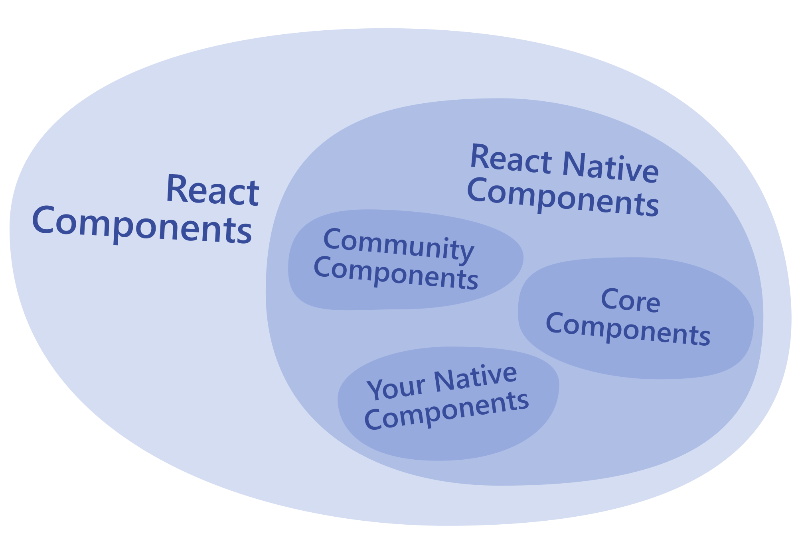

# concept

## Native Components
- In Android development, you write views in Kotlin or Java; in iOS development, you use Swift or Objective-C. With React Native, you can invoke these views with JavaScript using React components.
- At runtime, React Native creates the corresponding Android and iOS views for those components.
- Because React Native components are backed by the same views as Android and iOS, React Native apps look, feel, and perform like any other apps. 

We call these platform-backed components Native Components.

Native components能保持多端的一致性。

## Core Components
React Native comes with a set of essential, ready-to-use Native Components you can use to start building your app today. These are React Native's Core Components.

Core Components categories:
- Basic Components
- User Interface 
- List Views
- Android-specific
- iOS-specific
- Others
  
https://reactnative.dev/docs/components-and-apis

## Composite Components
JavaScript 创建，不用写 Native 代码，这类组件也叫复合组件（Composite Components）。
这些复合组件是基于Native组件或其他复合组件搭建而成的。

## ecosystem
Reactive native has a thriving ecosystem of these community-contributed components:
https://reactnative.directory/

## reference
- https://reactnative.dev/docs/intro-react-native-components