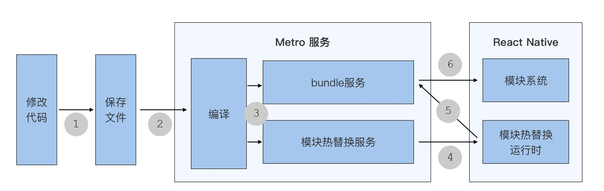

# Fast Refresh
React Native 快速刷新（Fast Refresh）是默认开启的，你不用做任何额外的配置，就能立刻体验到。

快速刷新提效的本质是及时反馈。也就是说，你写下代码后就能看到 UI，没有其他任何多余步骤。代码完成了，UI 就更新了，这就是及时反馈。

快速刷新带来的“所码即所见”能力的原理究竟是什么样的？

React Native 的快速刷新功能的最早期版本，叫做热重载 Hot Reload，是基于 Webpack 的模块热替换（Hot Module Replacement）的原理开发的。我们写 React Native 之前，都会运行一个 react-native start 命令，启动一个 Metro 服务，而 Metro 服务就实现了模块热替换的功能。

Metro 服务会监听代码文件的变化，当你修改完代码（①），保存文件时（②），Metro 服务就会收到通知。在你保存好后，Metro 就会编译涉及到的更新文件（③），编译完成后再生成一个用于更新的 bundle。

而 Metro 的模块热替换服务和 React Native 应用中的模块热替换客户端（HMR Client），在启动时其实已经建立好了 socket 连接。当新 bundle 生成时，模块热替换服务会通过 socket 通知块热替换客户端，热替换客户端实际就是运行在 React Native 应用中的一段 JavaScript 代码，它一开始就执行了一个 socket 监听事件（④）。

React Native 收到通知后，就会向请求 bundle 服务发起请求。然后，bundle 服务会返回一个用于更新的 bundle（⑤），并使用 JavaScript 引擎，在原来 React Native 应用的 JavaScript 上下文中执行用于更新的 bundle。

这个 bundle 是由多个模块组成的，你修改代码文件对应的模块及其依赖模块都是新模块，新模块会把原先的旧模块替换掉。⑥

整个过程大致如下：


但是这里会有一个问题，仅仅只是用新模块替换旧模块，会导致原生视图重新渲染，并且丢失原有状态。

这是因为，新模块的重新执行就意味着，每个新模块中的组件，无论是类组件或者函数组件，都会被重新创建。而 React 在判断是否要更新的时候，会判断更新前后的两个组件是否相等。这样一来，即便新旧组件的代码完全一样，React 也会认为你销毁了原有组件，又创建了一个新的组件。而组件所对应的原生视图，也会发生销毁和重建。

比如，当你保存 List 组件时，即便你没有对 List 组件中的代码做任何修改，模块热替换后，React 也会认为，你保存之前的是旧组件，保存之后的是新组件。而新组件不等于旧组件，那它就会帮你销毁旧的原生视图，并重新创建新的原生视图。这个时候，原有组件状态 state 和原生列表的滚动位置都会丢失：
```javascript
// 保存前：oldList.js
export default function List {}
// 保存后：newList.js
export default function List {}
// 渲染的都是 List 组件
render(){ <List /> }
// 但是，因为 newList ≠ oldList
require('newList').default !== require('oldList').default
// 所以，React 会销毁旧的 List 原生视图，创建新的 List 原生视图
```

## 进阶能力：复用组件及其状态
快速刷新功能复用组件和状态的原理分为两个步骤：
- 在编译时，修改组件的注册方式；
- 在运行时，用“代理”的方式管理新旧组件的切换。


在编译时， 快速刷新的 babel 插件 ReactFreshBabelPlugin 修改你的代码，将你的组件转换成可被代理的组件。快速刷新 babel 插件和其他 babel 插件一样，它的功能都是对代码进行转换。正如你使用 babel 可以把 JSX 转换为 JavaScript 一样，快速刷新 babel 插件也可以在你组件源代码中插入一些代码，实现组件的“代理”。

打一个比方，如果我们要对一个自定义的 Counter 函数组件实现代理。那我们要怎么做呢？首先，在 metro 打包时，快速刷新 babel 插件，找到文件中要导出的 Counter 组件；然后，通过它的函数名、文件名生成一个全局唯一的 ID，例如 ‘Counter.js#Counter’ ；最后，生成一行注册代码。这行代码的作用是，将 ID 作为一个不变的对象标识，用这个不变的对象去“代理”，因模块热替换而变化 Counter 组件，具体你可以看下这里：
```JSX
// 源代码
export function Counter() {
  const [count, setCount] = useState(0);
  const handlePress = () => setCount(count + 1)
  return <Text onPress={handlePress}>times:{count}</Text>
}

const __exports_default = Counter
export default __exports_default

// 由快速刷新 babel 生成
// 将组件注册到组件管理中心
register('Counter.js#Counter', Counter)
```
有了编译时插入的注册代码，在运行时，我们就可以用“代理”的方式，管理新旧组件的切换了。

无论是初次加载的 Count 组件，还是后续模块热替换不断新建的 Counter 组件，都会放在组件注册中心。而“代理”只会在 Count 组件初次加载时创建，创建之后就作为一个不变的对象放在“代理”注册中心。

在代码保存后，模块热替换会将新的组件代码运行，在新组件被创建的同时，新组件的注册函数就会被执行了。通过唯一的 ID，找到对应的不变“代理”，并将代理的 current 引用，切换到新组件上，完成新旧组件的切换。
```javascript
// ReactFreshRuntime.js
// “代理”注册中心
const allFamiliesByID = {}

// 组件注册中心
const allFamiliesByType = {}

function register(id, componentType) {
    let family = allFamiliesByID[id];

    if (family === undefined) {
      family = {current: componentType};
      // 将不变的“代理”放入“代理”注册中心
      allFamiliesByID[id] = family
    } else {
      // 用不变的“代理”，管理新旧组件的切换
      const prevType = family.current;
      family.current = componentType;
    }
    // 将所有组件都放入组件注册中心
    allFamiliesByType[componentType] = family;
}
```
因为代理组件是存在全局对象上的，所以当你保存代码引起模块系统更新时，代理组件的引用也不会发生改变。接着，页面开始更新，此时调用的是代理组件的 render 方法，然后代理组件调用的更新后的新模块组件的 render 方法。你每保存一次代码，模块系统都更新一次，代理组件实际 render 也会进行一次切换，但是只要你的代码没有变化，React 也不会重新创建原生视图。React Native 组件级别的快速刷新，就是通过代理组件实现的。

### 那究竟是如何实现复用组件及其状态的呢？
我们先来说状态复用。在我们前面的示例中，我们把 Counter 函数组件，放在了 Counter.js 的文件中，一个文件就是一个模块，如果里面只有一个函数组件的话，我们就可以把它叫做一个函数组件模块。模块代码是执行在该模块的上下文中的，上下文中有着各种变量，其中就包括状态。通过“代理”组件的方式，就可以实现在同一个组件模块的上下文中，执行不同的函数组件。无论是新函数组件，还是旧函数组件，用的都是相同的状态，这就是状态复用。

### 那么组件所代表的原始视图的复用又指的是什么呢？
我们同样打个比方，假设现在你改动的组件要开始渲染 render 了。我们前面提到过，render 时判断是否要重新创建原生视图，是通过浅对比算法 shallowCompare 实现的。如果新旧组件的类型相等就走 re-update 的逻辑不创建，如果新旧组件的类型相等就走 re-mount 的逻辑重新创建。现在，新旧组件的“代理”是就是同一个对象，状态也不会发生改变，浅对比算法判断肯定相等，所以原生视图不会重新创建，从而实现了原生视图的复用。


## 建议
尽可能地拥抱函数组件，放弃类组件。这样你在 UI 调试的时候，就能更多的享受函数组件带来的状态保留好处。特别是一些入口很深的组件，需要多次操作后才能调试，一旦导航、蒙层、滚动之类的组件状态丢失了，整个操作就要重新再来一遍，才能重新进行调试。拥抱函数组件，你的调试效率才会更高。

因为并不是所有情况都会复用状态和原生视图。

对于函数组件来说，hooks 的顺序非常重要，相同的状态下，不同的顺序会有不同的结果。如果你修改了 hooks 的顺序，快速刷新时就会重新初始化状态。在其他情况下，函数组件的快速刷新都会为你保留状态。

对于类组件来说，只要是类组件的代码发生更新，组件的内部状态都要重新初始化。关于这点，快速刷新功能的作者 Dan 在博客中解释到，“（保留类组件的状态）热重载是非常不可靠的，最大原因就是类组件的方法是可以被动态替换的。是的，在实例原型链上替换它们很简单，但是根据我的经验，有太多边缘情况了，它根本没有办法可靠地工作”。

快速刷新的逐步降级策略是，从更新颗粒度最小代码块开始的，然后是组件、模块，最后是大颗粒度的 React Native 应用。越小颗粒度的更新，为我们保留了越多原来的状态和环境，我们的开发调试效率也更高。