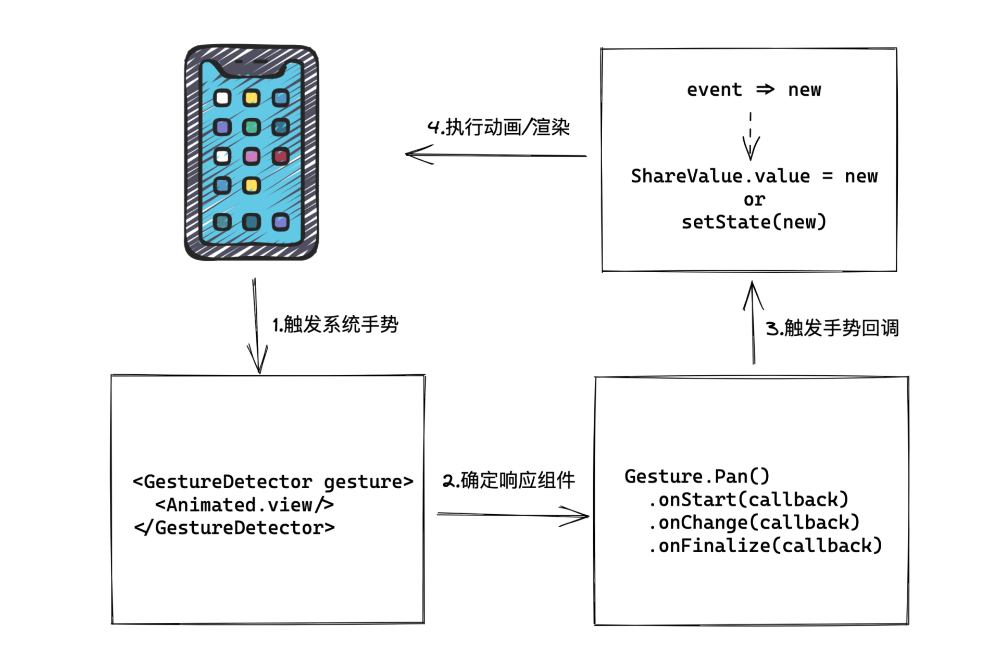
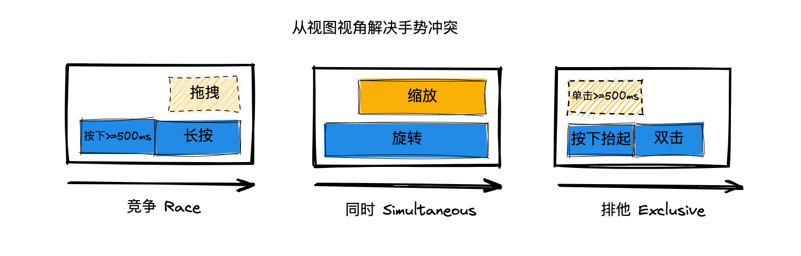

# Gesture
手势库 Gesture，虽然在声明的初始化过程是运行在 JavaScript 线程中的，但声明之后的手势回调函数的执行都是默认运行在 UI 线程的，并且它和 Reanimated 可以很好地结合起来，一起使用。因此手势动效的全过程都是可以运行在 UI 线程的，不受 JavaScript 线程性能瓶颈的约束。



使用 Gesture 手势库进行人机交互的基础流程一共分为 4 步：
- Gesture 手势库收到系统手势事件；
- Gesture 手势库确定需要响应哪些组件；
- Gesture 手势库触发相关手势回调函数；
- 通过 Gesture 回调函数返回 event 参数，使用回调返回值 event 可以更新共享值或状态，执行动画或渲染。

## 轻按手势
在 Gesture 手势库接收到系统的手势后，它需要判断页面中有没有哪个视图需要响应该手势，如果没有任何组视图需要响应该手势，那么什么都不会发生。

因此，你需要先告诉 Gesture 手势库，你有个视图需要响应手势。这一步是通过 GestureDetector 组件来实现的，代码如下：
```JSX
import { GestureDetector } from 'react-native-gesture-handler';

<GestureDetector gesture={singleTap}>
  <View />
</GestureDetector>
```
在这段代码中，GestureDetector 组件的作用是将单击手势 singleTap 绑定到 View 视图上。

GestureDetector 复合组件并不会真正渲染到屏幕上，它的作用是将配置好的手势绑定宿主组件视图上，这个宿主组件是 GestureDetector 组件内部第一个会真正渲染到屏幕上的视图。

创建 singleTap 手势的代码如下：
```JSX
import { Gesture } from 'react-native-gesture-handler';

const singleTap = Gesture.Tap()
  .onStart(() => console.log('开始触发轻按事件'))
```
Gesture 对象是 react-native-gesture-handler 手势库提供的手势对象，在 Gesture 对象下，有一个 Tap 方法，调用该方法就可以生成一个轻按手势 singleTap。

Gesture 手势库是跑在 UI 线程中的，因此 console.log 实际上是在 Reanimated 创建的 JavaScript 虚拟机中执行的，日志是从 UI 线程中打印出来的。

虽然我们可以在 UI 线程中打印 console 日志，但是并不能在 UI 线程调用 setState 的渲染方法，如果调用就会报错。触发报错的示例代码如下：
```JSX
const [logs, setLogs] = useState<string[]>([]);

const singleTap = Gesture.Tap()
  .onStart(() => setLogs(logs.concat('开始触发轻按事件')))

// 报错
Tried to synchronously call function {setLogs} from a different thread.
```
这是因为，渲染过程是跑在 JavaScript 线程中的，而 UI 线程的 JavaScript 虚拟机和 JavaScript 线程的 JavaScript 虚拟机的上下文是隔离的，UI 线程拿不到渲染相关的上下文。因此，如果你在 onStart 的回调函数中调用 setState ，就会报错。

修改后的方案如下:
```JSX
import {runOnJS} from 'react-native-reanimated';

const [logs, setLogs] = useState<string[]>([]);
const singleTap = Gesture.Tap()
  .onStart(() => runOnJS(setLogs)(logs.concat('开始触发轻按事件')))
```
在该方案中，onStart 的回调函数依旧是在 UI 线程执行的，但是从 react-native-reanimated 动画库中引入的 runOnJS 方法，可以把 setLogs 方法放回 JavaScript 线程执行。

完整示例：
```JSX
import React, {useState} from 'react';
import { Text, View,  SafeAreaView} from 'react-native';
import {runOnJS} from 'react-native-reanimated';
import {Gesture, GestureDetector} from 'react-native-gesture-handler';

export default function App() {
  const [logs, setLogs] = useState<string[]>([]);

  const singleTap = Gesture.Tap()
    // 渲染
    .onStart(() => runOnJS(setLogs)(logs.concat('开始触发轻按事件')));
    // 动画或日志
    // .onStart(() => console.log('开始触发轻按事件'));

  return (
    <SafeAreaView>
      <GestureDetector gesture={singleTap}>
        <View style={[{width: 100,height: 100,backgroundColor: 'red'}]} />
      </GestureDetector>
      {logs.map((log, index) => (
          <Text key={index}>{log}</Text>
        ))}
    </SafeAreaView>
  );
}
```

## 拖拽动效
轻按手势，我们使用 Pressable 组件也可以实现。Gesture 手势库真正厉害的地方，在于能和 Reanimated 动画库配合着一起使用，它们二者一结合，就能玩出 React Native 老版本玩不出来的手势动画效果。

现在，你要实现的拖拽动效是这样的：
- 你可以拖动屏幕上的一个圆形视图，让跟随你的手指一起移动。
- 在你触碰到该圆形视图时，圆形视图是蓝色的，当你手指离开该圆形视图时，圆形视图是灰色的。

第一步是，**将拖拽手势绑定到动画组件上**，示例代码如下：
```JSX
import Animated from 'react-native-reanimated';
import {Gesture, GestureDetector} from 'react-native-gesture-handler';

const dragGesture = Gesture.Pan()

<GestureDetector gesture={dragGesture}>
  <Animated.View style={[{
    width: 100,
    height: 100,
    borderRadius: 100,
  }, animatedStyles]}/>
</GestureDetector>
```
其中，animatedStyles 的具体实现代码如下：
```JSX
const isPressed = useSharedValue(false);
const offset = useSharedValue({ x: 0, y: 0 });

const animatedStyles = useAnimatedStyle(() => {
  return {
    transform: [
      { translateX: offset.value.x },
      { translateY: offset.value.y },
    ],
    backgroundColor: isPressed.value ? 'blue' : '#ccc',
  };
});
```
具体的动画样式 animatedStyles 是使用 isPressed 和 offset 衍生得到的，默认情况下它的 translateX=0 translateY=0，且 backgroundColor 为 #ccc 灰色。


接下来的第二步是，**实现拖拽手势 dragGesture 和其手势回调**。

现在，要用到的是**拖拽手势 Gesture.Pan**及其相关的三个回调 onBegin、onChange 和 onFinalize。

拖拽手势相关的回调一共 10 个:
```
const dragGesture = Gesture.Pan()
    .onBegin(() => console.log('onBegin'))
    .onTouchesDown(() => console.log('onTouchesDown'))
    .onTouchesMove(() => console.log('onTouchesMove'))
    .onStart(() => console.log('onStart'))
    .onUpdate(() => console.log('onUpdate'))
    .onChange(() => console.log('onChange'))
    .onTouchesUp(() => console.log('onTouchesUp'))
    .onEnd(() => console.log('onEnd'))
    .onTouchesCancelled(() => console.log('onTouchesCancelled'))
    .onFinalize(() => console.log('onFinalize'))
```
- onBegin：开始识别到手势，但此时拖拽并未发生。也就是说，这时你的手指是触碰到 View 视图，不过手指并未移动；
- onTouchesDown：手指按下触摸到视图时会触发。你可以理解为在手指触摸到视图时，先触发了 onBegin ，紧接着就触发了 onTouchesDown；
- onTouchesMove：手指移动后会触发；
- onStart：当手指移动距离超过 Float.MIN_VALUE 的阈值时，也就是精度为 0.000000 的距离时，就会触发该回调，此时拖拽事件正式触发；
- onUpdate：在手指移动的过程中 x/y 坐标系等参数会更新，参数更新后 onUpdate 回调就会触发；
- onChange：在手指移动的过程中 x/y 坐标系等参数会更新，参数更新后 onChange 回调会紧接着 onUpdate 触发。- onChange 和 onUpdate 的区别是，onChange 的参数是以上一次回调的参数作为基准进行更新的，而 onUpdate 是以手势触发 onStart 时的参数为基准进行更新的；
- onTouchesUp：当手指离开屏幕时，触发 onTouchesUp 回调；
- onEnd：当手指离开屏幕时，会先触发 onTouchesUp 回调，然后紧接着触发 onEnd 回调。需要注意的是， onEnd 回调是和 onStart 配套出现的，如果没有触发 onStart 回调，那也不会触发 onEnd 回调；
- onTouchesCancelled：一般是在系统弹窗中断手势的情况下触发，较为少见；
- onFinalize：只要手势结束，最终都会触发 onFinalize 回调。


手指触碰和离开视图时是不会触发 onStart 和 onEnd 回调的，只会触发 onBegin 和 onFinalize 回调，因此我选择了 onBegin 和 onFinalize 来处理手指触碰和手指离开这两个事件。

onUpdate 返回的是以 onStart 触发位置为基准的参数，而 onChange 返回的参数不仅包括 onUpdate 参数，还多了以上一次 onChange 触发位置为基准的偏移量 changeX 和 changeY，我需要根据上一次手势的偏移量 changeX 和 changeY来计算视图新的偏移量，因此我选择使用 onChange 而不是 onUpdate 。


实现拖拽动效的最后一步是，**更新动画的共享值**。

因为，Animated.View 视图的衍生样式值已经设置好了，只要动画的共享值一更新，衍生样式值就会更新，Animated.View 就会跟着手指动起来。
```JSX
  const dragGesture = Gesture.Pan()
    .onBegin(() => {
      isPressed.value = true;
    })
    .onChange((e) => {
      offset.value = {
        x: e.changeX + offset.value.x,
        y: e.changeY + offset.value.y,
      };
    })
    .onFinalize(() => {
      isPressed.value = false;
    });
```

整体代码如下：
```JSX
function Ball() {
  const isPressed = useSharedValue(false);
  const offset = useSharedValue({ x: 0, y: 0 });

  const animatedStyles = useAnimatedStyle(() => {
    return {
      transform: [
        { translateX: offset.value.x },
        { translateY: offset.value.y },
      ],
      backgroundColor: isPressed.value ? 'blue' : '#ccc',
    };
  });

  const dragGesture = Gesture.Pan()
    .onBegin(() => {
      isPressed.value = true;
    })
    .onChange((e) => {
      offset.value = {
        x: e.changeX + offset.value.x,
        y: e.changeY + offset.value.y,
      };
    })
    .onFinalize(() => {
      isPressed.value = false;
    });

  return (
    <GestureDetector gesture={dragGesture}>
      <Animated.View style={[styles.ball, animatedStyles]} />
    </GestureDetector>
  );
}

export default function Example() {
  return (
    <View style={styles.container}>
      <Ball />
    </View>
  );
}
```

<br>

##  进阶
Gesture 手势库一共支持“1 + 8”个手势


具体解释如下：


常用类回调参数：


场景类回调参数：


这 9 种手势事件、10 种回调函数、两类回调参数，都是基于 Gesture 手势 v2 版本来讲的。

<br>

## 常规手势冲突解决方案：捕获冒泡机制
一张事件冒泡机制解决手势冲突示意图:


框架它会先根视图 Root 往下一直问到叶子视图  B，然后再从叶子视图 B 往上一直问到根视图 Root。从上往下问叫做捕获，从下往上再问一次叫做冒泡。

因此，框架和视图之间就约定，正常情况下，所有的视图都是在冒泡的流程中确定是否响应事件，如果有哪个视图想要拦截其他视图的事件，就可以在捕获流程中提前拦截。

React Native 框架自带的手势事件用的就是捕获冒泡机制。但是这套机制有两个弊端，一是理解起来费劲，需要开发者理解视图树和捕获冒泡的传导机制；二是它没办法处理一个事件要在两个组件上同时响应的情况。

Gesture 手势库提供了另外两种解决手势冲突的视角：
- 一个是从单个视图的视角出发，来解决单视图、多手势之间的冲突问题
- 另一个是从单个手势的视角来解决多视图、多手势之间的冲突问题


## 单视图多手势冲突问题
Gesture 手势库，提供了 3 种解决单视图多手势冲突问题的 API:



示意图中的第一个例子是，通过 Gesture.Race 函数让同一个组件中的多个手势之间进行竞争。谁先触发就响应谁，通过竞争的方式解决了手势冲突的问题，示例代码如下：
```JSX
function RaceDemo() {
  const pan = Gesture.Pan()
  const longPress = Gesture.LongPress()

  return (
    <GestureDetector gesture={Gesture.Race(pan, longPress)}>
      <View/>
    </GestureDetector>
  );
}
```
此时，如果你手指按下的时间超过 500ms，就会触发长按事件。一旦触发了长按事件，即便你再移动手指也不会再触发拖拽事件了。反之，如果你按下的时间小于 500ms，这时你移动了手指，就会触发拖拽事件，即便后续你按下的时间超过了 500ms，也不会再触发长按事件了。

示意图中的第二个例子是，通过 Gesture.Simultaneous 函数让同一个组件中的多个手势同时响应。多个手势可以同时响应，就没有手势冲突的问题了
```JSX
function SimultaneousDemo() {
  const pinch = Gesture.Pinch()
  const rotation = Gesture.Rotation()

  return (
    <GestureDetector gesture={Gesture.Simultaneous(pinch, rotation)}>
      <View/>
    </GestureDetector>
  );
}
```
此时，你既可以使用两个手指旋转视图，也可以使用两个手指对视图进行缩放。其中，起作用的就是 Gesture.Simultaneous 函数。Gesture.Simultaneous 函数可以接收若干个手势事件，并且这些手势事件会同时触发。

示意图中的第三个例子是，通过 Gesture.Exclusive 函数让组件决定多个手势的响应优先级。它解决的是响应优先级的问题，示例代码如下：
```JSX
function ExclusiveDemo() {
  const singleTap = Gesture.Tap()
  const doubleTap = Gesture.Tap().numberOfTaps(2)

  return (
    <GestureDetector gesture={Gesture.Exclusive(doubleTap, singleTap)}>
      <View/>
    </GestureDetector>
  );
}
```
在上述代码中，我使用了 Gesture.Tap() 创建了单击手势，使用 Gesture.Tap().numberOfTaps(2) 创建了双击手势，并且使用了 Gesture.Exclusive(doubleTap, singleTap) 把双击手势的优先级设置在了单击手势之前。