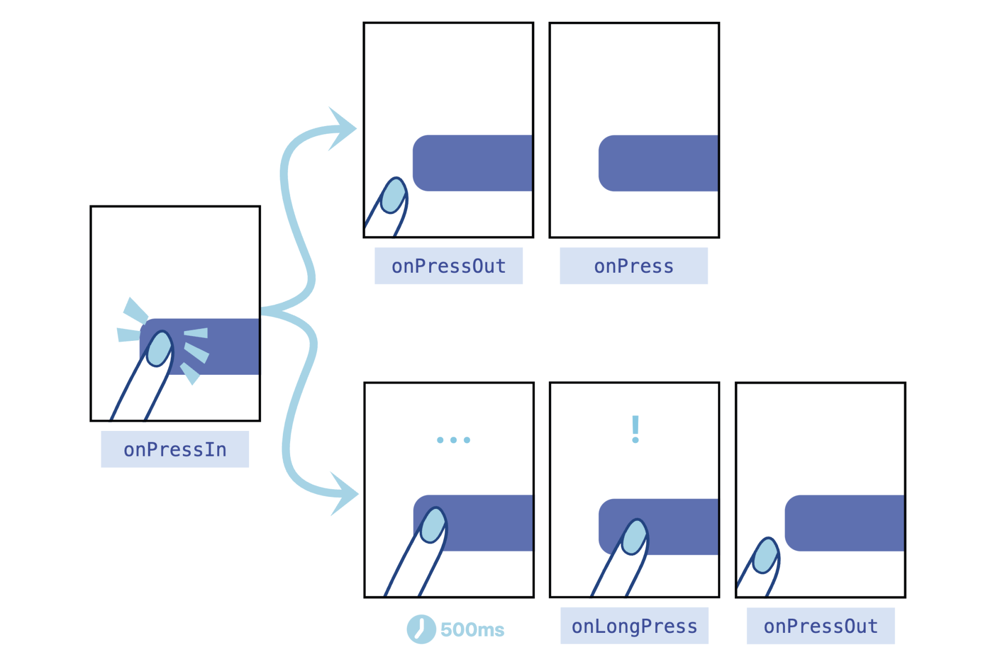

# Pressable
Pressable 点按组件，不再是 Touchable 组件的封装，而是一个全新重构的点按组件，它的反馈效果可由开发者自行配置。

Pressable 的样式 style 属性同时支持固定样式，和函数返回的“动态样式”：
```
type PressableStyle = ViewStyle | (({ pressed: boolean }) => ViewStyle)
```
- 固定样式，也就是type PressableStyle = ViewStyle 的意思是，Pressable 组件的支持样式类型和 View 组件的支持样式类型是一样的
- 动态样式，也就是type PressableStyle = (({ pressed: boolean }) => ViewStyle) 的意思是，在用户没有点击时 pressed 值为 false，在用户点击时 pressed 值为 true，你可以根据两种点按状态，为按钮定制不同的样式。

比如，你想在所有平台都实现降低透明度的点击反馈，那你可以定义一个基础样式 baseStyle，然后通过点按状态 pressed ，管理透明度 opacity 的切换。
```
// 固定的基础样式
const baseStyle = { width: 50, height: 50, backgroundColor: 'red'}

<Pressable
  onPress={handlePress}
  style={({ pressed }) => [ /* 动态样式 */
    baseStyle,
    { opacity: pressed ? 0.5 : 1} 
  ]} >
  <Text>按钮</Text>
</Pressable>
```

如果想实现 Android 平台特有的涟漪效果，Pressable 组件也能实现吗？可以，你可以使用 android_ripple 和 android_disableSound 属性进行配置。
- android_ripple：用于配置 Android 特有的涟漪效果 RippleConfig ；
- android_disableSound：禁用 Android 系统的点击音效，默认 false 不禁用。

此外，还提供了长按、onPressIn、onPressOut等方法。


<br>

## 触发区域HitRect
Pressable点按事件的默认触发区域是盒模型中的哪几部分？答案就是，盒模型中的默认不透明的部分。这些用户看得见的部分，包括 content、padding 和 border 部分，不包括margin。可以看得见才可以点击，这样的设计是非常合理的。

Pressable 组件有一个可触发区域 HitRect，默认情况下，可触发区域 HitRect 就是盒模型中的不透明的可见区域。你可以通过修改 hitSlop 的值，直接扩大可触发区域。

hitSlop定义如下：
```
type Rect = {
    top?: number;
    bottom?: number;
    left?: number;
    right?: number;
}

type HitSlop = Rect | number
```
HitSlop 接收两种类型的参数，一种是 number 类型，以原有盒模型中的 border 为边界，将可触发区域向外扩大一段距离。另一种是 Rect 类型，你可以更加精准地定义，要扩大的上下左右的距离。

在老点不中、老勾不中的场景中，你可以在不改变布局的前提下，设置 Pressable 组件的可触发区域 HitSlop，让可点击区域多个 10 像素、20 像素，让用户的更容易点中。

<br>

## 可保留区域 PressRect
用户的行为本身就很复杂，用户的意愿也可能会在很短的时间内发生改变的。其实，这里也是在回答开头我们提出的最后一个问题，用户行为的复杂性，就导致了我们在设计点按组件需要有更多的思考。

比如，用户已经点到购买按钮了，突然犹豫，又不想买了，于是将手指从按钮区域移开了。这时你得让用户能够反悔，能够取消即将触发的点击操作。

这里我们就要引入一个新的概念：可保留区域 PressRect。点按事件可保留区域的偏移量（Press Retention Offset）默认是 0，也就是说默认情况下可见区域就是可保留区域。你可以通过设置 pressRetentionOffset 属性，来扩大可保留区域 PressRect。pressRetentionOffset 属性的类型如下：
```
type PressRetentionOffset  = Rect | number
```
pressRetentionOffset 和 HitSlop 一样，接收两种类型的参数，一种是 number 类型，另一种是 Rect 类型。Rect 类型设置后，会以原有可触发区域为基准，将可保留区域向外扩大一段距离。

在你后悔点下购买按钮的情况下，你可以把已经按下的手指从可保留区域挪开，然后再松手，这就不会再继续触发点击事件了。


<br>

## Pressable优先
三代点按组件是同时存在于 React Native 的官方组件库中的，那开发时我们该怎么选呢？
- 第一代点按组件 Touchable，功能丰富但学习成本太高；
- 第二代点按组件 Button，简单易用但带了默认样式和反馈效果，通用性太差；
- 第三代点按组件 Pressable，同时满足了简单易用和复杂效果可扩展的特性。

<br>

## reference
https://reactnative.dev/docs/next/pressable