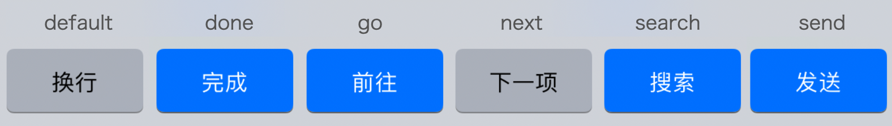

# TextInput
相对于点按组件组件来说，要把文本输入组件 TextInput 的细节体验弄好，要更难一些:
- TextInput 输入框中的文字状态、光标状态、焦点状态在 React Native 的 JavaScript 框架层的框架层有一份，在 Native 的还有一份，有时候业务代码中还有一份。那多份状态到底以谁为主呢？这件事我们得搞清楚。
- TextInput 组件和键盘是联动的，在处理好 TextInput 组件的同时，我们还得关心一下键盘。当然键盘本身是有 Keyboard API 的，但是键盘类型是“普通键盘”还是“纯数字键盘”，或者键盘右下角的按钮文字是“确定”还是“搜索”，都是由 TextInput 组件控制的。

关于如何处理输入框的文字，网上有两种说法。有些人倾向于使用非受控组件来处理，他们认为“不应该使用 useState 去控制 TextInput 的文字状态”，因为 ref 方案更加简单；有些人倾向于使用受控组件来处理，这些人认为“直接使用 ref 去操作宿主组件这太黑科技了”。这两种说法是相互矛盾的，究竟哪种是正确的呢？

受控的意思说的是使用 JavaScript 中的 state 去控制宿主组件中的值。一个受控的 ControlledTextInput 组件示例如下：
```JSX
function ControlledTextInput() {
  const [text, setText] = React.useState('');
  return  <TextInput value={text} onChangeText={setText} />
}
```

对于非受控组件来说，用户输入文字和文字展示到屏幕的过程，全部都是在宿主应用层面进行的，JavaScript 业务代码是没有参与的。


对于受控组件来说，用户输入文字和文字展示这两步，依旧是在宿主应用层面进行的。但后续 JavaScript 业务代码也参与进去了，业务代码依次执行了 onChangeText 函数、setText 函数、controlledTextInput 函数，并且再次更新了展示值。

也就是说，受控组件更新了两次展示的值，只是因为两次展示的值是一样的，用户看不出来而已。对于受控组件而言，即便存在系统或 Native 修改文本的情况，在 TextInput 的底层，也会将其强制更新为当前 TextInput 的 value 属性值。所以对于受控组件来说，**输入框的文字始终是由 state 驱动的**。

更新两次的好处在于，**可以更加自由地控制输入的文本，比如语音输入文字、通过地图定位填写详细地址**。这些复杂场景下，用户既可以自由输入文字，也可以引入程序参与进来。而非受控组件只适用于用户自由输入的场景。

<br>

## 输入框的焦点
```JSX
<TextInput autoFocus/>
```
TextInput 的 autoFocus 属性，就是用于控制自动对焦用的，其默认值是 false。也就是说，所有的 TextInput 元素默认都不会自动的对焦，而我们将 TextInput 的 autoFocus 属性设置为 true 时，框架会在 TextInput 元素挂载后，自动帮我们进行对焦。

页面只有一个搜索框的场景下 ，autoFocus 是好用的。但当一个页面有多个输入框时，autoFocus 就没法实现焦点的转移。
```
function AutoNextFocusTextInputs() {
  const ref1 = React.useRef<TextInput>(null);

  useEffect(()=>{
    ref1.current?.focus()
  },[])

  return  (
    <TextInput ref={ref1}  />
    )
}
```
先声明了一个 ref1 用于保存 TextInput 宿主组件。在该宿主组件上封装了 Native/C++ 层暴露给 JavaScript 的命令，比如对焦focus()、失焦blur()、控制选中文字的光标setSelection。

使用 focus()命令对焦和使用autoFocus属性对焦，在原生应用层面的实现原理是一样的，只不过在 JavaScript 层面，前者是命令式的，后者是声明式的。对自带状态的宿主组件而言，**命令式的方法能够进行更复杂的操作**。

那要实现每点一次键盘的“下一项”按钮，将焦点对到下一个 TextInput 元素上，怎么实现呢？具体的示例代码如下：
```JSX
function AutoNextFocusTextInputs() {
  const ref1 = React.useRef<TextInput>(null);
  const ref2 = React.useRef<TextInput>(null);
  const ref3 = React.useRef<TextInput>(null);

  return (
    <>
      <TextInput ref={ref1} onSubmitEditing={ref2.current?.focus} /> // 姓名输入框
      <TextInput ref={ref2} onSubmitEditing={ref3.current?.focus} /> // 电话输入框
      <TextInput ref={ref3} /> // 地址输入框
    </>
  );
}
```
这里再多说一句，为了简单起见，我们把三个 TextInput 元素都封装到了同一个组件中。在真实的项目中，这三个输入框往往不是封装成同一个组件中的，姓名输入框、电话输入框、地址输入框每个都是一个独立的组件，然后再有一个大的复合组件将它们组合在一起的。

那么这时，如何获取到 TextInput 元素 ref 呢？如果你遇到了这个问题，你可以查一下React 文档中，使用 [forwardRef](https://zh-hans.react.dev/reference/react/forwardRef#forwarding-a-ref-through-multiple-components) 转发。


```JSX
import { forwardRef } from 'react';

const MyInput = forwardRef(function MyInput(props, ref) {
  return <input {...props} ref={ref} />;
});
```
- props：父组件传递过来的 props。
- ref：父组件传递的 ref 属性。ref 可以是一个对象或函数。如果父组件没有传递一个 ref，那么它将会是 null。你应该将接收到的 ref 转发给另一个组件，或者将其传递给 useImperativeHandle。
- forwardRef 返回一个可以在 JSX 中渲染的 React 组件。与作为纯函数定义的 React 组件不同，forwardRef 返回的组件还能够接收 ref 属性。

在上方的代码中，MyInput 的 ref 会接收到 `<input>` DOM 节点。然而，你可以选择暴露一个自定义的值。为了修改被暴露的句柄，在你的顶层组件调用 useImperativeHandle.

举例来说，假设你不想暴露出整个 <input> DOM 节点，但你想要它其中两个方法：focus 和 scrollIntoView。为此，用单独额外的 ref 来指向真实的浏览器 DOM。然后使用 useImperativeHandle 来暴露一个句柄，它只返回你想要父组件去调用的方法：

```JSX
// MyInput.js
import { forwardRef, useRef, useImperativeHandle } from 'react';

const MyInput = forwardRef(function MyInput(props, ref) {
  const inputRef = useRef(null);

  useImperativeHandle(ref, () => {
    return {
      focus() {
        inputRef.current.focus();
      },
      scrollIntoView() {
        inputRef.current.scrollIntoView();
      },
    };
  }, []);

  return <input {...props} ref={inputRef} />;
});

export default MyInput;
```
现在，如果你的父组件获得了 MyInput 的 ref，就能通过该 ref 来调用 focus 和 scrollIntoView 方法。然而，它的访问是受限的，无法读取或调用下方 `<input>` DOM 节点的其他所有属性和方法。
```JSX
import { useRef } from 'react';
import MyInput from './MyInput.js';

export default function Form() {
  const ref = useRef(null);

  function handleClick() {
    ref.current.focus();
    // 下方代码不起作用，因为 DOM 节点并未被暴露出来：
    // ref.current.style.opacity = 0.5;
  }

  return (
    <form>
      <MyInput placeholder="Enter your name" ref={ref} />
      <button type="button" onClick={handleClick}>
        Edit
      </button>
    </form>
  );
}
```

<br>

## 联动键盘的体验
### 1. “置灰置蓝”的功能
先来看第一个体验细节，iOS 微信搜索框的键盘右下角按钮有一个“置灰置蓝”的功能。默认情况下，键盘右下角的按钮显示的是置灰的“搜索”二字，当你在搜索框输入文字后，置灰的“搜索”按钮会变成蓝色背景的“搜索”二字。

置灰的作用是提示用户，没有输入文字不能进行搜索，按钮变蓝提示的是有内容了，可以搜索了。

控制键盘右下角按钮置灰置蓝的，是 TextInput 的enablesReturnKeyAutomatically属性，这个属性是 iOS 独有的属性，默认是false，也就是任何使用键盘右下角的按钮，都可以点击。你也可以通过将其设置为 true，使其在输入框中没有文字时置灰。

### 2. 文案可变
第二个体验细节是，键盘右下角按钮的文案是可以变化的，你可以根据不同的业务场景进行设置。



有两个属性可以设置这些文案，包括 **iOS/Android 通用的 returnKeyType 和 Android 独有的 returnKeyLabel**。

这里只说一下通用属性：
- default：显示的文案是换行；
- done：显示的文案是“完成”，它适合作为最后一个输入框的提示文案；
- go：显示的文案是“前往”，它适合作为浏览器网站输入框或页面跳出的提示文案；
- next：显示的文案是“下一项”，它适合作为转移焦点的提示文案；
- search：显示的文案是“搜索”，它适合作为搜索框的提示文案；
- send：显示的文案是“发送”，它比较适合聊天输入框的提示文案。

### 3. 自动填写账号密码功能
第三个体验细节是，登录页面的自动填写账号密码功能。虽然现在有了二维码登录，但传统的账号密码登录场景还是非常多的。每次登录的时候，要输入一遍账号密码，就很麻烦了。

无论是 iOS 还是 Android，它们都有系统层面的记住账号密码的功能，帮助用户快速完成账号密码的填写。完成快速填写功能的 TextInput 属性，在 iOS 上叫做textContentType，在 Android 上叫做autoComplete。

还有一些键盘的体验细节，比如**keyboardType可以控制键盘类型**，可以让用户更方便地输入电话号码phone-pad、邮箱地址email-address等等。

当你知道这些键盘细节后，你就可以利用这些系统的特性，帮你的 App 体验变得更好:
```JSX
function AutoNextFocusTextInputs() {
  const ref1,ref2,ref3 ...

  return (
    <>
      <TextInput ref={ref1} placeholder="姓名" textContentType="name" returnKeyType="next" onSubmitEditing={ref2.current?.focus}/>
      <TextInput ref={ref2} placeholder="电话"  keyboardType="phone-pad" returnKeyType="done" onSubmitEditing={ref3.current?.focus}
      />
      <TextInput  ref={ref3}  placeholder="地址"  returnKeyType="done" />
    </>
  );
}
```
在这段代码中，我们使用了placeholder来提醒用户该输入框应该输入什么，使用了 textContentType="name" 来辅助用户填写姓名，使用了 keyboardType="phone-pad" 来指定键盘只用于输入电话号码，使用returnKeyType="next" 或 "done"来提示用户当前操作的含义，当然还有ref.current.focus()的自动聚焦功能。