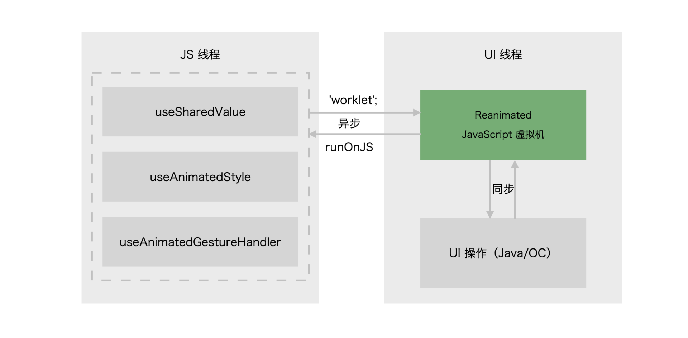

# Animation
React Native中，动画常用的方案有这三种：
- 第一种是 React Native 本身提供的 Animated API；
- 第二种是社区提供的 Reanimated 组件；
- 第三种是直接接入设计师使用的 AE 输出的 Lottie 动画。

那这三个方案怎么来进行选择呢？你可以根据具体的业务情况来选择：
- 如果是轻量级的动画，你不想多集成一个库，那你可以直接使用 Animated；
- 如果你对性能要求高又要大规模使用， 那 Reanimated 是你最好的选择；
- 最后 Lottie 的方案，适合那种没有人机交互的、由 UI 直接提供动画配置文件的动画形式。


## Reanimated
Reanimated 的名字来源于它的那句口号：React Native’s Animated library reimplemented.

下面是一个例子: 现在你有一个视图和一个按钮，视图的高度是固定的，视图的宽度可以用动画来控制，你每点一下切换宽度的文字，视图宽度都会随机改变。


在页面中蓝色视图初始化的宽度是 10 像素，当你点击切换宽度的文字后，蓝色视图的宽度会在 0~350 像素之间随机变化。因为是动画，所以蓝色视图的宽度并不是一下就变宽的，而是连续改变的。在 1s 内，先增长几像素，然后再增长几像素，依次类推直到目标长度，因为刷新的帧率很快，因此人的肉眼看起来就是宽度就是连续变化的。


无论是用 State 更新页面，还是用 Reanimated 更新动画，都需要 4 步。具体它们有什么相似之处呢？我们直接来分析 Reanimated 中的这 4 个概念。

第一个概念：**共享值（SharedValue）**。Reanimated 中共享值这个概念类似于 React 中的状态 State.
```JSX
// Reanimated 示例代码
import { useSharedValue} from 'react-native-reanimated';
const randomWidth = useSharedValue(10);
// randomWidth.value === 10
```
驱动动画的最初因子是共享值（ShareValue）。用于初始化共享值的钩子函数 useSharedValue 是从 react-native-reanimated 中引入的。然后使用 useSharedValue 创建出一个对象 randomWidth，randomWidth 的 value 属性是一个默认赋值数字 10。


第二个概念：**衍生值（DerivedValue）**。Reanimated 的衍生值（DerivedValue）这个概念类似于 React 中的状态衍生值。
```JSX
// Reanimated 示例代码
import { useAnimatedStyle } from 'react-native-reanimated';

// 错误示范
const style = {
  width: randomWidth.value
}

// 正确示范
const style = useAnimatedStyle(() => {
  return {
    width: randomWidth.value,
  };
});
```
在 Reanimated 示例代码中，如果你直接将  const style = {width: randomWidth.value} 组成的样式对象赋值给 JSX 元素，控制视图宽度改变的动画是不生效的。这是 Reanimated 驱动动画和 State 驱动视图的机制不一样导致的。
你需要从 react-native-reanimated 中引入钩子函数 useAnimatedStyle，这个钩子函数是专门用来处理动画样式的衍生值。

第三个概念，**动画组件（AnimatedComponent）**。Reanimated 的动画组件和 React/React Native 中的组件（Component）概念是类似的。
```JSX
// Reanimated 示例代码
import Animated from 'react-native-reanimated';

<Animated.View style={[{ width: 100}, style]} />
```
在 Reanimated 示例代码中，你需要从 react-native-reanimated 引入 Animated 对象，在该对象上挂了常用的 react-native 组件，比如示例代码中的 Animated.View，还有 Animated.Text、 Animated.FlatList等等。

共享值（ShareValue）和衍生值（DerivedValue）是专门给动画组件（AnimatedComponent）用的，普通组件（Component）用不了。

第四个概念，**更新共享值**。Reanimated 的更新共享值的方式和 React/React Native 更新状态的方式方式是不一样的。
```JSX
// Reanimated 示例代码
const randomWidth = useSharedValue(10);
// 不带动画的更新
randomWidth.value = Math.random() * 350;
// 带动画的更新
randomWidth.value = withTiming(Math.random() * 350);
```
Reanimated 有两种更新方式，一种是不带动画曲线的更新方式，另一种是带动画曲线的更新方式。
- 直接把视图宽度 Math.random() * 350 赋值给randomWidth.value，就是通过指定一个最终共享值的方式进行更新的，比如从 10 像素宽度直接变为 100 像素宽度。这种更新方式是一步到位的，没有动画曲线。
- 真正的动画是从 10 像素宽度，增长到 11 像素，然后增长到 12 像素，以此类推，通过连续的方式增长到 100 像素宽度的。具体地说，控制每一帧增长多少像素、减少多少像素，是通过类似 withTiming 的动画曲线实现的。withTiming 动画曲线的意思是，启动一个基于时间的动画，在每个单位时间内增长或减少的像素是相等的。

使用 withTiming(100) 更新共享值时，就会启动基于时间的动画曲线，其默认的持续时间是 300ms。理论上，在这 300ms 内，视图的宽度会从 10 像素开始，以每一帧增加一个固定的宽度的速度，增加到 100 像素。

切换宽度动画的完整示例代码如下：
```JSX
import Animated, {
  useSharedValue,
  withTiming,
  useAnimatedStyle,
  Easing,
} from 'react-native-reanimated';
import { View, Button } from 'react-native';
import React from 'react';

function AnimatedStyleUpdateExample(): React.ReactElement {
  const randomWidth = useSharedValue(10);

  const style = useAnimatedStyle(() => {
    console.log('==Animated==')
    return {
      width: withTiming(randomWidth.value),
    };
  });

  console.log('==render==')

  return (
    <View>
      <Animated.View
        style={[
          { width: 100, height: 30, backgroundColor: 'cornflowerblue'},
          style,
        ]}
      />
      <Button
        title="切换宽度"
        onPress={() => {
          randomWidth.value = Math.random() * 350;
        }}
      />
    </View>
  );
}
```
在使用 Reanimated 改变共享值触发动画更新时，只会触发示例代码中 useAnimatedStyle 的入参函数的执行，而不会触发 AnimatedStyleUpdateExample 组件函数的执行。也就是说，动画更新是不会打印 “==render==” 日志的，只会打印“==Animated==”日志。

<br>

## Reanimated 的原理
为什么动画代码和状态代码都放在同一个 JavaScript 文件中，但动画部分代码却由另一个线程来执行呢？

答案就是：把动画代码放到 UI 主线程来执行性能会更好，动画不容易卡顿。

React Native 有两个常用的线程：一个是 React Native 的 JavaScript 线程，另一个是 UI 主线程。JavaScript 线程和 UI 主线程是异步通信的，这也意味着，如果是由 JavaScript 线程发起动画的执行，UI 线程并不能同步地收到该命令并且立刻执行，UI 线程至少要处理完成当前一帧的渲染任务后，才会执行 JavaScript 线程的动画命令。也就是说异步通讯会导致动画至少延迟 1 帧。另一方面，JavaScript 线程处理的事件很多，包括所有的业务逻辑、React Diff、事件响应等等，容易抢占动画的执行资源。

处理 1 帧动画的耗时需要控制在 16.6ms 以内，如果超过 16.6ms 就会导致动画掉帧，掉帧严重的时候，用户就会感觉到卡顿。

既然动画部分的 JavaScript 代码放在  JavaScript 线程中执行，存在至少 1 帧的延迟，并且容易导致卡顿。那我们的解决方案是什么呢？

第一种思路就是 React Native 自带的 Animated 动画库用的思路。它是在组件初始化时，把动画的初始值、动画的形式、动画的结束值等配置都传给 UI 主线程。开发者有个开启 UI 主线程执行动画任务的开关 useNativeDriver，当开发者开启 useNativeDriver 这个开关后，动画就是在 UI 主线程执行了。

但是 Animated 动画库的缺陷也很明显，它传给 UI 主线程的是动画配置。配置只是单纯的数据，它不具备图灵完备的特性，不能配置复杂的逻辑。所以 React Native 官方也指出了：Animated 不能用来改变元素宽度、高度等布局属性，不能处理除了 ScrollView 组件的 onScroll 事件外的其他手势事件。

换句话说，<strong>在保障性能的前提下，简单的动画、无交互的动画，我们可以用自带的 Animated 动画库来处理；如果是逻辑稍微复杂点的、带交互的动画，自带的 Animated 动画库就干不了了</strong>。

Reanimated 动画库采用了另一种思路，它把动画相关的 JavaScript 函数及其上下文传给了 UI 主线程。不过，UI 主线程并没有能运行 JavaScript 函数的虚拟机，于是 Reanimated 又创建了一个 JavaScript 虚拟机来运行传过来的 JavaScript 函数。

换句话说，在使用 Reanimated 之前，React Native 只会在 JavaScript 线程创建一个 JavaScript 虚拟机，来运行 JavaScript 代码。而使用 Reanimated 之后，Reanimated 会在 UI 主线程中创建另一个 JavaScript 虚拟机来运行动画部分相关的代码。



在 JavaScript 线程中包括了三个动画相关的函数或值，useSharedValue（其底层会调用 cancelAnimation ）、useAnimatedStyle 和 useAnimatedGestureHandler。这三部分的代码会在其底层，将相关的回调函数标记为“worklet” ，被标记的“worklet” 函数或值会被放在一个由 Reanimated 创建的 JavaScript 虚拟机中执行。

而这个由 Reanimated 创建的 JavaScript 虚拟机，会在 UI 线程中执行传过来的“worklet” 函数，并且执行的函数还可以同步地操作 UI。

简而言之，Reanimated 动画性能好的原因就在于，React Native 的 JavaScript 线程是性能瓶颈点，而 UI 线程不是，在 Reanimated 真正执行动画时，你已经把所有与动画相关 JavaScript 函数都放到了 UI 线程中独立的 JavaScript 虚拟机中了，并不会和 JavaScript 线程抢占硬件资源，因此 Reanimated 执行动画的性能会更好。

## reference
- [《Introduction to React Native Reanimated 2》](https://www.youtube.com/watch?v=yz9E10Dq8Bg)，可以帮你快速入门。
- 入门之后，建议你再看看官方的文章，它会帮你更好的理解 Reanimated2 的 原理。
- 除了 useAnimatedStyle 、useAnimatedStyle 和 useAnimatedGestureHandler 之外，还有一些钩子函数也可以把它的入参函数放到 UI 线程中执行，包括 useDerivedValue、useAnimatedScrollHandler、useAnimatedReaction 和 useAnimatedProps，当然你也可以通过把 “worklet”  字面量放到函数顶部，这样  Reanimated 就会把该函数放到 UI 线程中执行了。
- 常见的动画曲线有 withTiming、withSpring、withDecay 和 withDelay，甚至你还可以使用 Easing.bezier 自定义动画曲线。