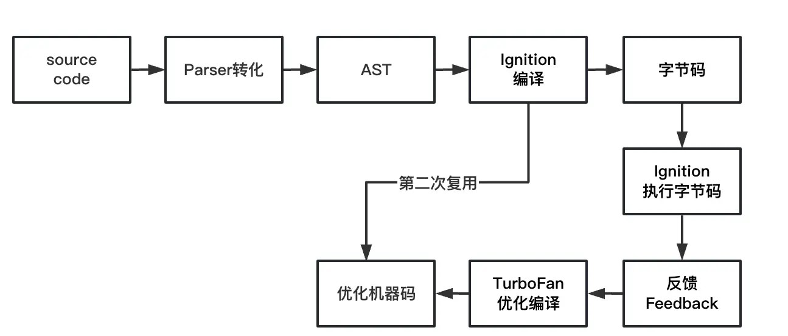

# 为什么React Native比Webview性能好
## Native 模式和 WebView 模式
hybird app中的H5 、小程序，它们本质上都是用 WebView 渲染的，而我们React Native是通过 Native 渲染的，两者本质上差别很大。

WebView 渲染：WebView 渲染还是浏览器渲染的模式那一套，WebView是 Native 的一个组件，能够像打开浏览器那样打开 HTML 页面。在小程序章节我们也讲到了，小程序页面也是由多个 HTML 页面构成。

WebView 渲染视图窗口可以由 Native 来控制，所以 Native 可以利用设置 WebView 宽高来实现局部动态化，也可以让 WebView 布满全屏来实现 H5 页面。

对于 Native 来说，WebView 打开的链接可以是线上资源，也可以是本地资源。如果把 HTML、JS 等资源在本地打开，速度会比加载网络资源快。这也是小程序打开速度和体验上要比直接打开 H5 强的原因，小程序会预先下载资源包，如果小程序已经打开过，就会缓存起来。

Native 渲染： Native 渲染就比较简单了，在 iOS 和 Android 系统上分别用 Native 模式渲染。而我 RN ，也是用 Native 渲染的，Native 渲染的用户体验会更好，还能直接调用系统接口。


## 为什么不是 Web？
Web 发布上线非常快，可以作为动态化方案之一，但是同样也暴露出很多问题。


H5 用户体验较差，这种体验分为首屏加载和交互体验。

首先 H5 WebView 的方式加载受到网络波动影响比较大，白屏时间长，这样的用户体验非常不好。整个 WebView 加载流程实质上和浏览器输入 url 到页面展示流程一样，依赖于浏览器引擎来解析 HTML、CSS 和执行 JavaScript，这可能导致渲染速度较慢，尤其是在复杂的页面或高负载情况下。

WebView 交互体验也比 Native 差很多，比如长列表场景、手势交互、动画效果等等。

原生能力支持弱，H5 WebView 这种方式很难调用移动设备的原生能力，比如语音功能、照相、扫脸支付等。一般情况下，可以通过桥和 Native 通信，让 Native 来完成，这会让流程变得非常繁琐，也会带来很多问题。


## 为什么是 RN?
RN 采用 React 语法，与 React Web 开发类似，前端开发人员很容易上手。而且，React 包含 JSX 语法，可以结合多种设计模式进行开发，使 RN 同样具备灵活性和可扩展性。

RN 是采用运行 React 的 JS 作为开发平台，这样可以让 Web 开发者也能够参与到 Native 开发中来。而且，RN 让一套代码可以运行在两端，大大减少了开发和维护成本。

React Native 的渲染通常比 WebView 更快，因为它直接使用原生组件，避免了浏览器渲染引擎的一些开销。由于使用原生组件，React Native 应用的用户体验更接近原生应用，响应速度更快，动画更流畅。

**RN 采用原生渲染，性能和体验仅次于 Native 开发**。

最后也是最重要的，就是 RN 是动态化的方案，也就是 RN 打出来的应用包，并不是和 Native 包绑定在一起发布的，而是在运行 Native 的时候拉下 RN 的包。这样做，一是减少了 Native 包体积，二是 RN 包可以随时发布，提高了迭代效率，也让一些线上问题能够快速解决。


## RN 的构成
RN 本质上是用 JS 作为逻辑层，用 Native 作为渲染层，还需要一个中间层作为逻辑层与渲染层的通信。所以 RN 本质上由逻辑层 JS，渲染层 Java (Android)和 iOS (Objective-C)，以及通信层 C++ 组成。

其中需要 JS 引擎来运行 RN 的 JS 代码，那么我们来看一下 RN 中的 JS 引擎。


### JS引擎
### v8
JS 是解释型语言，它的执行需要宿主环境提供，转成语法树，并且读懂语法树，转成字节码并执行的能力，V8 引擎的工作就需要有这些能力：
- Parser：将 JS 源码转换成抽象语法树。在计算机科学中，抽象语法树(abstract syntax tree 或者缩写为 AST)，或者语法树(syntax tree),是源代码的抽象语法结构的树状表现形式，这里特指编程语言的源代码。

- Lgniton：interpreter 解释器，负责将 AST 转换成指令字节码，解释执行指令字节码（ByteCode），解释器执行的时候主要有四个模块：内存中的字节码、寄存器、栈和堆。

- TurboFan：compiler 编译器，通过 Lgniton 收集的信息，将指令字节码转换成优化汇编代码。

- Orinoco：garbage collector 简称 GC，垃圾回收模块，负责将程序不需要的内存空间回收，提升引擎性能。

V8 率先引入了即时编译（JIT）的双轮驱动设计（混合使用编译器和解释器的技术），这是一种权衡策略，给 JS 的执行速度带来了极大的提升。



JIT 就是取编译执行语言和解释执行语言的长处，利用解释器对代码进行处理，对于在**频率高的代码进行热区收集**，在之后指令字节码编译成机器码的时候，储存高频率的二机制机器码，之后就可以复用并执行二机制代码，以减少解释器和编译器的压力。

### RN 的应用中用了什么 JS 引擎呢？

RN 在 0.60 版本之前使用 JSCore 作为默认的 JS 引擎。JSCore 全名 JavaScriptCore，是 WebKit 默认内嵌的 JS 引擎，JSCore作为一个系统级 Framework 被苹果提供给开发者，作为苹果的浏览器引擎 WebKit 中重要组成部分。

所以在 iOS 应用中默认为 JSCore 引擎，这使得 RN 也用 JSCore，但是 JSCore 没有对 Android 机型做好适配，在性能、体积和内存上和 V8 有着明显的差别。

基于这个背景，RN 团队提供了 JSI （JavaScript Interface）框架，JSI 并不是 RN 的一部分，JSI 可以视作一个兼容层，意在磨平不同 JS 引擎中的差异性。

JSI 实现了引擎切换，比如在 iOS 平台运行的 JSCore，在 Andriod 中运行的是 Hermes 引擎。

JSI 作为引擎统一的通用层，JSI 会定义与 JS 引擎交互的接口以及数据转化的方法。比如在 JSI 中定义了一个执行 JS 的方法叫做 evaluateJavaScript()。具体如何执行 JS 代码其实是由各引擎实现的，通过这种方式屏蔽不同引擎间的差异，可以方便地实现 JS 引擎切换。

比如 evaluateJavaScript 接口基于 JSI 在不同引擎上的实现。

首先是 JSC 中的实现：
```C++
jsi::Value JSCRuntime::evaluateJavaScript(
    const std::shared_ptr<const jsi::Buffer> &buffer,
    const std::string &sourceURL) {
  std::string tmp(
      reinterpret_cast<const char *>(buffer->data()), buffer->size());
  JSStringRef sourceRef = JSStringCreateWithUTF8CString(tmp.c_str());
  JSStringRef sourceURLRef = nullptr;
  if (!sourceURL.empty()) {
    sourceURLRef = JSStringCreateWithUTF8CString(sourceURL.c_str());
  }
  JSValueRef exc = nullptr;
  JSValueRef res =
      JSEvaluateScript(ctx_, sourceRef, nullptr, sourceURLRef, 0, &exc);
  JSStringRelease(sourceRef);
  if (sourceURLRef) {
    JSStringRelease(sourceURLRef);
  }
  checkException(res, exc);
  return createValue(res);
}
```
Hermes 中的实现:
```C++
//https://github.com/facebook/hermes/blob/main/API/hermes/hermes.cpp
jsi::Value HermesRuntimeImpl::evaluateJavaScript(
    const std::shared_ptr<const jsi::Buffer> &buffer,
    const std::string &sourceURL) {
  return evaluateJavaScriptWithSourceMap(buffer, nullptr, sourceURL);
}
```

##  React 引入 JSI 后新老架构对比


老架构：业务启动，一次性初始化全部 NativeModule。所有的调用为异步操作（同步桥除外），JS 和 Native 端通过序列化、反序列化进行通信。桥通讯由于排队、线程切换易引起阻塞。

新架构：
- JSI：增加引擎抽象层，实现引擎解耦便于切换引擎。同时支持 JS 持有 C++ HostObject 类型对象引用，实现 JS 和 Native 相互感知。
- TurboModule：替换原有桥机制，实现 NativeModule 按需加载，和 JS<->Native 同步调用Fabric：新 UI 架构，替换原有 UIManager。


## bundles
React Native 和传统的 Web 端 React 应用开发非常类似，因为它们都使用JavaScript 编程语言。这使得 Web 开发者能够轻松上手 RN 开发。不同之处在于，RN 的打包产物是单一的 JavaScript 文件(jsbundle)，而在 Web 中则需要部署 HTML、CSS 和 JavaScript 文件的集合体。

单 Bundle 和多 Bundle 模式

每次运行一个 bundle 时，RN 需要外层容器提供 JS 引擎来运行当前的jsbundle。在 RN 中，可以通过路由方案来实现页面跳转，通常情况下一个 jsbundle 对应一个或多个页面。

在业务开发中，需要根据具体情况选择单 bundle 或者多个 bundle 的方式。比如有一些独立的页面，需要不同的发版流程、上线周期，或者不同的团队维护，这种情况下一个页面对应一个 bundle 比较适合。但是有一些上下关联密切的页面，或者是上下级父子页面，也可以采用一个 bundle 对应多个页面，当然现实场景下：一对一、一对多的复杂情况都有可能发生，或者共存在一个项目中。


在同一 bundle 下，文件运行在相同的 JS 上下文中，因此可以使用 Redux 等状态管理工具在 React Native 中实现组件或页面状态的共享。