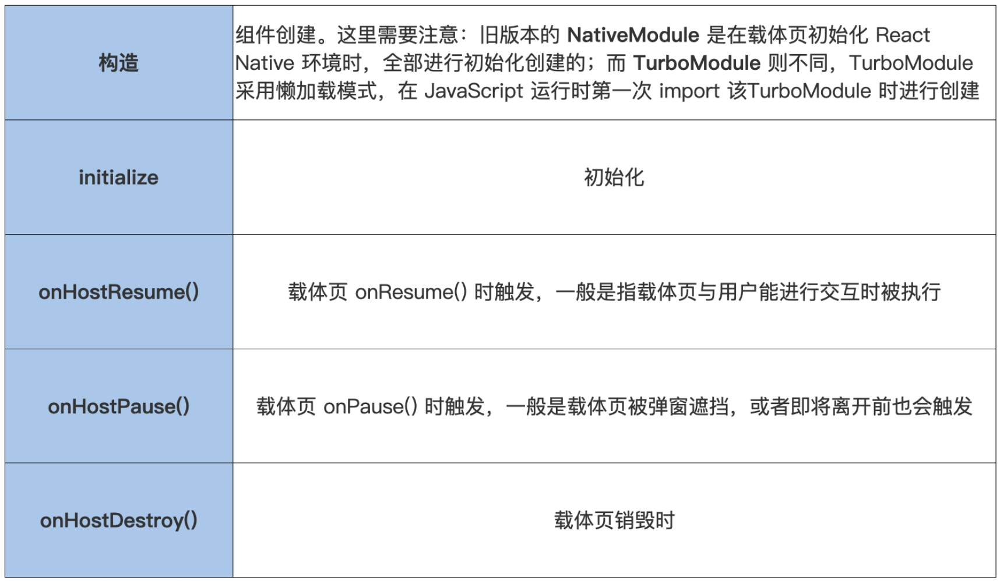

# lifecycles
在 Android 端，一个 Module 组件的生命周期包括：
```
构造 -> 初始化 -> onHostResume() -> onHostPause() -> onHostDestroy()
```


在Android开发中，了解各个组件的生命周期是非常重要的，因为这直接影响到如何正确管理资源和状态。以下是几种主要Android组件（Activity、Service、BroadcastReceiver 和 Fragment）的生命周期概述：

### Activity 生命周期

1. **onCreate()** - 当Activity第一次被创建时调用。
2. **onStart()** - 当Activity对用户可见时调用。
3. **onResume()** - 当Activity开始与用户交互时调用，此时Activity处于前台。
4. **onPause()** - 当Activity将失去焦点但仍然运行时调用。
5. **onStop()** - 当Activity不再对用户可见时调用。
6. **onSaveInstanceState()** - 在系统销毁Activity之前保存其状态。
7. **onDestroy()** - 当Activity被销毁前调用。

此外，还有两个方法用于处理配置变更：
- **onConfigurationChanged()** - 当设备配置发生改变时调用。
- **onLowMemory()** - 当系统内存较低时调用。

### Service 生命周期

1. **onCreate()** - 当Service第一次被创建时调用。
2. **onStartCommand()** - 当通过startService()启动Service时调用。
3. **onBind()** - 当通过bindService()绑定到Service时调用。
4. **onUnbind()** - 当所有客户端都解绑后调用。
5. **onRebind()** - 当Service重新被绑定时调用。
6. **onDestroy()** - 当Service被销毁时调用。

### BroadcastReceiver 生命周期

BroadcastReceiver相对简单，它只有一个关键方法：
- **onReceive()** - 当接收广播时调用。

### Fragment 生命周期

1. **onAttach()** - 当Fragment与宿主Activity关联时调用。
2. **onCreate()** - 当Fragment第一次被创建时调用。
3. **onCreateView()** - 创建Fragment的视图时调用。
4. **onActivityCreated()** - 当宿主Activity的onCreate()方法返回后调用。
5. **onStart()** - 当Fragment对用户可见时调用。
6. **onResume()** - 当Fragment开始与用户交互时调用。
7. **onPause()** - 当Fragment将失去焦点但仍然运行时调用。
8. **onStop()** - 当Fragment不再对用户可见时调用。
9. **onDestroyView()** - 当Fragment的视图被销毁时调用。
10. **onDestroy()** - 当Fragment被销毁时调用。
11. **onDetach()** - 当Fragment与宿主Activity解除关联时调用。

这些生命周期方法提供了控制应用行为的关键点，例如在适当的时候保存和恢复状态，处理数据请求，以及释放资源。理解并正确使用它们是编写高效、响应迅速的应用程序的基础。

<br>

# Native Module lifecycles
React Native 给我们提供了一个接口：com.facebook.react.bridge.LifecycleEventListener。我们只需要在组件中添加这个接口的注册和取消注册，就可以让组件具备生命周期了。这里要注意，不要忘记在 onHostDestroy() 中移除注册，否则会造成内存泄漏。示例代码如下：
```java
public class TestJavaModule extends ReactContextBaseJavaModule 
 implements LifecycleEventListener, ReactModuleWithSpec, TurboModule {
    public TestJavaModule(ReactApplicationContext reactContext) {
       super(reactContext.real());
       reactContext.addLifecycleEventListener(this);
    }

    @Override
    public String getName() {
       return getClass().getSimpleName();
    }

    @Override
    public void onHostResume() {
    }

    @Override
    public void onHostPause() {
    }

    @Override
    public void onHostDestroy() {
       getReactApplicationContext().removeLifecycleEventListener(this); 
    }
}
```
其实组件的生命周期原理很简单，就是观察者模式。当载体页触发自身的生命周期回调时，调用 ReactInstanceManager 的 onHostXXX() 方法，ReactInstanceManager 进而调用 ReactContext 的对应回调。

比如载体页调用 onResume() 时，最终会调用 ReactContext 的 onHostResume()，内部会遍历注册的事件进行回调：
```java
public void onHostResume(@Nullable Activity activity) {
    Iterator iterator = this.mLifecycleEventListeners.iterator();
    while(iterator.hasNext()) {
        LifecycleEventListener listener = (LifecycleEventListener) iterator.next();
        // 观察者模式，载体页时调用已注册组件的生命周期回调
        listener.onHostResume();
    }
}
```

<br>

## reference
https://www.jianshu.com/p/1b3f829810a1