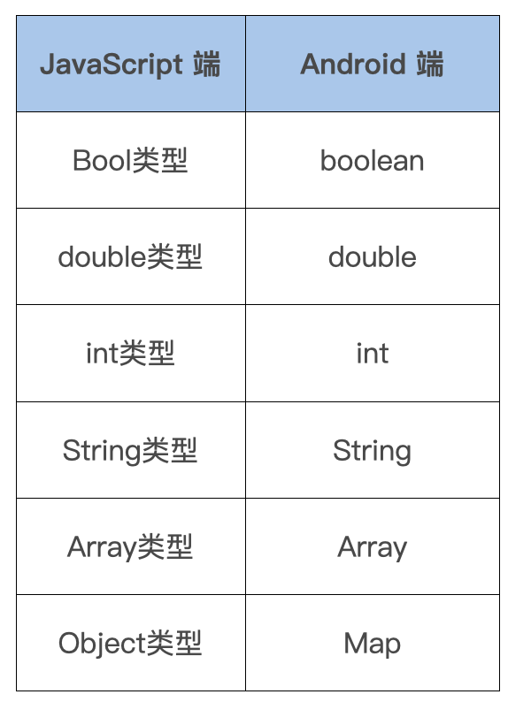

# data tansfer
Native 与 JavaScript 通信的过程中，组件需要获取输入参数、回传结果，对此 React Native 给我们包装了相应的数据类型，方便快速操作。



这里你要注意，数字类型有点特殊。因为 JavaScript 不支持 long 64 位长类型，只支持 int (32) 和 double，所以对于长数字，JavaScript 端统一用 double 表示。那么 Android 端如何转换成自己需要的数据类型呢？

以 long 为例，可以这样参考官方 issue这样处理：
```
double value = readableMap.getDouble(key);
try {
    // 判断是否为 long 的范围: 超过了 int 的最大值且为整数
    if (value > Integer.MAX_VALUE && value % 1 == 0) {
        long cv = (long) value;
        // 转换成 long 型返回
    }
} catch (Exception e) {
    // 异常时，仍使用 double
}
```
这段代码中，我们先将 JavaScript 传入的数值统一以双精度浮点数 double 来获取。获取完后，判断这个值是否超出了整数的最大值且不为小数，条件符合就将它转换成长整数 long，否则还是以 double 来返回。

现在，我们让 JavaScript 端调用 TestModule 的 testMethod 方法，传入参数 type 和 message，接收 native 回传数据：
```javascript
NativeModules.TestModule.testMethod({type: 1, message: "fromJS"}, (result)=>{
    console.info(result);
  }
);
```
```java
public class TestModule extends ReactContextBaseJavaModule implements ReactModuleWithSpec, TurboModule {
   public TestModule(ReactApplicationContext reactContext) {
      super(reactContext.real());
   }

   @Override
   public String getName() {
      return getClass().getSimpleName();
   }
   
   @ReactMethod
   public void testMethod(ReadableMap data, Callback callback) {
      // 获取 JS 的调用输入参数
      int type = data.getInt("type");
      String message = data.getString("message");
      // 回传数据给 JS
      WritableMap resultMap = new WritableNativeMap();
      map.putInt("code", 1);
      map.putString("message", "success");
      callback.invoke(resultMap);
   }
}
```
我们定义了 Native 组件 TestModule，内部实现了 JavaScript 需要调用的 testMethod 方法。此方法包含两个参数：ReadableMap 和 Callback。ReadableMap 为 JavaScript 传入参数的字典，我们可以通过对应的 key 获取到 JavaScript 的入参值，而 Callback 是在 Native 回传数据时需要使用的。