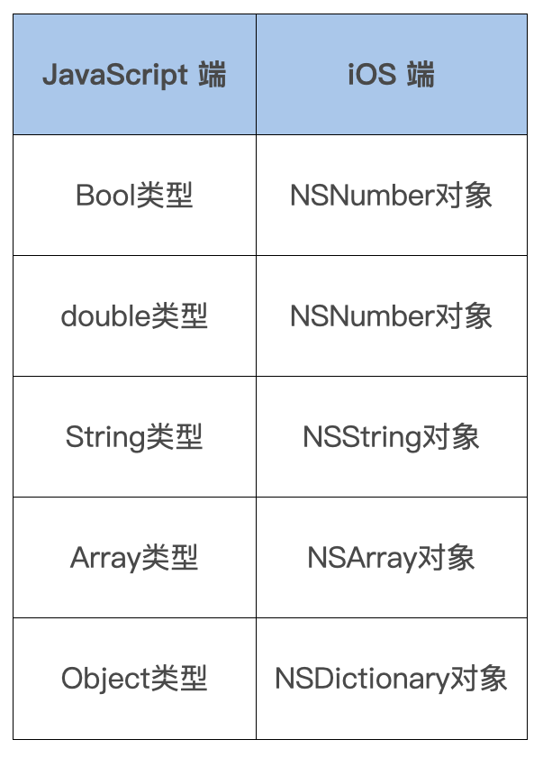

# data transfer
iOS 端也是一样，我们需要先看下 iOS 端支持的传入数据类型：



IOS如何实现如下js调用的TestModule？
```javascript
NativeModules.TestModule.testMethod({type: 1, message: "fromJS"}, (result)=>{
    console.info(result);
  }
);
```
可以在 Module 中进行 callback，然后通过 NSArray 来返回
```C
RCT_EXPORT_METHOD(getValueWithCallback : (RCTResponseSenderBlock)callback){
  if (!callback) {
    return;
  }
  callback(@[ @"value from callback!" ]);
}
```

在 React Native 中，你可以使用 Swift 来编写原生模块，并通过 JSI 或传统的桥接机制与 JavaScript 代码进行交互。以下是如何使用 Swift 编写一个简单的原生模块，并在 React Native 项目中调用它的示例。

### 使用 Swift 创建原生模块

1. **创建 Swift 文件**：
   在你的 React Native 项目的 `ios` 目录下，创建一个新的 Swift 文件，例如 `MyNativeModule.swift`。

2. **定义原生模块**：
   在 `MyNativeModule.swift` 中定义一个原生模块，并实现所需的方法。

```swift
import Foundation
import React

@objc(MyNativeModule)
class MyNativeModule: NSObject, RCTBridgeModule {

    // 模块名称
    static func moduleName() -> String! {
        return "MyNativeModule"
    }

    // 方法名映射
    @objc(sayHello:)
    func sayHello(name: NSString, callback: RCTResponseSenderBlock) {
        let greeting = "Hello, \(name)! This is from Swift."
        callback([greeting])
    }
}
```

3. **注册原生模块**：
   确保在 `AppDelegate.m` 中导入并注册这个模块。如果你的项目是纯 Swift 的，你可能需要创建一个 Objective-C 桥接文件（如 `ReactNativeBridge.h` 和 `ReactNativeBridge.m`）来注册 Swift 模块。

   - **创建桥接头文件**（如果还没有的话）：
     在 Xcode 中，选择项目，然后在 `Build Settings` 中找到 `Objective-C Bridging Header`，设置为 `YourProjectName/ReactNativeBridge.h`。

   - **编辑桥接头文件** `ReactNativeBridge.h`：
     ```objc
     #ifndef ReactNativeBridge_h
     #define ReactNativeBridge_h

     #import <React/RCTBridgeModule.h>

     #endif /* ReactNativeBridge_h */
     ```

   - **编辑桥接实现文件** `ReactNativeBridge.m`：
     ```objc
     #import "ReactNativeBridge.h"
     #import "MyNativeModule.h"

     @implementation ReactNativeBridge

     + (void)load {
         [RCTBridge registerModuleClass:[MyNativeModule class]];
     }

     @end
     ```

4. **确保 Swift 支持**：
   如果你的项目还没有启用 Swift 支持，你需要在 `Podfile` 中添加 `use_frameworks!` 并运行 `pod install`。

   ```ruby
   use_frameworks!
   ```

### 在 JavaScript 中调用 Swift 原生模块

1. **导入模块**：
   在你的 React Native 组件或 JavaScript 文件中导入并使用这个原生模块。

```javascript
import { NativeModules } from 'react-native';

const { MyNativeModule } = NativeModules;

// 调用原生方法
MyNativeModule.sayHello('John', (result) => {
  console.log(result); // 输出: Hello, John! This is from Swift.
});
```

### 完整示例

#### `MyNativeModule.swift`
```swift
import Foundation
import React

@objc(MyNativeModule)
class MyNativeModule: NSObject, RCTBridgeModule {

    static func moduleName() -> String! {
        return "MyNativeModule"
    }

    @objc(sayHello:)
    func sayHello(name: NSString, callback: RCTResponseSenderBlock) {
        let greeting = "Hello, \(name)! This is from Swift."
        callback([greeting])
    }
}
```

#### `ReactNativeBridge.h`
```objc
#ifndef ReactNativeBridge_h
#define ReactNativeBridge_h

#import <React/RCTBridgeModule.h>

#endif /* ReactNativeBridge_h */
```

#### `ReactNativeBridge.m`
```objc
#import "ReactNativeBridge.h"
#import "MyNativeModule.h"

@implementation ReactNativeBridge

+ (void)load {
    [RCTBridge registerModuleClass:[MyNativeModule class]];
}

@end
```

#### `Podfile`
```ruby
# 其他配置...
use_frameworks!

target 'YourProjectName' do
  # 其他依赖...
end
```

#### `App.js` 或其他 JavaScript 文件
```javascript
import { NativeModules } from 'react-native';

const { MyNativeModule } = NativeModules;

// 调用原生方法
MyNativeModule.sayHello('John', (result) => {
  console.log(result); // 输出: Hello, John! This is from Swift.
});
```

### 总结

通过上述步骤，你可以在 React Native 项目中使用 Swift 编写原生模块，并通过桥接机制与 JavaScript 代码进行交互。这种方法不仅提高了性能，还允许你利用 Swift 的强大功能和语法。如果你有更多具体的问题或需要进一步的帮助，请告诉我！