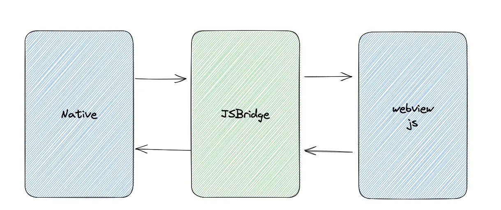

# jsbridge
JSBridge 简单理解就是向 JavaScript 中提供了可以调用 Native 方法的 api，并且 JavaScript 提供了 Native 调用的回调函数。这就实现了通信的一来一回，WebView 端可以向 Native 通信，Native 端也可以向 WebView 通信。



关于 JSBridge 的基本使用，我们从WebView 调用 Native 的方式入手。接下来，我们看看前端的几种调用方式。

**单纯向 Native 发送信息**。第一种形式就是单纯的向 Native 传递信息，不需要任何回调函数，比如向 native 发送一些关键节点的日志，也比如下面这样：
```js
const payload = {
    name:'开发指南',
    author:'Luke'
}
JSBridge.postMessage({
    type:'webview_event',
    payload
})
```

**调用 Native 方法，传递信息，并执行回调函数**。
```js
JSBridge.invoke('webview_event', payload, function(res){
    // 执行 native 的回调函数
})
```
这种方式就是通过调用 Native 的方法传递参数，并且接受 Native 的回调函数。

**监听 Native 事件**。
```js
JSBridge.registerEvent('webview_event', function(res){
   // 监听 native 的 webview_event 事件，
})
```
这种方式就是通过监听器监听 Native 通知的 webview_event、事件执行、回调函数触发。当然，上面的 JSBridge 和下面的方法并不是直接存在的，需要我们自己实现。


## JSBridge 原理分析
JSBridge 原理的实现也非常简单，Hybrid 方案是基于 WebView 的，<strong>JavaScript 执行在 WebView 提供的 JS 引擎中</strong>，比如 Android 就可以通过 webkit.WebView 类来控制 WebView 。


### JS 调用 Native 方式 1：api 注入
通过 Native 注入 api 的方式本质上是 WebView 提供对应的接口，Native 可以通过接口把方法进行映射，并最终挂载 window 对象上。当 JavaScript 中调用该方法时，本质上调用的就是与之对应的 Native 方法。

以 Android 为例，我们还原一下整个过程。在 WebView 上，可以通过 WebView 的 addJavascriptInterface 进行对象映射，但是这个接口有一个安全漏洞，因此在 4.2 中引入新的接口 @JavascriptInterface 来代替这个 api 。
```java
import android.webkit.WebView; /* 引入 WebView 类  */
import android.app.Activity; /* android 里面 Activity 组件 */
​
public class MainActivity extends Activity implements OnClickListener {
    @Override
  protected void onCreate(Bundle savedInstanceState){  /* Activity 初始化调用 */
        //....
        WebView.addJavascriptInterface(JavaScriptInterface, "JSOriginBridge");
    }
}
```
如上通过 addJavascriptInterface 将 Android 里面的 JavaScriptInterface 方法类映射到 JSBridge 上，就可以在 JavaScript 中采用如下的方式调用。
```js
window.JSOriginBridge.postMessage(message);
```
然后，在 Native 端就能够接收到前端的消息了。

但是在 iOS 上的调用会有差异，以 WKWebView 为例，可以用如下实现方式：
```C
@implementation WKWebVIewVC
- (void)viewDidLoad {
    [super viewDidLoad];
    [userCC addScriptMessageHandler:self name:@"JSOriginBridge"];
}
```
调用方式和 Android 有所区别：
```js
window.webkit.messageHandlers.JSOriginBridge.postMessage(message);
```
由于考虑到 Android 和 iOS 双端的差异，因此我们写在前端的代码需要做兼容：
```js
function possNativeMessage(message){
    const isAndroid = window.navigator.userAgent.indexOf('Android') !== -1
    if(isAndroid){
        window.JSOriginBridge.postMessage(message);
    }else {
        window.webkit.messageHandlers.JSOriginBridge.postMessage(message);
    }
}
```

### JS 调用 Native 方式 2：url scheme 拦截
还有一种方式就是拦截 url scheme。其本质就是通过 locaiton.href 或者 iframe.src 改变 url，Native 可以感知到 scheme 的变化进行拦截，参数会以 query string 的方式存在于 url 上。

scheme 跳转会有对应跳转协议，而头部大厂 App 中 scheme 的跳转和拦截都会有自己的一套规范。当然，这种方式的通信也有一些隐患，比如 url 长度的限制等。一个传统的自定义 scheme 如下：

xxx://xxx.xxx.com/message?name=alien

## Native 调用 JS 方法
Native 调用 JavaScipt 的方式<strong>本质上就是调用 WebView 上的方法</strong>。Native 调用 JavaScript 其实就是执行拼接 JavaScript 字符串，从外部调用 JavaScript 中的方法，因此 JavaScript 的方法必须在全局的 window 上。

这如何理解呢？我们还是以 Android 为例，说说 Native 调用 WebView 的两种方案。
```java
WebView.loadUrl("javascript:xxxfunction()");
```
这种方式可以直接调用 JS 中定义的函数，比如我们想用 Native 调用 WebView 的弹窗，就可以像如下这样：
```java
webview.loadUrl("javascript:alert('大前端跨端开发指南')")
```
还有一个 api
```java
webView.evaluateJavascript("javascript:alert('大前端跨端开发指南')", resultCallback)
```
这种方式在 Android 4.4 以上的系统中使用效率会很高，并且能够接收到执行 js 方法后的返回值。


## JSBridge 本质
JSBridge 并不是单纯的 Native 实现，而是由 JS 端 + Native 共同完成的。<strong>其本质就是由 Native 约定好 API 的实现方式，JS 端根据约定好的规则去实现</strong>，比如 WebView 映射 Native 的方法叫做 JSOriginBridge，那么在 JS 端就需要调用 window 属性上的 JSOriginBridge 来实现通信。

还有一点值得注意，在 WebView 调用 Native 的几种方式的时候，有说到回调函数的方式，本质上与 Native 通信只能够传简单的数据类型，比如 string 和 number。但是回调函数本身是不能直接向 Native 传递的，Native 与 JS 的通信会使用 HTML5 结构化克隆算法来序列化传递的数据，也就是说, <strong>传递的数据最终会被转换成字符串</strong>，所以不能被 JSON.stringify 或其他序列化方法转换的数据结构就会丢失，那我们就需要对回调函数处理。

JS Bridge前端实现如下：
```js
const isAndroid = window.navigator.userAgent.indexOf('Android') !== -1
​
 function possNativeMessage(message){
    if(isAndroid){
        window.JSOriginBridge.postMessage(message);
    }else {
        window.webkit.messageHandlers.JSOriginBridge.postMessage(message);
    }
}
​
/* 向 Native 发布事件 */
function publishNativeMessage(params){
    const message = {
        eventType:'publish',
        data:params
    }
    possNativeMessage(message)
}
​
/* 触发 Native 方法, 触发回调函数 */
function invokeNativeEvent(name,params,callbackId){
    const message = {
        eventType:'invoke',
        type:name,
        data:params,
        callbackId
    }
    possNativeMessage(message)
}
​
class JSBridge {
    /* 保存 */
    eventHandlers = new Map()
    responseCallbacks = new Map()
    callbackID = 0
    constructor() {
        window._handleNativeCallback = this.handleNativeCallback.bind(this)
        window._handleNativeEvent = this.handleNativeEvent.bind(this)
    }
    /* 向 native 发送消息 */
    postMessage(params){
        const data = JSON.stringify(params)
        publishNativeMessage(data)
    }
     /* 向 native 发送消息,等待回调函数 */
    invoke(name,payload,callback){
        this.callbackID++
        /* 将回调函数保存起来 */
        this.responseCallbacks.set(this.callbackID,callback)
        invokeNativeEvent(name,payload,this.callbackID)
    }
    /* 
    处理 native 调用 window 上的 _handleNativeCallback 方法。
    当执行 invoke 回调的时候，执行该方法
    */
    handleNativeCallback(jsonResponse){
        const res = JSON.parse(jsonResponse)
        const { callbackID,...params } = res
        const callback = this.responseCallbacks.get(callbackID)
        /* 取出回调函数并且执行 */
        callback && callback(params)
        /* 删除对应的回调函数 */
        this.responseCallbacks.delete(callbackID)
    }
    /* 
     处理 native 调用 window 上的 _handleNativeEvent 方法。
     处理绑定在 native 的事件
     */
    handleNativeEvent(jsonResponse){
        const res = JSON.parse(jsonResponse)
        const { eventName,...params } = res
        const callback = this.eventHandlers.get(eventName)
        callback(params)
    }
    /* 绑定注册事件 */
    registerEvent(name,callback){
        this.eventHandlers.set(name,callback)
    }
    /* 解绑事件 */
    unRegisterEvent(name){
        this.eventHandlers.delete(name)
    }
}
​
export default new JSBridge()
```
- 初始化阶段会向 window 对象上绑定两个方法，_handleNativeCallback 和 _handleNativeEvent 这些方法是约定好的，可以由 Native 主动调用；
- 当向 Native 发送消息的时候，调用 postMessage 方法 ，本质上调用的是 publishNativeMessage，里面会判断系统类型调用不同的方法，向 Native 通信；
- 当调用 Native 方法 invoke 时候，首先会在 JS 端形成一个 callbackId，并通过键值对的形式把回调函数用 responseCallbacks 保存起来。接下来会向 Native 通信，当 Native 完成事件处理之后，会调用 _handleNativeCallback ，向 js 通信，参数里面有对应的 callbackId，这样 JS 可以通过 callbackId 找到对应回调函数并执行，然后清除回调函数就可以了。
- 当绑定 Native 事件的时候，本质上是通过 eventHandlers 保存回调函数，如果 Native 向 JS 主动通信，就会执行 _handleNativeEvent 方法，通过返回的参数找到绑定的函数，执行对应的函数就可以了。这样就完成了 Native 和 WebView 通信的全流程。