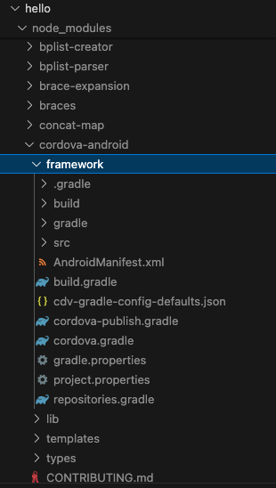

# Native Android集成Cordova
集成Android比IOS要简单得多，主要还是参考：
https://cordova.apache.org/docs/en/12.x/guide/platforms/android/webview.html


## ant jar这一步需要注意
第一个注意点是，首先需要进入cordova创建项目的.node_modules目录找到cordova-android, 进入framework目录，执行ant jar进行打包。需要安装apache ant
```shell
brew install ant
ant -version
```



新版本cordova 12.x，已经没有用ant了，用的是gradle,这里需要改为用gradle打包。
```shell
gradle build
```
可能会遇到如下问题：
```
* What went wrong:
A problem occurred evaluating root project 'framework'.
> Failed to apply plugin 'com.android.internal.version-check'.
   > Minimum supported Gradle version is 8.4. Current version is 7.6.4. If using the gradle wrapper, try editing the distributionUrl in /Users/luke-surface-mac/code/front-end/cross-end/webview/cordova/hello/node_modules/cordova-android/framework/gradle/wrapper/gradle-wrapper.properties to gradle-8.4-all.zip
```
升级gradle版本即可。安装最新版本gradle:
```
brew install gradle
```
然后重新配置环境变量
```shell
# vim ~/.zshrc
export PATH="/usr/local/opt/gradle/bin:$PATH"
export GRADLE_HOME="/usr/local/opt/gradle"
source ~/.zshrc
gradle -v
```

TDDO，Cordova12.x 这样集成会闪退，还没找到原因