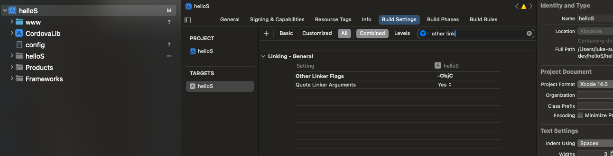
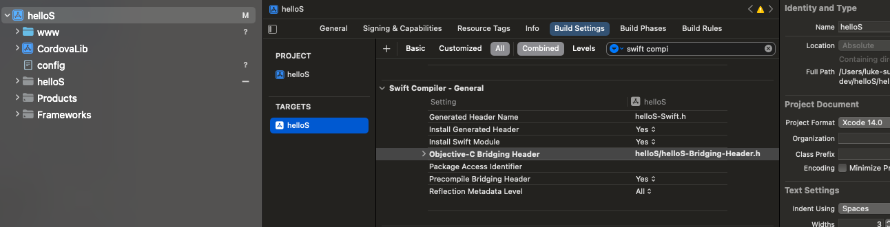

# 基于原生 IOS 工程集成 cordova

主要是基于[官网](https://cordova.apache.org/docs/en/12.x/guide/platforms/ios/webview.html)进行集成

有两种方式，一种是基于Carthage，比较简单，但是有网络问题。第二种就是手工集成。这里主要总结一下第二种方式。

**第一步，安装好cordova，并创建好cordova工程，添加IOS依赖**
```
npm install -g cordova
cordova create hello

cd hello
cordova platform add ios
```
就在工程目录生成一个platforms/ios目录。

**第二步，基于XCODE创建一个工程**。这里可以选Swift，也可以选ObjectC，如果选Swift，模版不要选SwiftUI，
因为Cordova封装的UI是基于Controller模式的。

**第三步，将 platforms/ios 目录下的如下文件拷贝到IOS工程的根目录**
- xcode最好先退出
- Copy the config.xml file described above into the project directory，
Choose "Create groups for any added folders" and press Finish.
- Use the Finder to copy the CordovaLib, add CordovaLib.xcodeproj into the Project
- 拷贝www目录，只需要在工程里添加reference即可(Create folder references for any added folders.
)。

**第四步，添加**

select the Build Settings tab.



Add -force_load and -ObjC for the Other Linker Flags value.

这里-force_load不是必须的。


**第五步添加构建依赖**

select the Build Phases tab.

Expand Link Binaries with Libraries.


Target Dependencies:
```
CordovaLib
```

Link Binaries with Libraries:
```
AssetsLibrary.framework
CoreLocation.framework
CoreGraphics.framework
MobileCoreServices.framework
libCordova.a
```

**第六步, Header Search Paths**


```
"$(TARGET_BUILD_DIR)/usr/local/lib/include"
"$(OBJROOT)/UninstalledProducts/include"
"$(OBJROOT)/UninstalledProducts/$(PLATFORM_NAME)/include"
"$(BUILT_PRODUCTS_DIR)"
```

<br>

## 注意
swift需要配置bridging header,用于swfit调用objectc,因为cordova是基于objectc的：



bridging header内容如下：
```c
#import <UIKit/UIkit.h>
#import <Cordova/CDVViewController.h>
#import <Cordova/CDVPlugin.h>
#import <Cordova/CDVCommandQueue.h>

@interface CordovaViewController: CDVViewController
```
实际就是C的header文件，封装一下。

**测试运行**
```swift
import UIKit
 
class ViewController: CDVViewController {
 
    override func viewDidLoad() {
        super.viewDidLoad()
    }
 
    override func didReceiveMemoryWarning() {
        super.didReceiveMemoryWarning()
    }
}
```

<br>

## reference
- https://cordova.apache.org/docs/en/12.x/guide/platforms/ios/webview.html
- https://www.hangge.com/blog/cache/detail_1155.html
- https://blog.csdn.net/nogodoss2018/article/details/128351554?share_token=5b00768e-6a07-4633-bece-ba8c623d9a64&tt_from=copy_link&utm_campaign=client_share&utm_medium=toutiao_android&utm_source=copy_link%20-%20Swift%20%E4%BB%8E%E9%9B%B6%E9%9B%86%E6%88%90Cordova%E6%A1%86%E6%9E%B6-CSDN%E5%8D%9A%E5%AE%A2%20-%20%E4%BB%8A%E6%97%A5%E5%A4%B4%E6%9D%A1
- https://www.jianshu.com/p/32b1ad8f07e0