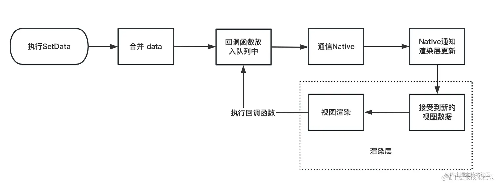

# setData
setData 是一个用于更新小程序页面数据的方法，使用的时候传入一个对象作为参数，更改数据的同时，小程序会把数据同步通信到渲染层，实现了页面的动态更新。
```js
setData(object, callback)
```
callback在渲染视图完毕后执行，执行的时候状态已经更新，并且视图已经渲染完毕。

## setData 传递数据注意事项
在 setData 中并不是所有的数据类型都能通过视图层传递给渲染层。
```js 
this.setData({
    message:{
        name:'大前端跨端开发指南',
        fn:()=>{},
        setProps:new Set()
    }
})
//wxml 
<children message="{{ message }}"  />
```
如上我们将 message 属性传递给 children 组件，message 属性中有一个函数 fn 和一个特殊的数据类型 Set setProps。子组件中，正常情况下是拿不到函数 fn 和 setProps （除非个别小程序对数据进行特殊的处理）。

本质原因在于，小程序采用的是双线程架构，当通过 setData 将数据通过逻辑层传递到渲染层的时候，底层实现是使用了 JSON 序列化和反序列化的方式来更新数据，而函数不是合法的 JSON 数据类型，无法被正确处理，而 set 会被处理成对象结构。

## 一次 setData 主要做了哪些事情：
- 首先在 Component 或者 Page 实例上合并 data；
- 然后把参数 callback 放到回调函数队列 queue；
- 接下来发起数据通信，把数据通过桥的方式，由逻辑层 -> Native -> 渲染层，完成视图层更新；
- 最后执行对应的 callback 函数，完成整个 setData 流程。



受到小程序双线程通信架构的影响，从 setData 原理上，我们能明确出一次 setData 到视图的改变，是由业务逻辑层 -> 宿主 Native -> 视图渲染层。相比于单纯的 H5 应用可以直接通过 DOM api 去改变视图，小程序的这种方式会让数据流程更加复杂。因此，小程序的架构设计决定了 setData 是性能瓶颈。
setData 的频与量：频繁使用 setData，或者 setData 大量的数据都会造成性能问题。

所以，我们应该：
- 控制 setData 的数据量。比如只set需要改变的数据，对数据进行预处理等等。
- 控制 setData 的频率。比如可以合并数据，使用节流防抖函数等。
- 先set优先级高的数据。