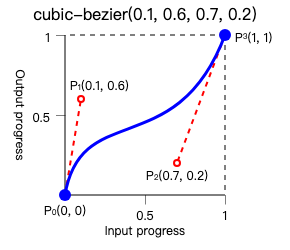

# 为什么要使用贝塞尔曲线
在 CSS 动画中使用贝塞尔曲线（Cubic Bézier Curve）的核心原因是通过**控制动画的速度变化节奏**，使动画更符合真实世界的物理规律和视觉预期。以下是具体原因拆解：

---

### 1. **模拟自然运动**
   - **机械感 vs 自然感**：线性动画（`linear`）的速度恒定，但现实中物体运动往往有加速/减速（如抛物体、弹簧）。贝塞尔曲线可以通过调整速度曲线（如 `ease-in-out`）让元素呈现「先加速后减速」的拟真效果。
   - **示例**：一个弹跳的小球，下落时加速（`ease-in`），触地反弹时减速（`ease-out`）。

---

### 2. **精确控制动画节奏**
   - **预设曲线**：CSS 提供预定义曲线（如 `ease`、`ease-in`、`ease-out`），但通过自定义 `cubic-bezier(n,n,n,n)` 可以精细调整动画的「加速度」和「减速度」。
   - **代码示例**：
     ```css
     .box {
       transition: transform 0.5s cubic-bezier(0.68, -0.55, 0.27, 1.55);
     }
     ```
     这个曲线会让元素先快速回缩再弹射到目标位置，类似弹簧效果。

---

### 3. **提升用户体验（UX）**
   - **引导注意力**：适当的加速度可以吸引用户注意关键动作（如按钮点击后的反馈）。
   - **避免突兀感**：突然的开始/结束会让用户感到不适，贝塞尔曲线通过平滑过渡降低认知负担。

---

### 4. **性能优化**
   - **硬件加速**：CSS 动画配合贝塞尔曲线通常由 GPU 渲染，比 JavaScript 实现的动画更高效。
   - **帧率稳定**：合理的速度曲线可减少不必要的渲染计算，保持 60fps 流畅度。

---

### 5. **对比其他时序函数**
   - `steps()`：适合逐帧动画（如精灵动画），但不适合平滑过渡。
   - `linear`：适合机械化的进度条，但缺乏动态感。

---

### 贝塞尔曲线工作原理
贝塞尔曲线通过两个控制点（P1, P2）定义速度变化：
- **横轴**：时间（0 到 1）
- **纵轴**：动画进度（0 到 1）
- **曲线斜率**：表示瞬时速度（斜率越大速度越快）。



---

### 何时使用特定曲线？
- **进入动画**：`ease-out`（快速出现，缓慢结束）
- **退出动画**：`ease-in`（缓慢开始，快速消失）
- **复杂交互**：自定义 `cubic-bezier(0.25, 0.1, 0.25, 1)`（苹果风格的平滑动画）

---

### references
https://developer.mozilla.org/en-US/docs/Web/CSS/easing-function/cubic-bezier