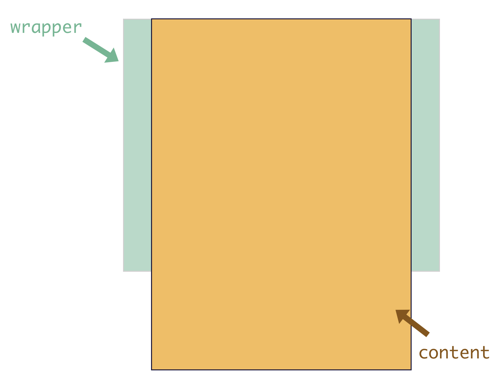

# 浏览器的滚动原理
我们先来看一下浏览器的滚动原理： 浏览器的滚动条大家都会遇到，当页面内容的高度超过视口高度的时候，会出现纵向滚动条；当页面内容的宽度超过视口宽度的时候，会出现横向滚动条。也就是当我们的视口展示不下内容的时候，会通过滚动条的方式让用户滚动屏幕看到剩余的内容。

我们可以使用
```css
overflow: scroll;
```
来实现超过视口高度的时候，出现滚动条。

overflow是基于是否超过padding box来决定行为。

BetterScroll 也是一样的原理:



绿色部分为 wrapper，也就是父容器，它会有固定的高度。黄色部分为 content，它是父容器的第一个子元素，它的高度会随着内容的大小而撑高。那么，当 content 的高度不超过父容器的高度，是不能滚动的，而它一旦超过了父容器的高度，我们就可以滚动内容区了，这就是 BetterScroll 的滚动原理。

## reference
https://better-scroll.github.io/docs/zh-CN/guide/