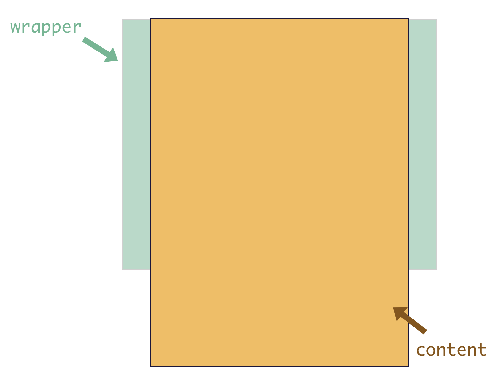

# 浏览器的滚动原理
我们先来看一下浏览器的滚动原理： 浏览器的滚动条大家都会遇到，当页面内容的高度超过视口高度的时候，会出现纵向滚动条；当页面内容的宽度超过视口宽度的时候，会出现横向滚动条。也就是当我们的视口展示不下内容的时候，会通过滚动条的方式让用户滚动屏幕看到剩余的内容。

我们可以使用
```css
overflow: scroll;
```
来实现超过视口高度的时候，出现滚动条。

overflow是基于是否超过padding box来决定行为。

BetterScroll 也是一样的原理:

