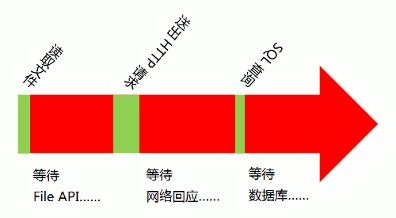
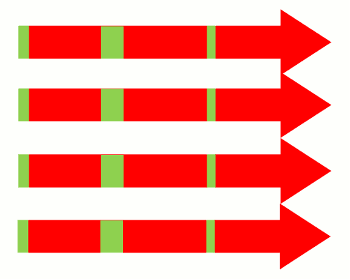
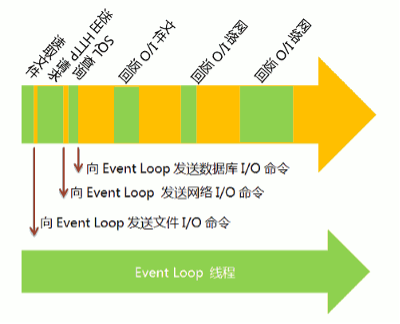
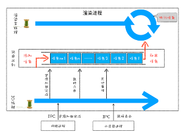

# Event Loop
以JavaScript语言为例，它是一种单线程语言，所有任务都在一个线程上完成。
一旦遇到大量任务或者遇到一个耗时的任务，网页就会出现"假死"，因为JavaScript停不下来，也就无法响应用户的行为。

如果某个任务很耗时，比如涉及很多I/O（输入/输出）操作，那么线程的运行大概是下面的样子。

上图的绿色部分是程序的运行时间，红色部分是等待时间。可以看到，由于I/O操作很慢，所以这个线程的大部分运行时间都在空等I/O操作的返回结果。这种运行方式称为"同步阻塞模式"。

如果采用多线程，同时运行多个任务，那很可能就是下面这样。

你也许会问，JavaScript为什么不实现为多线程？

这跟历史有关系。JavaScript从诞生起就是单线程。
原因大概是不想让浏览器变得太复杂，因为多线程需要共享资源、且有可能修改彼此的运行结果，对于一种网页脚本语言来说，这就太复杂了。
后来就约定俗成，JavaScript为一种单线程语言。（Worker API可以实现多线程，但是JavaScript本身始终是单线程的。）

JavaScript采用的解决方案就是Event Loop.

Event Loop是一个程序结构，用于等待和发送消息或事件 (a programming construct that waits for and dispatches events or messages in a program.)"

简单说，就是在程序中设置两个线程：一个负责程序本身的运行，称为"主线程"；
另一个负责主线程与其他进程（主要是各种I/O操作）的通信，被称为"Event Loop线程"（可以译为"消息线程"）。

上图主线程的绿色部分，还是表示运行时间，而橙色部分表示空闲时间。
每当遇到I/O的时候，主线程就让Event Loop线程去通知相应的I/O程序，然后接着往后运行，所以不存在红色的等待时间。
等到I/O程序完成操作，Event Loop线程再把结果返回主线程。主线程就调用事先设定的回调函数，完成整个任务。

由于多出了橙色的空闲时间，所以主线程得以运行更多的任务，这就提高了效率。
这种运行方式称为"异步模式"（asynchronous I/O）或"非阻塞模式"（non-blocking mode）。

这正是JavaScript语言的运行方式。单线程模型虽然对JavaScript构成了很大的限制，但也因此使它具备了其他语言不具备的优势。
如果部署得好，JavaScript程序是不会出现堵塞的，这就是为什么node.js平台可以用很少的资源，应付大流量访问的原因。

 

## 浏览器的事件循环

浏览器页面是通过事件循环机制来驱动的，每个渲染进程都有一个消息队列，页面主线程按照顺序来执行消息队列中的事件，如执行 JavaScript 事件、解析 DOM 事件、计算布局事件、用户输入事件等等，如果页面有新的事件产生，那新的事件将会追加到事件队列的尾部。 

所以可以说是消息队列和主线程循环机制保证了页面有条不紊地运行。

这里还需要补充一点，那就是当循环系统在执行一个任务的时候，都要为这个任务维护一个系统调用栈。
这个系统调用栈类似于 JavaScript 的调用栈，只不过系统调用栈是 Chromium 的开发语言 C++ 来维护的。