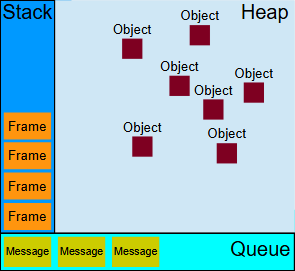

# 并发模型
JavaScript 有一个基于事件循环的并发模型，事件循环负责执行代码、收集和处理事件以及执行队列中的子任务。这个模型与其他语言中的模型截然不同，比如 C 和 Java。



---

## 栈
函数调用形成了一个由若干帧组成的栈。
```js
function foo(b) {
  let a = 10;
  return a + b + 11;
}

function bar(x) {
  let y = 3;
  return foo(x * y);
}

console.log(bar(7)); // 返回 42
```
- 当调用 bar 时，第一个帧被创建并压入栈中，帧中包含了 bar 的参数和局部变量。
- 当 bar 调用 foo 时，第二个帧被创建并被压入栈中，放在第一个帧之上，帧中包含 foo 的参数和局部变量。
- 当 foo 执行完毕然后返回时，第二个帧就被弹出栈（剩下 bar 函数的调用帧）。
- 当 bar 也执行完毕然后返回时，第一个帧也被弹出，栈就被清空了。

---

## 堆
对象被分配在堆中，堆是一个用来表示一大块（通常是非结构化的）内存区域的计算机术语。你new出来的类就是在堆上分配。

---

## 队列
一个 JavaScript 运行时包含了一个待处理消息的消息队列。每一个消息都关联着一个用以处理这个消息的回调函数。

在事件循环期间的某个时刻，运行时会从最先进入队列的消息开始处理队列中的消息。被处理的消息会被移出队列，并作为输入参数来调用与之关联的函数。正如前面所提到的，调用一个函数总是会为其创造一个新的栈帧。

函数的处理会一直进行到执行栈再次为空为止；然后事件循环将会处理队列中的下一个消息（如果还有的话）。

---

## 事件循环
之所以称之为 事件循环，是因为它经常按照类似如下的方式来被实现：

```js
while (queue.waitForMessage()) {
  queue.processNextMessage();
}
```
queue.waitForMessage() 会同步地等待消息到达 (如果当前没有任何消息等待被处理)。


## "执行至完成"
每一个消息完整地执行后，其他消息才会被执行。这为程序的分析提供了一些优秀的特性，包括：
当一个函数执行时，它不会被抢占，只有在它运行完毕之后才会去运行任何其他的代码，才能修改这个函数操作的数据。这与 C 语言不同，例如，如果函数在线程中运行，它可能在任何位置被终止，然后在另一个线程中运行其他代码。

这个模型的一个缺点在于当一个消息需要太长时间才能处理完毕时，Web 应用程序就无法处理与用户的交互，例如点击或滚动。为了缓解这个问题，浏览器一般会弹出一个“这个脚本运行时间过长”的对话框。一个良好的习惯是缩短单个消息处理时间，并在可能的情况下将一个消息裁剪成多个消息。

---

## reference
https://developer.mozilla.org/zh-CN/docs/Web/JavaScript/Event_loop