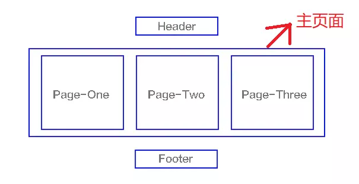

# SPA
SPA（single-page application），翻译过来就是单页应用SPA是一种网络应用程序或网站的模型，它通过动态重写当前页面来与用户交互，
这种方法避免了页面之间切换打断用户体验在单页应用中，所有必要的代码（HTML、JavaScript和CSS）都通过单个页面的加载而检索，
或者根据需要（通常是为响应用户操作）动态装载适当的资源并添加到页面页面在任何时间点都不会重新加载，也不会将控制转移到其他页面。
举个例子来讲就是一个杯子，早上装的牛奶，中午装的是开水，晚上装的是茶，我们发现，变的始终是杯子里的内容。



我们熟知的JS框架如 React, Vue, Angular 默认都属于SPA。

用户访问路由后，无论是什么 URL 地址，都直接渲染一个前端的入口文件 index.html，然后就会在 index.html 文件中加载 JS 和 CSS。
之后，JavaScript 获取当前的页面地址，以及当前路由匹配的组件，再去动态渲染当前页面即可。

## SPA VS MPA
多页应用MPA（MultiPage-page application），翻译过来就是多页应用在MPA中，每个页面都是一个主页面，都是独立的当我们在访问另一个页面的时候，都需要重新加载html、css、js文件

### 单页面应用（SPA）
- 一个主页面和多个页面片段
- 局部刷新
- SEO 难实现，可使用 SSR 方式改善
- 数据传递容易
- 页面切换速度快，用户体验良好
- 维护成本相对 MPA 较低

### 多页面应用（MPA）
- 多个主页面
- 整页刷新
- SEO 容易实现
- 通过url、cookie、localStorage等传递数据
- 页面切换加载资源，速度慢，用户体验差
- 维护成本相对 SPA 较高

<br>

## SPA优缺点
### 优点：
- 具有桌面应用的即时性、网站的可移植性和可访问性；
- 用户体验好、快，内容的改变不需要重新加载整个页面；
- 良好的前后端分离，分工更明确。

### 缺点：
- 不利于搜索引擎的抓取, 可使用SSR进行改善，但不是所有场景都适合SSR；
- 首次渲染速度相对较慢。

<br>

## 前端路由原理
通过 URL 区分路由的机制上，有两种实现方式，一种是 hash 模式，通过 URL 中 # 后面的内容做区分，我们称之为 hash-router；
另外一个方式就是 history 模式，在这种方式下，路由看起来和正常的 URL 完全一致。

这两个不同的原理，在 vue-router 中对应两个函数，分别是 createWebHashHistory 和 createWebHistory。

### hash模式
```
http://www.xxx.com/#/login
```
通过对 hashchange 事件的监听，即监听了url变化，就可以在 fn 函数内部进行动态地页面切换。
```
window.addEventListener('hashchange',fn)
```

### history模式
2014 年之后，因为 HTML5 标准发布，浏览器多了两个 API：pushState 和 replaceState。
通过这两个 API ，我们可以改变 URL 地址，并且浏览器不会向后端发送请求，我们就能用另外一种方式实现前端路由。

下面的代码中，我们监听了 popstate 事件，可以监听到通过 pushState 修改路由的变化。并且在 fn 函数中，我们实现了页面的更新操作。
```
window.addEventListener('popstate', fn)
```
几个重要API:
```
history.pushState 浏览器历史纪录添加记录
history.replaceState 修改浏览器历史纪录中当前纪录
history.popState 当 history 发生变化时触发
```

example:
```
window.addEventListener("popstate", (event) => {
  console.log(
    `location: ${document.location}, state: ${JSON.stringify(event.state)}`,
  );
});
history.pushState({ page: 1 }, "title 1", "?page=1");
history.pushState({ page: 2 }, "title 2", "?page=2");
history.replaceState({ page: 3 }, "title 3", "?page=3");
history.back(); // Logs "location: http://example.com/example.html?page=1, state: {"page":1}"
history.back(); // Logs "location: http://example.com/example.html, state: null"
history.go(2); // Logs "location: http://example.com/example.html?page=3, state: {"page":3}"
```