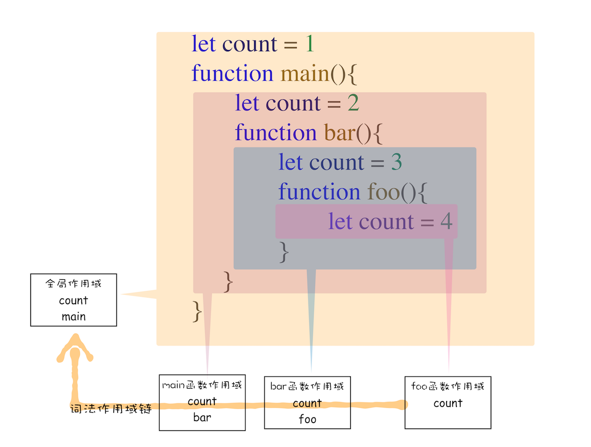

# JavaScript的作用域链
## 作用域链例子
查看scopechain.js
```
function bar() {
    console.log(myName)
}
function foo() {
    var myName = "jole luo"
    bar()
}
var myName = "luoji"
foo()
```
执行结果是:luoji, 这与我们的直是不符的
(当然，如果使用let或者const定义myName,作用域就决定了只会是外面的，这也是为什么不要使用var的原因之一)。

其实，在每个执行上下文的变量环境中，都包含了一个外部引用，用来指向外部的执行上下文，我们把这个外部引用称为 outer。

比如上面那段代码在查找 myName 变量时，如果在当前的变量环境中没有查找到，
那么 JavaScript 引擎会继续在 outer 所指向的执行上下文中查找。
而bar()函数 outer 所指的上下文并不是foo(),而是全局，于是找到了 myName = "luoji"

### 作用域链定义
bar 函数和 foo 函数的 outer 都是指向全局上下文的，这也就意味着如果在 bar 函数或者 foo 函数中使用了外部变量，
那么 JavaScript 引擎会去全局执行上下文中查找。我们把这个查找的链条就称为作用域链。

### 为什么bar()函数 outer 所指的上下文并不是foo(),而是全局 ？
### 词法作用域
词法作用域就是指作用域是由代码中函数声明的位置来决定的，所以词法作用域是静态的作用域，
通过它就能够预测代码在执行过程中如何查找标识符。



关键就在于，词法作用域是函数声明就决定的，
前面scopechain.js的代码里，foo 和 bar 的上级作用域都是全局作用域，所以如果 foo 或者 bar 函数使用了一个它们没有定义的变量，
那么它们会到全局作用域去查找。也就是说，词法作用域是代码编译阶段就决定好的，和函数是怎么调用的没有关系。

## 块级作用域
查看demo blockscope.js

因为bar的outer指向全局,根据上面词法作用域的的分析，test最终会输出1;

另一方面，ES6 是支持块级作用域的，当执行到代码块时，如果代码块中有 let 或者 const 声明的变量，那么变量就会存放到该函数的词法环境中。
因此输出为：Chrome浏览器。
