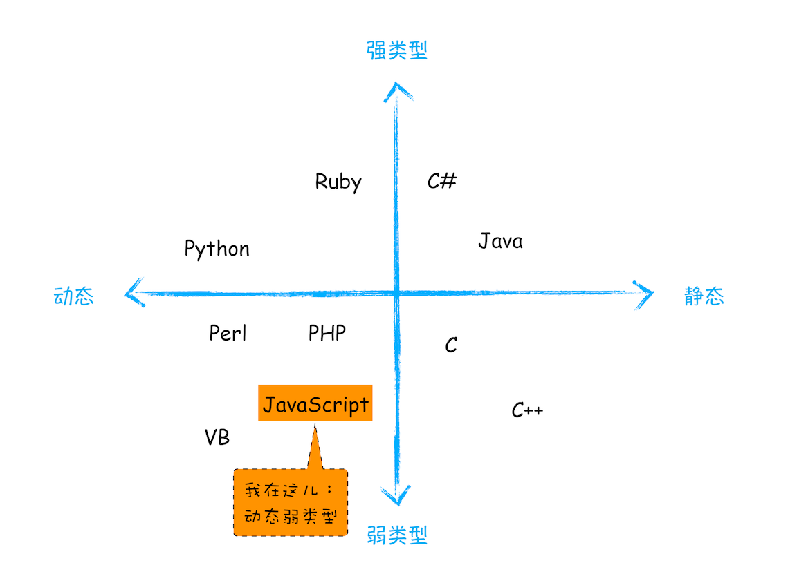
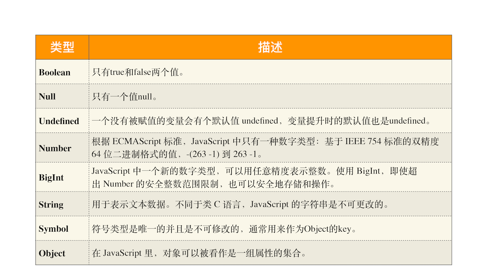
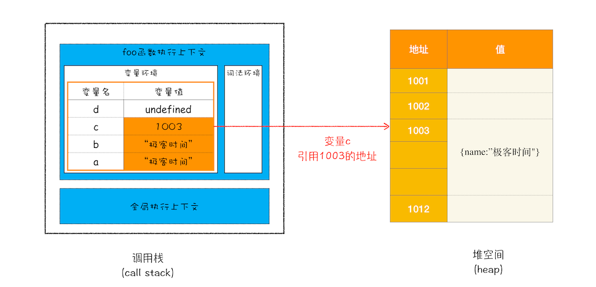

# js basic
### JavaScript是一个弱类型的动态语言
- 弱类型，意味着你不需要告诉 JavaScript 引擎这个或那个变量是什么数据类型，JavaScript 引擎在运行代码的时候自己会计算出来。
- 动态，意味着你可以使用同一个变量保存不同类型的数据。



### JavaScript 中的数据类型一种有 8 种


需要注意以下几点：
- 使用 typeof 检测 Null 类型时，返回的是 Object。这是当初 JavaScript 语言的一个 Bug，一直保留至今，之所以一直没修改过来，主要是为了兼容老的代码。
- Object 类型比较特殊，它是由上述 7 种类型组成的一个包含了 key-value 对的数据类型。
- 我们把前面的 7 种数据类型称为原始类型，把最后一个对象类型（Object）称为引用类型，之所以把它们区分为两种不同的类型，是因为它们在内存中存放的位置不一样。

### JavaScript的内存空间
在 JavaScript 的执行过程中， 主要有三种类型内存空间，分别是代码空间、栈空间和堆空间。
```
function foo(){
    var a = "极客时间"
    var b = a
    var c = {name:"极客时间"}
    var d = c
}
foo()
```

你应该知道了：原始类型的数据值都是直接保存在“栈”中的，引用类型的值是存放在“堆”中的。

通常情况下，栈空间都不会设置太大，主要用来存放一些原始类型的小数据。而引用类型的数据占用的空间都比较大，所以这一类数据会被存放到堆中，堆空间很大，能存放很多大的数据，不过缺点是分配内存和回收内存都会占用一定的时间。

## 1. == 和 === 的区别
- ==比较时不判断类型，比如 3=='3'会返回true
- ===比较先判断类型，再比较值，都相等才算相等

## 2. let 和 var 的区别
let 和 const 是ES6推荐使用的，var 不再推荐使用，
因为 var 定义在块内的变量也是全局，和全局重名就会有冲突：

- 通过var关键字声明的变量没有块作用域，在块{ }内声明的变量可以从块之外进行访问。
   通过let关键字声明的变量拥有块作用域，在块{ }内声明的变量无法从块外访问。
``` 
{ 
  var x = 10; 
}
// 此处可以使用 x

{ 
  let x = 10;
}
// 此处不可以使用 x
```
 
- 通过var关键字重新声明变量会带来问题，在块中声明变量也将重新声明块外的变量，覆盖块外的变量; 通过let关键字重新声明的变量不会重新声明块外的变量，会重新声明一个有块作用域的变量
```
var x = 10;
// 此处 x 为 10
{ 
  var x = 6;
  // 此处 x 为 6
}
// 此处 x 为 6

var x = 10;
// 此处 x 为 10
{ 
  let x = 6;
  // 此处 x 为 6
}
// 此处 x 为 10
```

## 3. NaN不应当用于比较
NaN is not equal to anything, even itself. Testing for equality or inequality against NaN will yield predictable results, but probably not the ones you want.
```
var a = NaN;

if (a === NaN) {  // Noncompliant; always false
  console.log("a is not a number");  // this is dead code
}
if (a !== NaN) { // Noncompliant; always true
  console.log("a is not NaN"); // this statement is not necessarily true
}
```
正确示例：
```
if (Number.isNaN(a)) {
  console.log("a is not a number");
}
if (!Number.isNaN(a)) {
  console.log("a is not NaN");
}
```

## 4. "undefined" should not be assigned
undefined is the value you get for variables and properties which have not yet been created. Use the same value to reset an existing variable and you lose the ability to distinguish between a variable that exists but has no value and a variable that does not yet exist. Instead, null should be used, allowing you to tell the difference between a property that has been reset and one that was never created.
<br>
坏味道：
```
var myObject = {};

// ...
myObject.fname = undefined;  // Noncompliant
// ...
if (myObject.fname == undefined) {
  // no real way of knowing the true state of myObject.fname
}
```
正确示例
```
var myObject = {};

// ...
myObject.fname = null;
// ...
```

## 5.  Jump statements should not occur in "finally" blocks
```
function foo() {
    try {
        return 1; // We expect 1 to be returned
    } catch(err) {
        return 2; // Or 2 in cases of error
    } finally {
        return 3; // Noncompliant: 3 is returned before 1, or 2, which we did not expect
    }
}
```

## 5. Promise rejections should not be caught by 'try' block
错误示例：
```
function runPromise() {
  return Promise.reject("rejection reason");
}

function foo() {
  try { // Noncompliant, the catch clause of the 'try' will not be executed for the code inside promise
    runPromise();
  } catch (e) {
    console.log("Failed to run promise", e);
  }
}
```
正确示例：
```
function foo() {
  runPromise().catch(e => console.log("Failed to run promise", e));
}

// or
async function foo() {
  try {
    await runPromise();
  } catch (e) {
    console.log("Failed to run promise", e);
  }
}
```

## 6. "await" should not be used redundantly
坏味道：
```
async function foo() {
  // ...
}

async function bar() {
  // ...
  return await foo(); // Noncompliant
}
```
正确示例：
```
async function foo() {
  // ...
}

async function bar() {
  // ...
  return foo();
}
```

## 7. Shorthand promises should be used
When a Promise needs to only "resolve" or "reject", it's more efficient and readable to use the methods specially created for such use cases: Promise.resolve(value) and Promise.reject(error).
坏味道：
```
let fulfilledPromise = new Promise(resolve => resolve(42));
let rejectedPromise = new Promise(function(resolve, reject) {
  reject('fail');
});
```
正确做法：
```
let fulfilledPromise = Promise.resolve(42);
let rejectedPromise = Promise.reject('fail');
```

## 8. this
this闭坑原则：
- 当函数作为对象的方法调用时，函数中的 this 就是该对象；
- 当函数被正常调用时，在严格模式下，this 值是 undefined，非严格模式下 this 指向的是全局对象 window；
- 嵌套函数中的 this 不会继承外层函数的 this 值
```
var myObj = {
  name : "luoji", 
  showThis: function(){
    console.log(this)
    function bar(){console.log(this)}
    bar()
  }
}
myObj.showThis()
```
上面代码会返回undefined

- 因为箭头函数没有自己的执行上下文，所以箭头函数的 this 就是它外层函数的 this。
```
var myObj = {
  name : "luoji", 
  showThis: function () {
    console.log(1, this)
    let bar = () => {
      console.log(this)
    }
    bar()
  }
}
myObj.showThis()
```