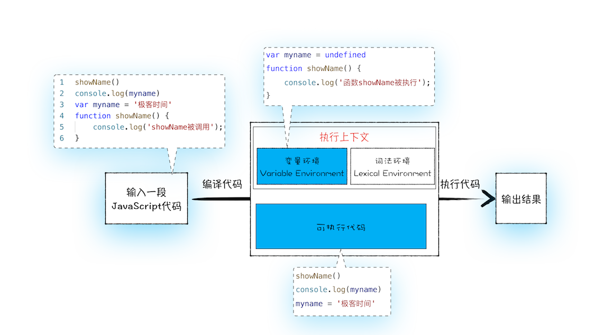

# JS执行顺序

## 案例
在浏览器中，或者通过node运行a.js和b.js
```
showName()
console.log(myname)
var myname = 'luoji'
function showName() {
    console.log('函数showName被执行');
}
```
a.js的结果为：
```
函数showName被执行
undefined
```
而b.js直接报错。

<br>

我们可以得出如下三个结论:
- 在执行过程中，若使用了未声明的变量，那么 JavaScript 执行会报错。
- 在一个变量定义之前使用它，不会出错，但是该变量的值会为 undefined，而不是定义时的值。
- 在一个函数定义之前使用它，不会出错，且函数能正确执行。

<br>

## 变量提升
所谓的变量提升，是指在 JavaScript 代码执行过程中，JavaScript 引擎把变量的声明部分和函数的声明部分提升到代码开头的“行为”。
变量被提升后，会给变量设置默认值，这个默认值就是我们熟悉的 undefined。

```
var myname = 'luoji'
```
可以看成两行
```
var myname    //声明部分
myname = 'luoji'  //赋值部分
```
再看看函数c.js：
```
if (typeof foo === "function") {
    foo()
}

if (typeof bar === "function") {
    bar()
}

function foo(){
    console.log('foo')
}

var bar = function() {
    console.log('bar')
}
```
- 第一个函数 foo 是一个完整的函数声明，也就是说没有涉及到赋值操作；
- 第二个函数是先声明变量 bar，再把function(){console.log('bar')}赋值给 bar
- 由于变量提升，只有foo会被打印

<br>

## JavaScript 代码的执行流程
实际上变量和函数声明在代码里的位置是不会改变的，而且是在编译阶段被 JavaScript 引擎放入内存中.
一段 JavaScript 代码在执行之前需要被 JavaScript 引擎编译，编译完成之后，才会进入执行阶段。

一个例子：
```
function showName() {
    console.log('luoji');
}
showName();
function showName() {
    console.log('zhazhayue);
}
showName(); 
```
- 首先是编译阶段。遇到了第一个 showName 函数，会将该函数体存放到变量环境中。接下来是第二个 showName 函数，继续存放至变量环境中，但是变量环境中已经存在一个 showName 函数了，此时，第二个 showName 函数会将第一个 showName 函数覆盖掉。这样变量环境中就只存在第二个 showName 函数了。
- 接下来是执行阶段。先执行第一个 showName 函数，但由于是从变量环境中查找 showName 函数，而变量环境中只保存了第二个 showName 函数，所以最终调用的是第二个函数，打印的内容是“zhazhayue”。第二次执行 showName 函数也是走同样的流程，所以输出的结果也是“zhazhayue”。

<br>

## 总结
- JavaScript 代码执行过程中，需要先做变量提升，而之所以需要实现变量提升，是因为 JavaScript 代码在执行之前需要先编译。
- 在编译阶段，变量和函数会被存放到变量环境中，变量的默认值会被设置为 undefined；在代码执行阶段，JavaScript 引擎会从变量环境中去查找自定义的变量和函数。
- 如果在编译阶段，存在两个相同的函数，那么最终存放在变量环境中的是最后定义的那个，这是因为后定义的会覆盖掉之前定义的。