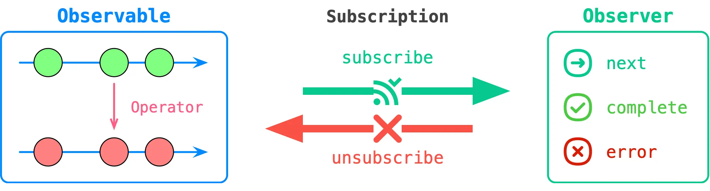

# RxJS
RxJS is a library for reactive programming using Observables, to make it easier to compose asynchronous or callback-based code. 

## install
```
npm install rxjs
```
另外可以安装插件rxjs-watcher：https://github.com/xripcsu/rxjs-watcher

A Simple devtools extension to visualize Rxjs observables.

<br>

## 通过demo理解RxJS核心概念

helloRxJS.js demo中涉及到了3个变量：

1. stream$, 对应到Rxjs中，就是一个observable，单纯从英文翻译到中文的含义来看，基本很难理解。但是它的本质其实就是一个随时间不断产生数据的一个集合，称之为流更容易理解。而其对象存在一个subscribe方法，调用该方法后，才会启动这个流（也就是数据才会开始产生），这里需要注意的是多次启动的每一个流都是独立的，互不干扰。

2. observer，代码中是stream$.subscribe(observer)，对应到Rxjs中，也是称之为observer，从英文翻译到中文的含义来看，也很难理解。从行为上来看，无非就是定义了如何处理上述流产生的数据，称之为流的处理方法，更容易理解

3. subscription，也就是const subscription = stream$.subscribe(observer);，这里对应到Rxjs，英文也是称之为subscription，翻译过来是订阅，也是比较难以理解，其实它的本质就是暂存了一个启动后的流，之前提到，每一个启动后的流都是相互独立的，而这个启动后的流，就存储在subscription中，提供了unsubscribe，来停止这个流。

简单理解了这三个名词observable, observer, subscription后，从数据的角度来思考：observable定义了要生成一个什么样的数据，其subscribe方法，接收一个observer（定义了接收到数据如何处理），并开始产生数据，该方法的返回值，subscription, 存储了这个已经开启的流（暂时没想到啥好的中文名），同事具有unscbscribe方法，可以将这个流停止。整理成下面这个公式：
```
Subscription = Observable.subscribe(observer)
observable: 随着时间产生的数据集合，可以理解为流，其subscribe方法可以启动该流
observer: 决定如何处理数据
subscription: 存储已经启动过的流，其unsubscribe方法可以停止该流
```



<br>

## Subject
Subject的行为和发布订阅模式非常接近，subscribe去订阅，next触发。事件的订阅通过subscribe，事件的触发使用next，从而实现一个发布订阅的模式。demo查看subject.js, 其它用法可参考官方文档。

<br>

## Operators
操作符是函数，操作符是能让你以声明方式轻松组合复杂异步代码的基本构造块。有两种操作符：

管道的操作符（Pipeable Operators）是可以使用语法 observableInstance.pipe(operator()) 联入 Observables 管道的类型。其中包括 filter(...) 和 mergeMap(...)。调用时，它们不会更改现有的 Observable 实例。
相反，它们返回一个新的 Observable，其订阅逻辑是基于第一个 Observable 的。
```
obs.pipe(op1(), op2(), op3(), op4());
```

创建操作符（Creation Operators）是另一种操作符，可以作为独立函数调用以创建新的 Observable。
例如： of(1, 2, 3) 创建一个 observable，它将一个接一个地发出 1、2 和 3。

demo参考operators.js

## 参考
- https://zhuanlan.zhihu.com/p/274469124
- https://juejin.cn/post/7018006694051446820
- https://juejin.cn/post/6976071705584205855
- https://rxjs.dev/
- https://rxjs.tech/guide/operators