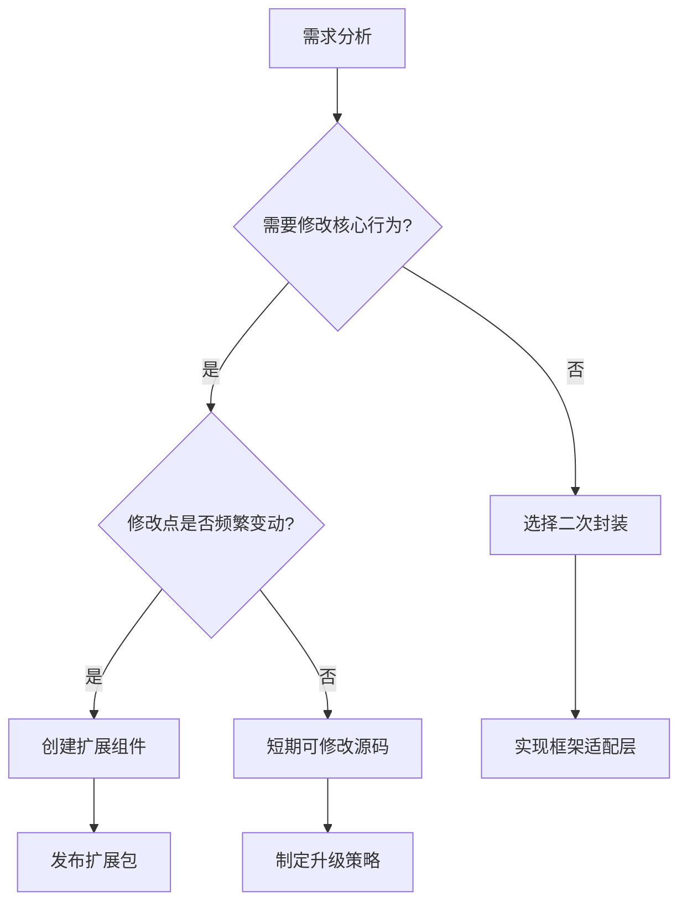

# 基于shoelace二次封装
基于 Shoelace 组件库封装一个与前端框架无关的组件库是完全可行的，以下是具体实现方案和最佳实践：

---

### **可行性分析**
Shoelace 的核心优势是**基于 Web Components 标准**构建，其组件天然具备框架无关性。这意味着：
1. 可被 React、Vue、Angular 等任何框架直接使用
2. 不依赖特定框架运行时
3. 生命周期独立于框架

---

### **实现方案**

#### **1. 核心层：直接使用 Shoelace（Web Components）**
- **安装依赖**
  ```bash
  npm install @shoelace-style/shoelace
  ```
- **独立使用示例**
  ```html
  <!DOCTYPE html>
  <script type="module" src="/node_modules/@shoelace-style/shoelace/dist/shoelace.js"></script>
  
  <sl-button variant="primary">原生按钮</sl-button>
  ```

#### **2. 适配层：为框架提供封装器（Wrapper）**
为不同框架提供轻量封装层，解决框架特有语法问题：

- **React 封装示例** (`components/SlButton.tsx`)
  ```tsx
  import { useRef, useEffect } from 'react';
  import type { SlButton } from '@shoelace-style/shoelace';

  export default function SlButton({ children, ...props }) {
    const ref = useRef<SlButton>(null);
    
    // 同步属性变化
    useEffect(() => {
      if (ref.current) {
        Object.entries(props).forEach(([key, val]) => {
          ref.current![key] = val;
        });
      }
    }, [props]);

    return (
      <sl-button ref={ref}>
        {children}
      </sl-button>
    );
  }
  ```

- **Vue 封装示例** (`components/SlButton.vue`)
  ```vue
  <script setup>
  import { ref, watch } from 'vue';
  const buttonRef = ref(null);

  watch(
    () => props,
    (val) => {
      Object.assign(buttonRef.value, val);
    },
    { deep: true }
  );
  </script>

  <template>
    <sl-button ref="buttonRef">
      <slot />
    </sl-button>
  </template>
  ```

#### **3. 工程化最佳实践**
- **项目结构**
  ```
  your-component-lib/
  ├── core/                 # Shoelace 直接导入
  ├── adapters/
  │   ├── react/            # React 封装层
  │   ├── vue/              # Vue 封装层
  │   └── angular/          # Angular 指令封装
  ├── styles/               # 统一主题定制
  └── docs/                 # 框架无关文档
  ```

- **主题定制方案**
  创建统一的 CSS 变量覆盖：
  ```css
  /* styles/theme.css */
  :root {
    --sl-primary-color: #3a86ff;
    --sl-border-radius-medium: 8px;
  }
  ```

- **类型支持**
  为每个封装组件导出 TypeScript 类型：
  ```ts
  // react/types.d.ts
  import type { SlButton } from '@shoelace-style/shoelace';
  
  export interface ButtonProps extends Partial<Omit<SlButton, 'children'>> {
    onClick?: (e: CustomEvent) => void;
  }
  ```

- **构建优化**
  使用 Vite 为不同封装层分别构建：
  ```js
  // vite.config.js
  export default {
    build: {
      lib: {
        entry: {
          react: 'src/adapters/react/index.ts',
          vue: 'src/adapters/vue/index.ts'
        },
        formats: ['es']
      }
    }
  }
  ```

---

### **关键挑战与解决方案**
1. **事件处理**
   - **问题：** Web Components 使用 `customEvent`
   - **方案：** 在封装器中转换事件
     ```jsx
     // React 封装示例中增加：
     useEffect(() => {
       ref.current?.addEventListener('click', (e) => props.onClick?.(e));
     }, []);
     ```

2. **插槽差异**
   - **React：** 使用 `children` prop
   - **Vue：** 使用 `<slot>` 语法
   - **统一方案：** 封装层透明传递子元素

3. **双向绑定**
   - **方案：** 实现监听器桥接
     ```vue
     <!-- Vue 封装 -->
     <sl-button 
       :ref="buttonRef"
       @sl-change="$emit('update:modelValue', $event.detail.value)"
     />
     ```

---

### **最佳实践建议**
1. **封装厚度原则**
   - 保持封装层 < 100 行代码/组件
   - 避免添加额外业务逻辑

2. **文档策略**
   - 核心文档：展示 Web Components 原生用法
   - 框架专区：提供 React/Vue 代码示例
   - 实时示例：用 Storybook 或 Docz 搭建

3. **版本管理**
   ```
   1.0.0          # 核心层版本
   react@1.0.0    # React 适配层
   vue@1.0.0      # Vue 适配层
   ```

4. **按需加载支持**
   ```js
   // 支持 tree-shaking 的导出方式
   export { default as SlButton } from './Button';
   export { default as SlInput } from './Input';
   ```

---

### **完整工作流示例**
```bash
# 使用组件
npm install your-lib-core
npm install your-lib-react

# React 中使用
import { SlButton, SlInput } from 'your-lib-react';

export default () => (
  <>
    <SlButton variant="primary">提交</SlButton>
    <SlInput label="姓名" />
  </>
);
```

---

### **验证方案**
1. **跨框架测试矩阵**
   ```mermaid
   graph TD
     A[测试用例] --> B(React 18)
     A --> C(Vue 3)
     A --> D(Angular 15)
     A --> E(原生HTML)
   ```

2. **Bundle 分析**
   - 确保封装层体积 < 原始组件 20%
   - 验证无重复依赖

---

通过此方案，你可构建一个真正的框架无关组件库：核心保持 Web Standards，为不同框架提供符合其生态习惯的轻量封装，同时享受 Shoelace 的设计系统优势。最终交付产物满足：
- ✅ 单组件多框架支持
- ✅ 无框架锁定
- ✅ 体积零开销
- ✅ 类型安全


---

## 二次封装和修改源码的方案对比
# 修改 Shoelace 源码 vs 二次封装：全面对比分析

直接修改 Shoelace 源码与采用二次封装方案各有优缺点，下面是详细对比：

## 修改 Shoelace 源码方案

### 实现方式
1. 克隆 Shoelace 仓库
2. 直接修改组件源代码
3. 构建自定义版本
4. 发布私有 npm 包

```bash
# 示例工作流
git clone https://github.com/shoelace-style/shoelace
cd shoelace
# 修改 src/components/button/button.ts
npm run build
npm publish --access=public
```

### ✅ 优点
1. **深度定制能力**
   - 可修改组件内部实现逻辑
   - 可调整底层 DOM 结构
   - 可重写样式计算逻辑

2. **性能优化**
   - 移除不需要的功能减小体积
   - 优化特定场景下的性能
   - 避免封装层的运行时开销

3. **无缝集成**
   - 保持原生 Web Components 特性
   - 不需要额外的适配层
   - 组件行为完全可控

4. **彻底的主题定制**
   - 直接修改设计系统中的变量
   - 重写内置样式规则
   - 创建完全自定义的设计语言

### ❌ 缺点
1. **维护噩梦**
   - 无法直接获取官方更新
   - 每次升级需手动合并冲突
   - 需维护完整的分支管理策略

2. **失去官方支持**
   - 无法使用官方文档和示例
   - 遇到问题需自行解决
   - 无法受益于社区贡献

3. **升级成本高**
   ```mermaid
   graph LR
     A[官方发布新版本] --> B[检查修改点]
     B --> C{有冲突?}
     C -->|是| D[手动解决冲突]
     C -->|否| E[合并更新]
     D --> F[测试所有修改]
     F --> G[发布新版本]
   ```

4. **生态隔离**
   - 无法使用 Shoelace 插件生态
   - 与其他库的兼容性需自行验证
   - 团队需掌握整个代码库

5. **法律风险**
   - 需仔细遵守 MIT 许可证要求
   - 修改后仍需保留版权声明
   - 分发时需提供修改说明

## 二次封装方案

### ✅ 优点
1. **可持续性**
   - 自动获取官方更新
   - 只需验证封装层兼容性
   - 保持与社区同步

2. **维护简单**
   - 封装层通常 < 100 行/组件
   - 问题隔离：90%的问题来自官方组件
   - 可使用官方文档和示例

3. **框架优化**
   ```jsx
   // React 封装示例
   function SlButton({ children, onClick, ...props }) {
     const ref = useRef();
     
     useEffect(() => {
       const handler = (e) => onClick?.(e.detail);
       ref.current.addEventListener('click', handler);
       return () => ref.current.removeEventListener('click', handler);
     }, [onClick]);
     
     return <sl-button ref={ref} {...props}>{children}</sl-button>;
   }
   ```

4. **渐进增强**
   - 可添加额外功能而不修改核心
   - 按需扩展组件能力
   - 保持核心组件纯净

5. **生态兼容**
   - 可使用所有 Shoelace 插件
   - 兼容官方主题系统
   - 受益于社区解决方案

### ❌ 缺点
1. **能力受限**
   - 无法修改组件内部逻辑
   - 受限于 Web Components 的 API 设计
   - 某些高级定制无法实现

2. **性能开销**
   - 额外的封装层（通常 <1KB/组件）
   - 属性/事件的代理转换
   - 框架层与 Web Components 的桥接成本

3. **复杂性转移**
   - 需处理框架特性差异
   - 要解决 React/Vue 的不同模式
   - 需实现框架特定的优化

## 关键决策因素对比

| 维度 | 修改源码 | 二次封装 |
|------|----------|----------|
| **长期维护** | ⚠️ 高成本 | ✅ 低成本 |
| **升级路径** | ⚠️ 手动合并 | ✅ 自动更新 |
| **定制深度** | ✅ 完全控制 | ⚠️ API 限制 |
| **性能** | ✅ 最优 | ⚠️ 轻微开销 |
| **学习曲线** | ⚠️ 需掌握整个代码库 | ✅ 仅需了解封装模式 |
| **团队协作** | ⚠️ 专属知识体系 | ✅ 标准模式 |
| **生态兼容** | ⚠️ 隔离 | ✅ 完整接入 |
| **法律合规** | ⚠️ 需谨慎处理 | ✅ 无风险 |

## 混合方案：扩展而非修改

推荐采用折中方案 - **创建扩展组件**：

```typescript
import { SlButton } from '@shoelace-style/shoelace';

// 通过类扩展而非修改源码
export class EnhancedButton extends SlButton {
  constructor() {
    super();
    // 添加自定义逻辑
    this.addEventListener('click', this._handleClick);
  }
  
  private _handleClick() {
    // 扩展功能
    this.dispatchEvent(new CustomEvent('enhanced-click'));
  }
}

// 注册自定义元素
customElements.define('enhanced-button', EnhancedButton);
```

### 混合方案优点
1. 保持与官方组件的兼容性
2. 可获取官方更新
3. 实现深度定制
4. 避免直接修改源码
5. 可作为独立包发布

## 推荐决策路径



## 结论

**推荐优先选择二次封装方案**，除非：
1. 有必须修改核心逻辑的特殊需求
2. 性能要求极其苛刻
3. 确定长期不需要升级版本
4. 有充足资源维护分支

对于大多数场景，二次封装方案：
- ✅ 更可持续
- ✅ 更易维护
- ✅ 风险更低
- ✅ 长期成本更小

若需要深度定制，采用**扩展组件**方案比直接修改源码更可取，它平衡了定制需求与可维护性。