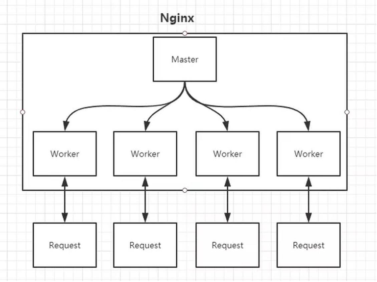
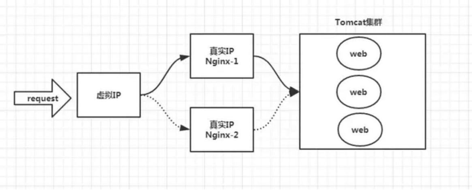

# nginx basic
nginx是一款轻量级的Web服务器、反向代理服务器，由于它的内存占用少，启动极快，高并发能力强，在互联网项目中广泛应用。

nginx有点入口网关的味道。

<br>

## nginx 的 Master-Worker 模式

启动nginx后，默认在80端口启动了Socket服务进行监听，如图所示，nginx涉及Master进程和Worker进程：



可以通过 ps -ef | grep nginx 查看其进程

### Master进程的作用是？
- 读取并验证配置文件nginx.conf；
- 管理worker进程；

### Worker进程的作用是？
每一个Worker进程都维护一个线程（避免线程切换），处理连接和请求；
注意，Worker进程的个数由配置文件决定，一般和CPU个数相关（有利于进程切换），配置几个就有几个Worker进程。

<br>

## nginx如何做到热部署？
所谓热部署，就是配置文件nginx.conf修改后，不需要重启nginx，不需要中断请求，就能让配置文件生效！

通过上文我们已经知道worker进程负责处理具体的请求，为达到热部署的效果，nginx的方案是：
修改配置文件nginx.conf后，重新生成新的worker进程，当然会以新的配置进行处理请求，而且新的请求必须都交给新的worker进程，至于老的worker进程，等把那些以前的请求处理完毕后，kill掉即可。

<br>

## nginx如何做到高并发下的高效处理？
nginx的worker进程个数与CPU绑定、worker进程内部包含一个线程高效回环处理请求，这的确有助于效率，但这是不够的。
作为专业的程序员，我们可以开一下脑洞：BIO/NIO/AIO、异步/同步、阻塞/非阻塞...

要同时处理那么多的请求，要知道，有的请求需要发生IO，可能需要很长时间，如果等着它，就会拖慢worker的处理速度。

nginx采用了Linux的epoll模型，epoll模型基于事件驱动机制，它可以监控多个事件是否准备完毕，如果OK，那么放入epoll队列中，这个过程是异步的。worker只需要从epoll队列循环处理即可。


## nginx挂了怎么办？
nginx既然作为入口网关，很重要，如果出现单点问题，显然是不可接受的。

答案是：Keepalived+nginx实现高可用。

Keepalived 是一个高可用解决方案，主要是用来防止服务器单点发生故障，可以通过和 nginx 配合来实现Web服务的高可用。（其实，Keepalived 不仅仅可以和nginx配合，还可以和很多其他服务配合）



Keepalived + nginx实现高可用的思路：
- 第一：请求不要直接打到 nginx 上，应该先通过 Keepalived（这就是所谓虚拟IP，VIP）
- 第二：Keepalived应该能监控nginx的生命状态（提供一个用户自定义的脚本，定期检查nginx进程状态，进行权重变化,，从而实现nginx故障切换）


## nginx.conf
模板：
```
#4核8g机器的nginx代理配置
#vim /usr/local/nginx/conf/nginx.conf
user  nginx;

#没有出现io性能问题，采用默认的1即可；非要设置，必须要和CPU的内核数8匹配
#worker_processes  1;
#worker_rlimit_nofile 102400;
error_log  /data0/log/nginx/error.log  notice;
pid        /data0/log/nginx/nginx.pid;

#配置影响nginx服务器或与用户的网络连接
events {
    use epoll;
    worker_connections  65535;
}

http {
    include mime.types;
    default_type application/octet-stream;
    log_format main '$remote_addr – $remote_user [$time_local] "$request" '
    '$status $body_bytes_sent "$http_referer" '
    '"$http_user_agent" "$http_x_forwarded_for"';
    access_log logs/access.log main;
    #client_max_body_size 50m;
    #client_body_buffer_size 256k;
    #client_header_timeout 120s;
    #client_body_timeout 120s;
    #send_timeout 1m;
    sendfile on;
    #tcp_nopush on;
    #keepalive_timeout 0;
    keepalive_timeout 65;

    #gZip配置
    #gzip on;
    #gzip_http_version 1.1;
    #gzip_comp_level 5;
    #gzip_min_length 1000;
    #gzip_types gzip_types text/csv text/xml text/css text/plain text/javascript application/javascript application/x-javascript application/json application/xml;

    #负载均衡服务器列表
    upstream data-server {
        server 127.0.0.1:8080;
    }
    upstream static-web-server {
        server 127.0.0.1:8888;
    }

    server {
        listen 80;
        # 可以在server_name配置二级域名
        server_name localhost;
        #charset koi8-r;
        #access_log logs/host.access.log main;

        # 在Server级别配置反向代理的参数
        proxy_redirect off ;
        proxy_set_header Host $host;
        proxy_set_header X-Real-IP $remote_addr;
        proxy_set_header REMOTE-HOST $remote_addr;
        proxy_set_header X-Forwarded-For $proxy_add_x_forwarded_for;
        
        # location写法：
        # (location =) > (location 完整路径) > (location ^~ 路径) > (location ~,~* 正则顺序) > (location 部分起始路径) > (/)
        # 以 = 开头，表示精确匹配；如只匹配根目录结尾的请求，后面不能带任何字符串。
        # 以^~ 开头，表示uri以某个常规字符串开头，不是正则匹配
        # 以~ 开头，表示区分大小写的正则匹配;
        # 以~* 开头，表示不区分大小写的正则匹配
        # 以/ 开头，通用匹配, 如果没有其它匹配,任何请求都会匹配到

        # 第一个必选规则
        # 直接匹配网站根，起始页码跳转到index.html，通过域名访问网站首页比较频繁，使用这个会加速处理
        # 这里是一个静态首页，也可以直接转发给后端应用服务器
        location = / {
            rewrite /index.html last;
            #proxy_pass http://static-web-server/index;
        }

        # 404错误页
        error_page  404              /404.html;

        # 50x错误页
        error_page  500 502 503 504  /50x.html;
        location = /50x.html {
            root   html;
        }

        # 第二个必选规则是处理静态文件请求，这是nginx作为http服务器的强项
        # 有两种配置模式，目录匹配或后缀匹配,任选其一或搭配使用
        # 目录匹配
        location ^~ /static/ {
            #proxy_set_header Host $host:8888; # 根据需要
            #proxy_pass http://static-web-server;
            root /root/static/;
        }
        # 后缀匹配
        #location ~* \.(gif|jpg|jpeg|png|css|js|ico)$ {
        #    root /root/res/;
        #}

        # 第三个必选规则
        # 默认反向代理到通用规则（动态请求）
        location / {
            # proxy_set_header Host $host:8888; # 根据需要
            proxy_pass http://static-web-server;
        }

        # 特殊页面 1
        location ~* (login|logout).html$ {
            # proxy_set_header Host $host:666; # 根据需要
            proxy_pass http://data-server;
        }

        # 特殊页面 2
        location ~* openid {
            # proxy_set_header Host $host:666; # 根据需要
            proxy_pass http://data-server;
        }

        # 通用数据接口以do或者json结尾的，反向代理到数据服务器
        location ~* .(do|json)$ {
            # proxy_set_header Host $host:666; # 根据需要
            proxy_pass http://data-server;
        }

        # 数据接口服务器
        location ~* (login|logout)$ {
            #proxy_set_header Host $host:666; # 根据需要
            proxy_pass http://data-server;
        }
    }
}
```
nginx能够提高速度的其中一个特性就是：动静分离，就是把静态资源放到nginx上，由nginx管理，动态请求转发给后端.

我们可以在nginx下把静态资源、日志文件归属到不同域名下（也即是目录），这样方便管理维护。

nginx可以进行IP访问控制，有些电商平台，就可以在nginx这一层，做一下处理，内置一个黑名单模块，那么就不必等请求通过nginx达到后端在进行拦截，而是直接在nginx这一层就处理掉。

proxy_pass 即实现了反向代理。root说明是静态资源，可以由nginx进行返回；而proxy_pass说明是动态请求，需要进行转发，比如代理到Tomcat上。

<br>

## 示例 

### 例1： 静态资源和反向代理
```
server {
    listen 8080; 
    server_name localhost; 
    location / { 
        root html; # nginx默认值 index index.html index.htm; 
    } # 静态化配置，所有静态请求都转发给 nginx 处理，存放目录为 my-project 
    location ~ .*\.(html|htm|gif|jpg|jpeg|bmp|png|ico|js|css)$ { 
        root /usr/local/var/www/my-project; # 静态请求所代理到的根目录 
    } # 动态请求匹配到path为'node'的就转发到8002端口处理 
    location /node/ { 
        proxy_pass http://localhost:8002; # 充当服务代理 
    } 
}
```
访问静态资源 nginx 服务器会返回 my-project 里面的文件，如获取 index.html： http://localhost:8080/index.html
而访问/node/，就会请求到8002端口去。

<br>

### 例2：负载均衡
```
upstream domain { 
    server localhost:8000; 
    server localhost:8001; 
} 

server { 
    listen 8080; 
    server_name localhost; 	
    location / { 
        # root html; # nginx默认值 
        # index index.html index.htm; 
        proxy_pass http://domain; # 负载均衡配置，请求会被平均分配到8000和8001端口 proxy_set_header Host $host:$server_port; 
    }
} 
```

<br>

### 例3：过滤
```
server { 
    listen 8080; 
    server_name localhost; 
    location / { 
        # IP访问限制（只允许IP是 10.81.1.11 的机器才能访问） 
        allow 10.81.1.11; 
        deny all; 
        root html; 
        index index.html index.htm; 
    } 
}
```
当你的项目没有灰度环境，又想在功能上线后先让测试同事试用一下的时候，就需要设置访问的白名单了。

<br>

### 例4：图片防盗链
```
server { 
    listen 8080; 
    server_name localhost; 
    location / { 
        root /usr/local/var/www/my-project; # 设置为个人项目的根目录路径 index index.html index.htm; 
    } 
    # 图片防盗链 
    location ~* \.(gif|jpg|jpeg|png|bmp|swf)$ { 
        valid_referers none blocked 192.168.0.103;#只允许本机IP外链引用 
        if ($invalid_referer){ 
            return 403; 
        } 
    } 
}
```
不允许别的网站以外链的方式进行引用图片，其他域名下的请求都会被403禁止访问。

<br>

### 例5：解决跨域
跨域是前端经常会遇到的问题，解决的方式有很多，例如：jsonp、node.js中转、CORS等。
但是使用 nginx 来跨域简单明了，主要用到的是 nginx 的反向代理原理。
```
server { 
    listen 8080; 
    server_name localhost; 
    location / { 
        # 跨域代理设置 
        proxy_pass http://www.proxy.com; 
        # 要实现跨域的域名 
        add_header Access-Control-Allow-Origin *; 
        add_header Access-Control-Allow-Methods 'GET, POST, OPTIONS'; add_header Access-Control-Allow-Headers 'DNT,X-Mx-ReqToken,Keep-Alive,User-Agent,X-Requested-With,If-Modified-Since,Cache-Control,Content-Type,Authorization'; 
    } 
}
```
思路就是在反向代理请求过程中，增加可以跨域访问的请求头。

<br>

### 例6：适配PC端和移动端
```
server {
    listen 8080;
    server_name localhost;
    location / {
        # 适配移动端/PC端配置
        set $type "pc";
        if ($http_user_agent ~* (mobile|nokia|iphone|ipad|android|samsung|htc|blackberry)) { 
        set $type "mobile"; 
    } 
    root /usr/local/var/www/my-project/$type; 
    # 根据设备类型选择设定根目录文件夹名（pc/mobile） 
    index index.html index.htm; 
    } 
}
```
主要思路也是通过判断浏览器的 useragent 来取对应的静态页面资源。如果我们的前端应用部署后是有服务的怎么办呢？那就不取对应的静态页面，而是 proxy_pass 代理到对应的页面路由上即可。

<br>

### 例7：开启gzip
```
http { 
    # 配置gzip压缩 
    gzip on;
    gzip_min_length 1000; # 设定压缩的临界点 
    gzip_comp_level 3; # 压缩级别 
    gzip_types text/plain application/xml; # 要压缩的文件类别 
}
```
能看到响应头带上了Content-Encoding: gzip 标识，就说明你配置的gzip压缩功能起效果了。

<br>

### 例8：合并请求
web前端性能优化中很重要的一条就是减少 http 请求数。而通过淘宝开发的 nginx-http-concat 第三方模块，我们可以实现多请求的合并。

配置好 nginx 的合并请求功能后，前端就可以用一种特殊的 url 请求规则（例如example.com/??1.js,2.js,3.js ）向 nginx 发起请求。此时，nginx 会将前端想要的多个资源请求合并成一个请求返回给前端，极大的减少了网络请求时间的开销。
```
server { 
    ...... 
    # 新增一个 location，static 为静态资源目录 
    location /static/ { 
        concat on; # 是否打开资源合并开关 
        concat_types application/javascript; # 允许合并的资源类型 
        concat_unique off; # 是否允许合并不同类型的资源 
        concat_max_files 20; # 允许合并的最大资源数目 
    } 
}
```

