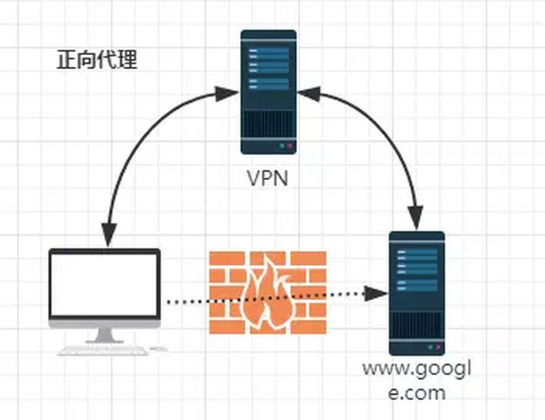
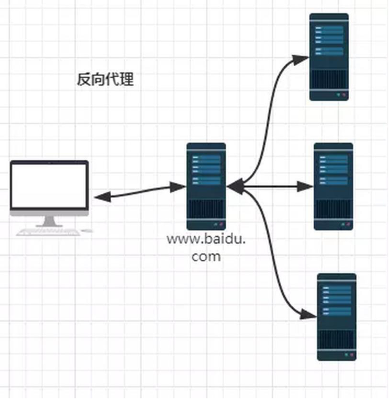

# 正向代理

由于防火墙的原因，我们并不能直接访问谷歌，那么我们可以借助VPN来实现，这就是一个简单的正向代理的例子。
这里你能够发现，正向代理“代理”的是客户端，而且客户端是知道目标的，而目标是不知道客户端是通过VPN访问的。

# 反向代理

当我们在外网访问百度的时候，其实会进行一个转发，代理到内网去，这就是所谓的反向代理，即反向代理“代理”的是服务器端，而且这一个过程对于客户端而言是透明的，即客户端不需要知道内网去了哪里处理，反正只知道访问了百度就行。

反向代理的作用:
1.	保障应用服务器的安全（增加一层代理，可以屏蔽危险攻击，更方便的控制权限）
2.	实现负载均衡
3.	实现跨域（号称是最简单的跨域方式）
