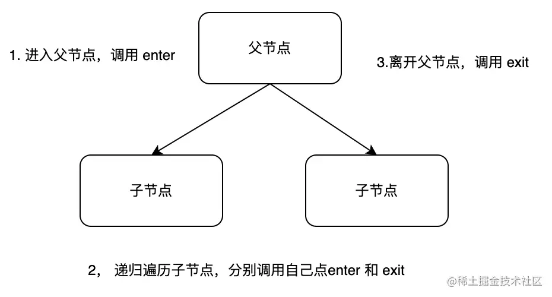

# AST
Babel uses an AST modified from ESTree; 
[estree](https://github.com/estree/estree/blob/master/es5.md) 就是 es 语法对应的标准 AST.
```
function square(n) {
  return n * n;
}
```
-> AST
```
{
  type: "FunctionDeclaration",
  id: {
    type: "Identifier",
    name: "square"
  },
  params: [{
    type: "Identifier",
    name: "n"
  }],
  body: {
    type: "BlockStatement",
    body: [{
      type: "ReturnStatement",
      argument: {
        type: "BinaryExpression",
        operator: "*",
        left: {
          type: "Identifier",
          name: "n"
        },
        right: {
          type: "Identifier",
          name: "n"
        }
      }
    }]
  }
}
```
You'll notice that each level of the AST has a similar structure.
```
{
  type: "FunctionDeclaration",
  id: {...},
  params: [...],
  body: {...}
}
```
Each of these are known as a Node. 
An AST can be made up of a single Node, or hundreds if not thousands of Nodes. 
Together they are able to describe the syntax of a program that can be used for static analysis.

<br>

##  Stages of Babel 
The three primary stages of Babel are parse, transform, generate.


### Parse
The parse stage, takes code and outputs an AST. 
There are two phases of parsing in Babel: Lexical Analysis and Syntactic Analysis.
```
parse(sourceCode) => AST
```


parse 阶段，主要通过 @babel/parser这个包进行转换，之前叫 babylon，是基于 acorn 实现的，扩展了很多语法，
可以支持 esnext（现在支持到 es2020）、jsx、flow、typescript 等语法的解析，其中 jsx、flow、typescript 这些非标准的语法的解析需要指定语法插件。
[demo](./src/parse.js)
```
node src/parse.js
```

<br>

### Transform
The transform stage takes an AST and traverses through it, adding, updating, and removing nodes as it goes along. 
This is where plugins operated.
```
transform(AST, BabelPlugins) => newAST 
```

transform 阶段主要是对上一步 parse 生成的 AST 进行深度优先遍历，从而对于匹配节点进行增删改查来修改树形结构。
在 babel 中会用所配置的 plugin 或 presets 对 AST 进行修改后，得到新的 AST.babel 插件大部分用于这个阶段。

babel 中通过 @babel/traverse 这个包来对 AST 进行遍历，找出需要修改的节点再进行转换，这个过程有点类似我们操作 DOM 树。
当我们谈及“进入”一个节点，实际上是说我们在访问它们， 之所以使用这样的术语是因为有一个访问者模式（visitor）的概念。
访问者 visitor 是一个用于 AST 遍历的跨语言的模式。 简单的说它就是一个对象，定义了用于在一个树状结构中获取具体节点的方法。
visitor 是一个由各种 type 或者是 enter 和 exit 组成的对象，完成某种类型节点的"进入"或"退出"两个步骤则为一次访问，
在其中可以定义在遍历 AST 的过程中匹配到某种类型的节点后该如何操作，目前支持的写法如下：
```
traverse(ast, {
  /* VisitNodeObject */
  enter(path, state) {},
  exit(path, state) {},
  /* [Type in t.Node["type"]] */
  Identifier(path, state) {}, // 进入 Identifier（标识符节点） 节点时调用
  StringLiteral: { // 进入 StringLiteral（字符串节点） 节点时调用
    enter(path, state) {}, // 进入该节点时的操作
    exit(path, state) {},  // 离开该节点时的操作
  },
  'FunctionDeclaration|VariableDeclaration'(path, state) {}, // // 进入 FunctionDeclaration 和 VariableDeclaration 节点时调用
})
```



<br>

### Generate
The code generation stage takes the final AST and turns it back into a string of code, 
also creating source maps.
```
generate(newAST) => newSourceCode 

```
在 babel 中通过 @babel/generator 包的 api 来实现。

[demo](./src/transform-generate.js)

<br>

## reference
https://github.com/jamiebuilds/babel-handbook/blob/master/translations/en/plugin-handbook.md#toc-asts