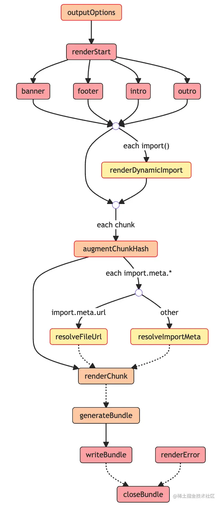

# rollup plugin
## 插件 Hook 类型
插件的各种 Hook 可以根据Build和Output两个构建阶段分为两类: Build Hook 与 Output Hook。

Build Hook即在Build阶段执行的钩子函数，在这个阶段主要进行模块代码的转换、AST 解析以及模块依赖的解析，
那么这个阶段的 Hook 对于代码的操作粒度一般为模块级别，也就是单文件级别。

Ouput Hook(官方称为Output Generation Hook)，则主要进行代码的打包，对于代码而言，
操作粒度一般为 chunk级别(一个 chunk 通常指很多文件打包到一起的产物)。

除了根据构建阶段可以将 Rollup 插件进行分类，根据不同的 Hook 执行方式也会有不同的分类，
主要包括Async、Sync、Parallel、Squential、First这五种。无论哪个 Hook 都离不开这五种执行方式。

1. Async & Sync

首先是Async和Sync钩子函数，两者其实是相对的，分别代表异步和同步的钩子函数，两者最大的区别在于同步钩子里面不能有异步逻辑，
而异步钩子可以有。

2. Parallel（并行的钩子函数）

如果有多个插件实现了这个钩子的逻辑，一旦有钩子函数是异步逻辑，则并发执行钩子函数，不会等待当前钩子完成(底层使用 Promise.all)。

比如对于Build阶段的buildStart钩子，它的执行时机其实是在构建刚开始的时候，各个插件可以在这个钩子当中做一些状态的初始化操作，
但其实插件之间的操作并不是相互依赖的，也就是可以并发执行，从而提升构建性能。
反之，对于需要依赖其他插件处理结果的情况就不适合用 Parallel 钩子了，比如 transform。

3. Sequential（串行的钩子函数）

这种 Hook 往往适用于插件间处理结果相互依赖的情况，
前一个插件 Hook 的返回值作为后续插件的入参，这种情况就需要等待前一个插件执行完 Hook，获得其执行结果，
然后才能进行下一个插件相应 Hook 的调用，如transform。

4. First

如果有多个插件实现了这个 Hook，那么 Hook 将依次运行，直到返回一个非 null 或非 undefined 的值为止。
比较典型的 Hook 是 resolveId，一旦有插件的 resolveId 返回了一个路径，将停止执行后续插件的 resolveId 逻辑。

刚刚我们介绍了 Rollup 当中不同插件 Hook 的类型，实际上不同的类型是可以叠加的，
Async/Sync 可以搭配后面三种类型中的任意一种，比如一个 Hook既可以是 Async 也可以是 First 类型。

<br>

## Build 阶段插件工作流程


1. 首先经历 <strong>options 钩子进行配置的转换</strong>，得到处理后的配置对象。

2. 随之 Rollup 会调用buildStart钩子，正式开始构建流程。

3. Rollup 先进入到 <strong>resolveId 钩子中解析文件路径</strong>。(从 input 配置指定的入口文件开始)。

4. Rollup 通过调用<strong>load钩子加载模块内容</strong>。

5. 紧接着 Rollup 执行所有的 <strong>transform 钩子来对模块内容进行进行自定义的转换</strong>，比如 babel 转译。

6. 现在 Rollup 拿到最后的模块内容，进行 AST 分析，得到所有的 import 内容，调用 moduleParsed 钩子:
- 6.1 如果是普通的 import，则执行 resolveId 钩子，继续回到步骤3。
- 6.2 如果是动态 import，则执行 resolveDynamicImport 钩子解析路径，如果解析成功，则回到步骤4加载模块，否则回到步骤3通过 resolveId 解析路径。

7. 直到所有的 import 都解析完毕，Rollup 执行buildEnd钩子，Build 阶段结束。

当然，在 Rollup 解析路径的时候，即执行resolveId或者resolveDynamicImport的时候，
有些路径可能会被标记为external(翻译为排除)，也就是说不参加 Rollup 打包过程，
这个时候就不会进行load、transform等等后续的处理了。

在流程图最上面，不知道大家有没有注意到watchChange和closeWatcher这两个 Hook，这里其实是对应了 rollup 的watch模式。
当你使用 rollup --watch 指令或者在配置文件配有watch: true的属性时，代表开启了 Rollup 的watch打包模式，
这个时候 Rollup 内部会初始化一个 watcher 对象，当文件内容发生变化时，watcher 对象会自动触发watchChange钩子执行并对项目进行重新构建。
在当前打包过程结束时，Rollup 会自动清除 watcher 对象调用closeWacher钩子。

<br>

## Output 阶段工作流



1. 执行所有插件的 outputOptions 钩子函数，对 output 配置进行转换。

2. 执行 renderStart，并发执行 renderStart 钩子，正式开始打包。

3. 并发执行所有插件的banner、footer、intro、outro 钩子(底层用 Promise.all 包裹所有的这四种钩子函数)，
这四个钩子功能很简单，就是往打包产物的固定位置(比如头部和尾部)插入一些自定义的内容，比如协议声明内容、项目介绍等等。

4. 从入口模块开始扫描，针对动态 import 语句执行 renderDynamicImport钩子，来自定义动态 import 的内容。

5. 对每个即将生成的 chunk，执行 augmentChunkHash钩子，来决定是否更改 chunk 的哈希值，
在 watch 模式下即可能会多次打包的场景下，这个钩子会比较适用。

6.如果没有遇到 import.meta 语句，则进入下一步，否则:
- 6.1 对于 import.meta.url 语句调用 resolveFileUrl 来自定义 url 解析逻辑
- 6.2 对于其他import.meta 属性，则调用 resolveImportMeta 来进行自定义的解析。

7. 接着 Rollup 会生成所有 chunk 的内容，针对每个 chunk 会依次调用插件的renderChunk方法进行自定义操作，
也就是说，在这里时候你可以直接操作打包产物了。

8. 随后会调用 generateBundle 钩子，这个钩子的入参里面会包含所有的打包产物信息，包括 chunk (打包后的代码)、asset(最终的静态资源文件)。
你可以在这里删除一些 chunk 或者 asset，最终这些内容将不会作为产物输出。

rollup.rollup方法会返回一个bundle对象，这个对象是包含generate和write两个方法，
两个方法唯一的区别在于后者会将代码写入到磁盘中，同时会触发writeBundle钩子，传入所有的打包产物信息，
包括 chunk 和 asset，和 generateBundle钩子非常相似。
不过值得注意的是，这个钩子执行的时候，产物已经输出了，而 generateBundle 执行的时候产物还并没有输出

<br>

## 插件源码学习
1. alias插件的代码简化后如下:
```
export default alias(options) {
  // 获取 entries 配置
  const entries = getEntries(options);
  return {
    // resolveId 钩子一般用来解析模块路径，为Async + First类型即异步优先的钩子。
    // 传入三个参数，当前模块路径、引用当前模块的模块路径、其余参数
    resolveId(importee, importer, resolveOptions) {
      // 先检查能不能匹配别名规则, importee比如 index.js中 import的 module-a
      const matchedEntry = entries.find((entry) => matches(entry.find, importee));
      // 如果不能匹配替换规则，或者当前模块是入口模块，则不会继续后面的别名替换流程
      if (!matchedEntry || !importerId) {
        // return null 后，当前的模块路径会交给下一个插件处理
        return null;
      }
      // 正式替换路径
      const updatedId = normalizeId(
        importee.replace(matchedEntry.find, matchedEntry.replacement)
      );
      // 每个插件执行时都会绑定一个上下文对象作为 this
      // 这里的 this.resolve 会执行所有插件(除当前插件外)的 resolveId 钩子
      return this.resolve(
        updatedId,
        importer,
        Object.assign({ skipSelf: true }, resolveOptions)
      ).then((resolved) => {
        // 替换后的路径即 updateId 会经过别的插件进行处理
        let finalResult: PartialResolvedId | null = resolved;
        if (!finalResult) {
          // 如果其它插件没有处理这个路径，则直接返回 updateId
          finalResult = { id: updatedId };
        }
        return finalResult;
      });
    }
  }
}
```
resolveId 主要作用是帮助 Rollup 确定如何处理和查找模块。当 Rollup 遇到一个 import 或 require 语句时，它需要知道从哪里加载这个模块。resolveId 钩子允许插件自定义这个过程。

从上面例子可以看到 resolveId 钩子函数的一些常用使用方式，它的入参分别是当前模块路径、引用当前模块的模块路径、解析参数，返回值可以是 null、string 或者一个对象，我们分情况讨论。

- 返回值为 null 时，会默认交给下一个插件的 resolveId 钩子处理。
- 返回值为 string 时，则停止后续插件的处理。这里为了让替换后的路径能被其他插件处理，特意调用了 this.resolve 来交给其它插件处理，否则将不会进入到其它插件的处理。
- 返回值为一个对象时，也会停止后续插件的处理，不过这个对象就可以包含更多的信息了，包括解析后的路径、是否被 enternal、是否需要 tree-shaking 等等，不过大部分情况下返回一个 string 就够用了。


2. load 为Async + First类型，即异步优先的钩子，和resolveId类似。

它的作用是通过 resolveId 解析后的路径来加载模块内容，例如image插件：
```
const mimeTypes = {
  '.jpg': 'image/jpeg',
  // 后面图片类型省略
};

export default function image(opts = {}) {
  const options = Object.assign({}, defaults, opts);
  return {
    name: 'image',
    load(id) {
      const mime = mimeTypes[extname(id)];
      if (!mime) {
        // 如果不是图片类型，返回 null，交给下一个插件处理
        return null;
      }
      // 加载图片具体内容
      const isSvg = mime === mimeTypes['.svg'];
      const format = isSvg ? 'utf-8' : 'base64';
      const source = readFileSync(id, format).replace(/[\r\n]+/gm, '');
      const dataUri = getDataUri({ format, isSvg, mime, source });
      const code = options.dom ? domTemplate({ dataUri }) : constTemplate({ dataUri });

      return code.trim();
    }
  };
}
```
load 钩子的入参是模块 id，返回值一般是 null、string 或者一个对象：
- 如果返回值为 null，则交给下一个插件处理；
- 如果返回值为 string 或者对象，则终止后续插件的处理，如果是对象可以包含 SourceMap、AST 等更详细的信息。


3. 代码转换: transform
transform 钩子也是非常常见的一个钩子函数，为Async + Sequential类型，也就是异步串行钩子，作用是对加载后的模块内容进行自定义的转换。我们以官方的 replace 插件为例, 核心逻辑简化如下:
```
import MagicString from 'magic-string';

export default function replace(options = {}) {
  return {
    name: 'replace',
    transform(code, id) {
      // 省略一些边界情况的处理
      // 执行代码替换的逻辑，并生成最后的代码和 SourceMap
      return executeReplacement(code, id);
    }
  }
}

function executeReplacement(code, id) {
  const magicString = new MagicString(code);
  // 通过 magicString.overwrite 方法实现字符串替换
  if (!codeHasReplacements(code, id, magicString)) {
    return null;
  }

  const result = { code: magicString.toString() };

  if (isSourceMapEnabled()) {
    result.map = magicString.generateMap({ hires: true });
  }

  // 返回一个带有 code 和 map 属性的对象
  return result;
}
```
transform 钩子的入参分别为模块代码、模块 ID，返回一个包含 code(代码内容) 和 map(SourceMap 内容) 属性的对象，当然也可以返回 null 来跳过当前插件的 transform 处理。

需要注意的是，当前插件返回的代码会作为下一个插件 transform 钩子的第一个入参，实现类似于瀑布流的处理。


4. Chunk 级代码修改: renderChunk
继续以 replace插件举例，在这个插件中，也同样实现了 renderChunk 钩子函数:
```
export default function replace(options = {}) {
  return {
    name: 'replace',
    transform(code, id) {
      // transform 代码省略
    },
    renderChunk(code, chunk) {
      const id = chunk.fileName;
      // 省略一些边界情况的处理
      // 拿到 chunk 的代码及文件名，执行替换逻辑
      return executeReplacement(code, id);
    },
  }
}
```
可以看到这里 replace 插件为了替换结果更加准确，在 renderChunk 钩子中又进行了一次替换，因为后续的插件仍然可能在 transform 中进行模块内容转换，进而可能出现符合替换规则的字符串。

这里我们把关注点放到 renderChunk 函数本身，可以看到有两个入参，分别为 chunk 代码内容、chunk 元信息，返回值跟 transform 钩子类似，既可以返回包含 code 和 map 属性的对象，也可以通过返回 null 来跳过当前钩子的处理。


5. 产物生成最后一步: generateBundle
generateBundle 也是异步串行的钩子，你可以在这个钩子里面自定义删除一些无用的 chunk 或者静态资源，或者自己添加一些文件。这里以 Rollup 官方的html插件来具体说明，这个插件的作用是通过拿到 Rollup 打包后的资源来生成包含这些资源的 HTML 文件，源码简化后如下所示:

export default function html(opts: RollupHtmlOptions = {}): Plugin {
  // 初始化配置
  return {
    name: 'html',
    async generateBundle(output: NormalizedOutputOptions, bundle: OutputBundle) {
      // 省略一些边界情况的处理
      // 1. 获取打包后的文件
      const files = getFiles(bundle);
      // 2. 组装 HTML，插入相应 meta、link 和 script 标签
      const source = await template({ attributes, bundle, files, meta, publicPath, title});
      // 3. 通过上下文对象的 emitFile 方法，输出 html 文件
      const htmlFile: EmittedAsset = {
        type: 'asset',
        source,
        name: 'Rollup HTML Asset',
        fileName
      };
      this.emitFile(htmlFile);
    }
  }
}
相信从插件的具体实现中，你也能感受到这个钩子的强大作用了。入参分别为output 配置、所有打包产物的元信息对象，通过操作元信息对象你可以删除一些不需要的 chunk 或者静态资源，也可以通过 插件上下文对象的emitFile方法输出自定义文件。