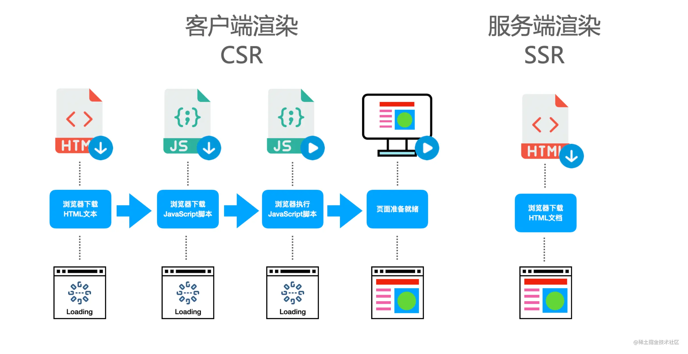

# SSR 和 SSG
## SSR
SSR是Server Side Render简称；页面上的内容是通过服务端渲染生成的，浏览器直接显示服务端返回的html就可以了。

在 SSR 的场景下，服务端生成好完整的 HTML 内容，直接返回给浏览器，浏览器能够根据 HTML 渲染出完整的首屏内容，
而不需要依赖 JS 的加载，这样一方面能够降低首屏渲染的时间，另一方面也能将完整的页面内容展现给搜索引擎的爬虫，利于 SEO。



当然，SSR 中只能生成页面的内容和结构，并不能完成事件绑定，因此需要在浏览器中执行 CSR(客户端渲染) 的 JS 脚本，
完成事件绑定，让页面拥有交互的能力，这个过程被称作 hydrate(翻译为注水或者激活)。
需要注意的是，hydrate需要的 JS，和CSR一样，也是从服务器下载的。
同时，像这样服务端渲染 + 客户端 hydrate 的应用也被称为同构应用，并且同构比SSR更加贴切。

服务器端渲染：用户请求服务器，服务器上直接生成 HTML 内容并返回给浏览器。
服务器端渲染来，页面的内容是由 Server 端生成的。
一般来说，服务器端渲染的页面交互能力有限，如果要实现复杂交互，还是要通过引入 JavaScript 文件来辅助实现。
服务器端渲染这个概念，适用于任何后端语言。

同构：同构这个概念存在于 Vue，React 这些新型的前端框架中，同构实际上是客户端渲染和服务器端渲染的一个整合。
我们把页面的展示内容和交互写在一起，让代码执行两次。
<strong>在服务器端执行一次，用于实现服务器端渲染(生成html)，在客户端再执行一次(hydrate)，用于接管页面交互</strong>。

## SSR 相对 SPA的优势
与客户端的单页应用 (SPA) 相比，SSR 的优势主要在于：

1. 更快的内容到达时间
服务端渲染的 HTML 无需等到所有的 JavaScript 都下载并执行完成之后才显示，所以你的用户将会更快地看到完整渲染的页面。
除此之外，数据获取过程在首次访问时在服务端完成，相比于从客户端获取，可能有更快的数据库连接。
这通常可以带来更高的核心 Web 指标评分、更好的用户体验，而对于那些“内容到达时间与转化率直接相关”的应用来说，这点可能至关重要。

2. 统一的心智模型
你可以使用相同的语言以及相同的声明式、面向组件的心智模型来开发整个应用，而不需要在后端模板系统和前端框架之间来回切换。

3. 更好的 SEO
搜索引擎爬虫可以直接看到完全渲染的页面。

---

## SSR权衡
使用 SSR 时还有一些权衡之处需要考量：

1. 开发中的限制。浏览器端特定的代码只能在某些生命周期钩子中使用；一些外部库可能需要特殊处理才能在服务端渲染的应用中运行。

2. 更多的与构建配置和部署相关的要求。服务端渲染的应用需要一个能让 Node.js 服务器运行的环境，不像完全静态的 SPA 那样可以部署在任意的静态文件服务器上。

3. 更高的服务端负载。在 Node.js 中渲染一个完整的应用要比仅仅托管静态文件更加占用 CPU 资源，因此如果你预期有高流量，请为相应的服务器负载做好准备，并采用合理的缓存策略。

在为你的应用使用 SSR 之前，你首先应该问自己是否真的需要它。这主要取决于内容到达时间对应用的重要程度。
例如，如果你正在构建一个内部的仪表盘，初始加载时的那额外几百毫秒对你来说并不重要，这种情况下使用 SSR 就有点小题大作了。
然而，在内容到达时间极其重要的场景下，SSR 可以尽可能地帮你实现最优的初始加载性能。

一般建议大家，<strong>除非你的项目特别依赖搜索引擎流量，或者对首屏时间有特殊的要求</strong>，否则不建议使用 SSR。

---

## SSR 之所以能够实现，本质上是因为虚拟 DOM 的存在
SSR 的工程中，代码会在客户端和服务器端各执行一次。你可能会想，这没什么问题，都是 JavaScript 代码，
既可以在浏览器上运行，又可以在 Node 环境下运行。
但事实并非如此，如果你的 React 代码里，存在直接操作 DOM 的  代码，那么就无法实现 SSR 这种技术了，
因为在 Node 环境下，是没有 DOM 这个概念存在的，所以这些代码在 Node 环境下是会报错的。

好在 React、Vue框架中引入了一个概念叫做虚拟 DOM，虚拟 DOM 是真实 DOM 的一个 JavaScript 对象映射，
在做页面操作时，实际上不是直接操作 DOM，而是操作虚拟 DOM，也就是操作普通的 JavaScript 对象，
这就使得 SSR 成为了可能。
在服务器，我可以操作 JavaScript 对象，判断环境是服务器环境，把虚拟 DOM 映射成字符串输出；
在客户端，我也可以操作 JavaScript 对象，判断环境是客户端环境，我就直接将虚拟 DOM 映射成真实 DOM，完成页面挂载。

---

## SSR 应用的两大生命周期: 构建时和运行时
### 构建时
1. 解决模块加载问题。在原有的构建过程之外，需要加入SSR 构建的过程，
具体来说，我们需要另外生成一份 CommonJS 格式的产物，使之能在 Node.js 正常加载。
当然，随着 Node.js 本身对 ESM 的支持越来越成熟，我们也可以复用前端 ESM 格式的代码，Vite 在开发阶段进行 SSR 构建也是这样的思路。

2. 移除样式代码的引入。直接引入一行 css 在服务端其实是无法执行的，因为 Node.js 并不能解析 CSS 的内容。但 CSS Modules 的情况除外，如下所示:
```
import styles from './index.module.css'
// 这里的 styles 是一个对象，如{ "container": "xxx" }，而不是 CSS 代码
console.log(styles)
```
3. 依赖外部化(external)。对于某些第三方依赖我们并不需要使用构建后的版本，而是直接从 node_modules 中读取，
比如 react-dom，这样在 SSR 构建的过程中将不会构建这些依赖，从而极大程度上加速 SSR 的构建。


## 运行时
对于 SSR 的运行时，一般可以拆分为比较固定的生命周期阶段，简单来讲可以整理为以下几个核心的阶段:

1. 加载 SSR 入口模块。在这个阶段，我们需要确定 SSR 构建产物的入口，即组件的入口在哪里，并加载对应的模块。
   
2. 进行数据预取。这时候 Node 侧会通过查询数据库或者网络请求来获取应用所需的数据。

3. 渲染组件。这个阶段为 SSR 的核心，主要将第 1 步中加载的组件渲染成 HTML 字符串或者 Stream 流。
   
4. HTML 拼接。在组件渲染完成之后，我们需要拼接完整的 HTML 字符串，并将其作为响应返回给浏览器。

---

## Vite SSR
Vite 作为一个构建工具，是如何支持 SSR 构建的呢？换句话说，它是如何让前端的代码也能顺利在 Node.js 中成功跑起来的呢？

可以分为两种情况，在开发环境下，Vite 依然秉承 ESM 模块按需加载即 no-bundle的理念，对外提供了ssrLoadModule API，
你可以无需打包项目，将入口文件的路径传入ssrLoadModule 即可:
```
// 加载服务端入口模块
const xxx = await vite.ssrLoadModule('/src/entry-server.tsx')
```
而在生产环境下，Vite 会默认进行打包，对于 SSR 构建输出 CommonJS 格式的产物。我们可以在package.json中加入这样类似的构建指令:
```
{
  "build:ssr": "vite build --ssr 服务端入口路径"
}
```
这样 Vite 会专门为 SSR 打包出一份构建产物。因此你可以看到，大部分 SSR 构建时的事情，Vite 已经帮我们提供了开箱即用的方案，我们后续直接使用即可。

---

## 项目参考 vite-ssr
### 项目骨架搭建
第一步， npm create vite 创建一个vite + react + ts 项目

第二步，删除项目自带的src/main.ts，然后在 src 目录下新建entry-client.tsx和entry-server.tsx两个入口文件

第三步，新建src/ssr-server/index.ts, 简单编写一个express后端服务

第四步，在package.json script中添加命令，这里涉及两个工具需要安装：
- nodemon: 一个监听文件变化自动重启 Node 服务的工具。
- esno: 类似 ts-node 的工具，用来执行 ts 文件，底层基于 Esbuild 实现。
```
npm i esno nodemon -D
```
### SSR 运行时实现
SSR 作为一种特殊的后端服务，我们可以将其封装成一个中间件的形式。
运行时实现参考：src/ssr-server/index.ts

###  静态资源问题处理
npm run build及npm run preview进行生产环境的预览，会发现 SSR 可以正常返回内容，但所有的静态资源及 CSR 的代码都失效了
这是因为对于开发阶段的静态资源 Vite Dev Server 的中间件已经帮我们处理了，而生产环境所有的资源都已经打包完成，
我们需要启用单独的静态资源服务来承载这些资源。这里你可以使用serve-static中间件来完成这个服务。
参考：src/ssr-server/index.ts。

不过，一般情况下，我们会将静态资源部上传到 CDN 上，并且将 Vite 的 base 配置为域名前缀，
这样我们可以通过 CDN 直接访问到静态资源，而不需要加上服务端的处理。
不过作为本地的生产环境预览而言，serve-static还是一个不错的静态资源处理手段。

---

## Node 只是一个中间层
在 SSR 架构中，一般 Node 只是一个中间层，用来做服务器端渲染，而 Node 需要的数据通常由 API 服务器单独提供。

这样做一是为了工程解耦，二也是为了规避 Node 服务器的一些计算性能问题。

服务器端渲染时，直接请求 API 服务器的接口获取数据没有任何问题。
但是在客户端，就有可能存在跨域的问题了，所以，这个时候，我们需要在服务器端搭建 Proxy 代理功能，客户端不直接请求 API 服务器，而是请求 Node 服务器，经过代理转发，拿到 API 服务器的数据。

这里你可以通过 express-http-proxy 这样的工具帮助你快速搭建 Proxy 代理功能，但是记得配置的时候，
要让代理服务器不仅仅帮你转发请求，还要把 cookie 携带上，这样才不会有权限校验上的一些问题。

// Node 代理功能实现代码
app.use('/api', proxy('http://apiServer.com', {
  proxyReqPathResolver: function (req) {
    return '/ssr' + req.url;
  }
}));

---

## 开箱即用产品

### Vue
Vue3提供了SSR的API: https://cn.vuejs.org/guide/scaling-up/ssr.html

建议使用 Nuxt 或 Quasar。
- Nuxt 是一个构建于 Vue 生态系统之上的全栈框架，它为编写 Vue SSR 应用提供了丝滑的开发体验。更棒的是，你还可以把它当作一个静态站点生成器来用！我们强烈建议你试一试。
- Quasar 是一个基于 Vue 的完整解决方案，它可以让你用同一套代码库构建不同目标的应用，如 SPA、SSR、PWA、移动端应用、桌面端应用以及浏览器插件。除此之外，它还提供了一整套 Material Design 风格的组件库。

### React
React 也提供了 SSR 的 API：

服务端：
```jsx
import { renderToString } from 'react-dom/server';


const html = renderToString(<App />);
```

客户端：
```jsx
import { hydrateRoot } from 'react-dom/client';


hydrateRoot(document.getElementById('root'), <App />);
```
建议使用Next.js.

Next.js 是一个用于构建服务器渲染（Server-Side Rendering，简称 SSR）应用的 React 框架。它由 Vercel 公司开发，并且已经成为构建大型生产级应用的流行选择之一。

Next.js 不仅简化了 SSR 的实现过程，还提供了许多开箱即用的功能，如自动代码分割、静态文件服务、API 路由等，使得开发者可以更加专注于业务逻辑的实现，而不需要过多地关心底层的技术细节。通过使用 Next.js，开发者可以轻松创建出高性能、SEO 友好的 Web 应用程序。

## SSG
SSG 全称为 Static Site Generation，即静态站点生成。
它本质上是构建阶段的 SSR，在 build 过程中产出完整的 HTML。

它的优点如下：
- 服务器压力小；
- 继承 SSR 首屏性能以及 SEO 的优势。

不过它也有一定的局限性，并不适用于数据经常变化的场景。
你可以试想一个 10 分钟刷新一次的榜单，如果使用 SSG 方案，那么项目会进行频繁的构建和部署，并且也做不到良好的时效性。

因此，SSG 更加适合一些数据变化频率较低的站点，比如文档站、官方站点、博客等等。

---

## 参考
- https://staging-cn.vuejs.org/guide/scaling-up/ssr.html
- https://zhuanlan.zhihu.com/p/90746589
- https://zhuanlan.zhihu.com/p/47044039