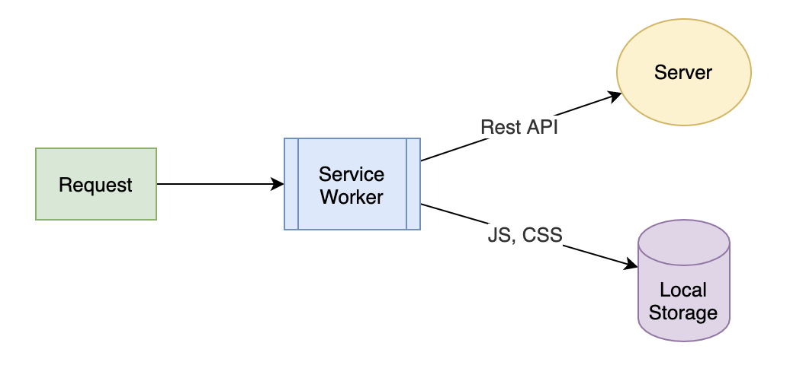

# ServiceWorker
Service Worker 其实是很容易被大家忽视的一种缓存机制，因为它通常是和 PWA （Progressive Web Application）联系在一起的，用于开发离线的 Web 应用。

Service Worker 还提供了拦截前端请求的能力，使得它能够结合 Local Storage，成为一个独立的缓存方案。所以它不仅可以用于实现前端静态资源的缓存，还能用来开发离线的 Web 应用。

我们可以把 Service Worker 看作一种前端的资源请求代理。每一个前端页面发出的请求都会先由这个代理进行处理，然后你再决定请求是直接发送到服务器端，还是从本地的 Local Storage 读取内容返回。

Service Worker 是一段独立于页面之外的 JavaScript 脚本，它并不在 Web 页面中运行，但是会在 Web 页面加载时，由一段代码去触发注册、下载和激活。一旦安装完成之后，Service Worker 就会拦截所有当前域名下的所有请求，由代码逻辑决定应该如何处理.