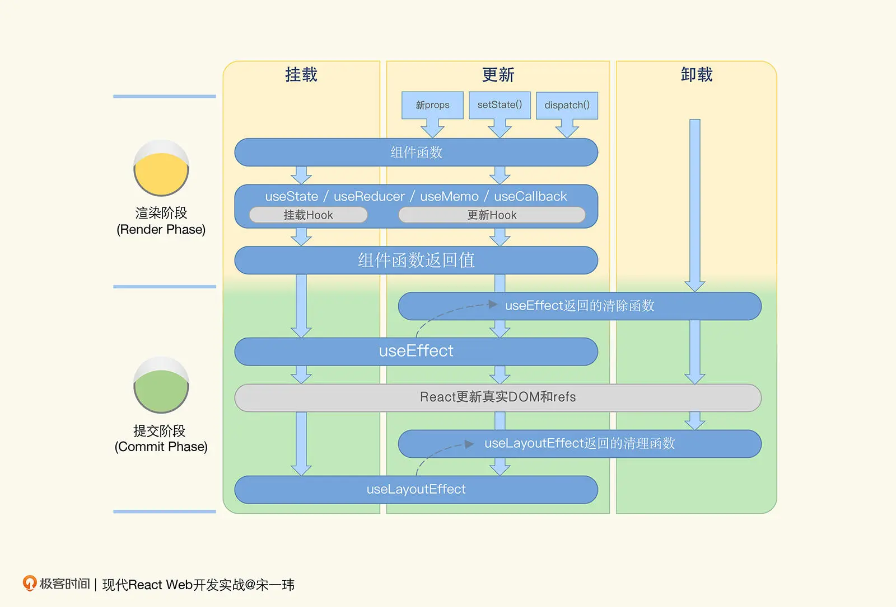

# Hooks
到了 React v16.8，Hooks 正式发布，函数组件取代类组件成为了 React 组件的 C 位。

在 React 中，Hooks 就是把某个目标结果钩到某个可能会变化的数据源或者事件源上，
那么当被钩到的数据或事件发生变化时，产生这个目标结果的代码会重新执行，产生更新后的结果。

Hooks 提供了让你监听某个数据变化的能力。这个变化可能会触发组件的刷新，也可能是去创建一个副作用，又或者是刷新一个缓存。
那么定义要监听哪些数据变化的机制，其实就是指定 Hooks 的依赖项。

Hooks 中被钩的对象，不仅可以是某个独立的数据源，也可以是另一个 Hook 执行的结果，这就带来了 Hooks 的最大好处：逻辑的复用。

Hooks 在一定程度上更好地体现了 React 的开发思想，即从 State => View 的函数式映射。
此外， Hooks 也解决了 Class 组件存在的一些代码冗余、难以逻辑复用的问题。

Hooks 和  Class 两种方式在 React 开发中几乎是完全等价的，没有绝对的优劣。
如果你决定开始使用 Hooks，那么对于已有的 Class 组件，其实是完全没必要进行立刻重构的。只要在新的功能上，再来使用函数组件和 Hooks 就可以了。

React 提供的 Hooks 其实非常少，一共只有 10 个，比如 useState、useEffect、useCallback、useMemo、useRef、useContext 等等。

<br>

## Hooks使用规则
1. 所有 Hook 必须要被执行到，必须按顺序执行。
   
错误示例：
```
import { Modal } from "antd";
import useUser from "../09/useUser";

function UserInfoModal({ visible, userId, ...rest }) {
  // 当 visible 为 false 时，不渲染任何内容
  if (!visible) return null;
  // 这一行 Hook 在可能的 return 之后，会报错！
  const { data, loading, error } = useUser(userId);

  return (
    <Modal visible={visible} {...rest}>
      {/* 对话框的内容 */}
    </Modal>
  );
};
}
```
修复方法：把条件判断的结果放到两个组件之中，确保真正 render UI 的组件收到的所有属性都是有值的。
可以在 UserInfoModal 外层加一个容器，这样就能实现条件渲染了：
```
// 定义一个容器组件用于封装真正的 UserInfoModal
export default function UserInfoModalWrapper({
  visible,
  ...rest, // 使用 rest 获取除了 visible 之外的属性
}) {
  // 如果对话框不显示，则不 render 任何内容
  if (!visible) return null; 
  // 否则真正执行对话框的组件逻辑
  return <UserInfoModal {...rest} />;
}
```

1. Hooks 作为专门为函数组件设计的机制，使用的情况只有两种，一种是在函数组件内，另外一种则是在自定义的 Hooks 里面。

总结了一下：
- Hooks 不能出现在条件语句或者循环中，也不能出现在 return 之后；
- Hooks 只能在函数组件或者自定义 Hooks 中使用。

## useState: 让函数组件具有维持状态的能力
```
// 定义一个年龄的 state，初始值是 42
const [age, setAge] = useState(42);
// 定义一个水果的 state，初始值是 banana
const [fruit, setFruit] = useState('banana');
// 定一个一个数组 state，初始值是包含一个 todo 的数组
const [todos, setTodos] = useState([{ text: 'Learn Hooks' }]);
```
通常来说，我们要遵循的一个原则就是：state 中永远不要保存可以通过计算得到值。比如：
- 从 props 传递过来的值。有时候 props 传递过来的值无法直接使用，而是要通过一定的计算后再在 UI 上展示，比如说排序。那么我们要做的就是每次用的时候，都重新排序一下，或者利用某些 cache 机制，而不是将结果直接放到 state 里。
- 从 URL 中读到的值。比如有时需要读取 URL 中的参数，把它作为组件的一部分状态。那么我们可以在每次需要用的时候从 URL 中读取，而不是读出来直接放到 state 里。
- 从 cookie、localStorage 中读取的值。通常来说，也是每次要用的时候直接去读取，而不是读出来后放到 state 里。

调用 state 更新函数后，组件的更新是异步的，不会马上执行；在 React 18 里，更是为更新 state 加入了自动批处理功能: <strong>多个 state 更新函数调用会被合并到一次重新渲染中</strong>。
例如，下面的代码中，组件只会重新渲染一次，而且这次渲染使用了两个 state 分别的最新值。这就是 React对多个 state 更新的自动批处理。
```
function App() {
  const [showAdd, setShowAdd] = useState(false);
  const [todoList, setTodoList] = useState([/*省略*/]);
  // ...省略
  const handleSubmit = (title) => {
    setTodoList(currentTodoList => [
      { title, status: new Date().toString() },
      ...currentTodoList
    ]);
    setShowAdd(false);
  };
  // ...省略
}

```
然而需要注意的是，自动批处理功能在 React 18 版本以前，只在 React 事件处理函数中生效。如果 state 更新语句所在的区域稍有不同，比如将两个 state 更新写在异步请求的回调函数中，自动批处理就失效了。
```
const Search = () => {
  const [province, setProvince] = useState(null);
  const [cities, setCities] = useState([]);
  const handleSearchClick = () => {
    // 模拟调用服务器端接口搜索"吉林"
    setTimeout(() => {
      setProvince('吉林');
      setCities(['长春', '吉林']);
    }, 1000);
  };
  // ...省略
```


下面的方式，可以保证更新函数使用最新的 state 来计算新 state 值
```
setShowAdd(prevState => !prevState);
setTodoList(prevState => {
  return [...prevState, aNewTodoItem];
});
```

<br>

## useEffect：执行副作用
什么是副作用呢？
第一类，函数中最常见的副作用，就是全局变量（global variable），比如在函数内改变了全局变量的值。

除了全局变量以外，另一个比较明显的问题就是 IO 影响（IO effects）。这里的 IO 说的不是前面函数里的参数和返回值，而是类似前端浏览器中的用户行为，比如鼠标和键盘的输入，或者如果是服务器端的 Node 的话，就是文件系统、网络连接以及 stream 的 stdin（标准输入）和 stdout（标准输出）。

第三种比较常见的副作用是与网络请求（HTTP request）相关，比如我们要针对一个用户下单的动作发起一个网络请求，需要先获得用户 ID，再连着用户的 ID 一起发送。如果我们还没获取到用户 ID，就发起下单请求，可能就会收到报错。

<strong>纯函数的意思是说，一个函数的返回结果的变化只依赖其入参数，并且没有副作用</strong>。
总之，副作用就是让一个函数不再是纯函数的各类操作。

```
useEffect(callback, dependencies)
```
第一个为要执行的函数 callback，第二个是可选的依赖项数组 dependencies。
其中依赖项是可选的，如果不指定，那么 callback 就会在<strong>每次组件render()完后都执行</strong>；
如果指定了，那么只有<strong>依赖项中的值发生变化</strong>的时候，它才会执行。


总结一下，useEffect 让我们能够在下面四种时机去执行一个回调函数产生副作用：
- 每次 render 后执行：不提供第二个依赖项参数。比如 useEffect(() => {})。
- 仅第一次 render 后执行：提供一个空数组作为依赖项。比如 useEffect(() => {}, [])。
- 第一次以及依赖项发生变化后执行：提供依赖项数组。比如 useEffect(() => {}, [deps])。
- 组件 unmount 后执行返回的一个回调函数。比如 useEffect(() => { return () => {} }, [])。

那么在定义依赖项时，我们需要注意以下三点：
- 依赖项中定义的变量一定是会在回调函数中用到的，否则声明依赖项其实是没有意义的。
- 依赖项一般是一个常量数组，而不是一个变量。因为一般在创建 callback 的时候，你其实非常清楚其中要用到哪些依赖项了。
- React 会使用<strong>浅比较</strong>来对比依赖项是否发生了变化，所以要特别注意数组或者对象类型。如果你是每次创建一个新对象，即使和之前的值是等价的，也会被认为是依赖项发生了变化。这是一个刚开始使用 Hooks 时很容易导致 Bug 的地方。

```
function Sample() {
  // 这里在每次组件执行时创建了一个新数组
  const todos = [{ text: 'Learn hooks.'}];
  useEffect(() => {
    console.log('Todos changed.');
  }, [todos]);
}
```
代码的原意可能是在 todos 变化的时候去产生一些副作用，但是这里的 todos 变量是在函数内创建的，实际上每次都产生了一个新数组。
所以在作为依赖项的时候进行引用的比较，实际上被认为是发生了变化的。

### useEffect和useLayoutEffect的区别
- useEffect 是异步执行的，而useLayoutEffect是同步执行的。
- useEffect 的执行时机是浏览器完成渲染之后，而 useLayoutEffect 的执行时机是浏览器把内容真正渲染到界面之前。
- 如果你在 ssr 的时候使用这个函数会有一个 warning。
```
Warning: useLayoutEffect does nothing on the server, because...
```
这是因为 useLayoutEffect 是不会在服务端执行的，所以就有可能导致 ssr 渲染出来的内容和实际的首屏内容并不一致。
所以，这时候应该用useEffect代替useLayoutEffect.

## useCallback
```
useCallback(fn, deps)
```
这里 fn 是定义的回调函数，deps 是依赖的变量数组。只有当某个依赖变量发生变化时，才会重新声明 fn 这个回调函数，
否则函数保持不变。注意，这里并不是说依赖项变了才会执行函数，要与useMemo区分开来。


## useMemo
useMemo 也是为了缓存而设计的。只不过，useCallback 缓存的是一个函数，而 useMemo 缓存的是计算的结果。
它们只是做了同一件事情：建立了一个绑定某个结果到依赖数据的关系。只有当依赖变了，这个结果才需要被重新得到。

```
useMemo(fn, deps);
```
这个场景应该很容易理解：如果某个数据是通过其它数据计算得到的，那么只有当用到的数据，也就是依赖的数据发生变化的时候，才应该需要重新计算。
类似于Vue中的computed计算属性。

```
// 使用 userMemo 缓存计算的结果
const usersToShow = useMemo(() => {
    if (!users) return null;
    return users.data.filter((user) => {
      return user.first_name.includes(searchKey));
    }
  }, [users, searchKey]);
```
除了避免重复计算之外，useMemo 还有一个很重要的好处：避免子组件的重复渲染。
比如在例子中的 usersToShow 这个变量，如果每次都需要重新计算来得到，那么对于 UserList 这个组件而言，就会每次都需要刷新，
因为它将 usersToShow 作为了一个属性。而一旦能够缓存上次的结果，就和 useCallback 的场景一样，可以避免很多不必要的组件刷新。

useMemo可以代替useCallback:
```
 onst myEventHandler = useMemo(() => {
   // 返回一个函数作为缓存结果
   return () => {
    // 在这里进行事件处理
   }
}, [dep1, dep2]);
 ```

<br>

## useRef：在多次渲染之间共享数据
我们可以把 useRef 看作是在函数组件之外创建的一个容器空间。
在这个容器上，我们可以通过唯一的 current 属设置一个值，从而在函数组件的多次渲染之间共享这个值。具体demo查看timer。

使用 useRef 保存的数据一般是和 UI 的渲染无关的，因此当 ref 的值发生变化时，是不会触发组件的重新渲染的，这也是 useRef 区别于 useState 的地方。

除了存储跨渲染的数据之外，useRef 还有一个重要的功能，就是保存某个 DOM 节点的引用:

```
function TextInputWithFocusButton() {
  const inputEl = useRef(null);
  const onButtonClick = () => {
    // current 属性指向了真实的 input 这个 DOM 节点，从而可以调用 focus 方法
    inputEl.current.focus();
  };
  return (
    <>
      <input ref={inputEl} type="text" />
      <button onClick={onButtonClick}>Focus the input</button>
    </>
  );
}
```

<br>

## useContext：定义全局状态
demo见context

在 React 的开发中，除了像 Theme、Language 等一目了然的需要全局设置的变量外，我们很少会使用 Context 来做太多数据的共享。
需要再三强调的是，Context 更多的是提供了一个强大的机制，让 React 应用具备定义全局的响应式数据的能力。

<br>

## Hooks和class
hooks和class一些生命周期的关系
```
useEffect(() => {
  // componentDidMount + componentDidUpdate
  console.log('这里基本等价于 componentDidMount + componentDidUpdate');
  return () => {
    // componentWillUnmount
    console.log('这里基本等价于 componentWillUnmount');
  }
}, [deps])
```

useEffect 第二个参数传入空数组，就只在组件初始化时和销毁前分别执行一次
```
useEffect(() => {
  return () => {
    // 这里只会在组件销毁前（componentWillUnmount）执行一次
  }
}, [])
```

Class 组件中还有其它一些比较少用的方法，比如 getSnapshotBeforeUpdate, componentDidCatch, getDerivedStateFromError。
比较遗憾的是目前 Hooks 还没法实现这些功能。因此如果必须用到，你的组件仍然需要用类组件去实现。

在 React 中，Class 组件和函数组件是完全可以共存的。对于新的功能，我会更推荐使用函数组件。而对于已有的功能，则维持现状就可以。
除非要进行大的功能改变，可以顺便把相关的类组件进行重构，否则是没有必要进行迁移的。



挂载阶段。React 会执行组件函数，在函数执行过程中遇到的 useState 、 useMemo 等 Hooks 依次挂载到 FiberNode 上，useEffect 其实也会被挂载，但它包含的副作用（Side-effect，在 Fiber 引擎中称为 Effect）会保留到提交阶段。

更新阶段。当组件接收到新 props，调用 useState 返回的 setter 或者 useReducer 返回的 dispatch 修改了状态，组件会进入更新阶段。组件函数本身会被再次执行，Hooks 会依次与 FiberNode 上已经挂载的 Hooks 一一匹配，并根据需要更新。组件函数的返回值用来更新 FiberNode 树。

卸载阶段。主要是执行 Effect 的清理函数。函数组件也有错误处理阶段，但没有对应的生命周期 Hooks，错误处理依赖于父组件或祖先组件提供的错误边界。

<br>

### Hooks实现类似Class构造函数的只初始化一次的功能
函数组件基本上没有统一的初始化需要，因为 Hooks 自己会负责自己的初始化。
比如 useState 这个 Hook，接收的参数就是定义的 State 初始值。
而在过去的类组件中，你通常需要在构造函数中直接设置 this.state ，也就是设置某个值来完成初始化。

虽然没有直接的机制可以做到这一点，但是利用 useRef 这个 Hook，我们可以实现一个 useSingleton 这样的一次性执行某段代码的自定义 Hook:
```
// 创建一个自定义 Hook 用于执行一次性代码
function useSingleton(callback) {
  // 用一个 called ref 标记 callback 是否执行过
  const called = useRef(false);
  // 如果已经执行过，则直接返回
  if (called.current) return;
  // 第一次调用时直接执行
  callBack();
  // 设置标记为已执行过
  called.current = true;
}


import useSingleton from './useSingleton';
const MyComp = () => {
  // 使用自定义 Hook
  useSingleton(() => {
    console.log('这段代码只执行一次');
  });

  return (
    <div>My Component</div>
  );
};
```
可以看到，自定义 Hooks 的两个特点：
- 名字一定是以 use 开头的函数，这样 React 才能够知道这个函数是一个 Hook；
- 函数内部一定调用了其它的 Hooks，可以是内置的 Hooks，也可以是其它自定义 Hooks。这样才能够让组件刷新，或者去产生副作用。

为什么一定要通过 Hooks 进行封装呢？
在 Hooks 中，你可以管理当前组件的 state，从而将更多的逻辑写在可重用的 Hooks 中。
但是要知道，在普通的工具类中是无法直接修改组件 state 的，那么也就无法在数据改变的时候触发组件的重新渲染。

怎么才能让函数组件不会太过冗长呢？
做法很简单，就是尽量将相关的逻辑做成独立的 Hooks，然后在函数组中使用这些 Hooks，通过参数传递和返回值让 Hooks 之间完成交互。
我们要真正把 Hooks 就看成普通的函数，能隔离的尽量去做隔离，从而让代码更加模块化，更易于理解和维护。

<br>

## 其它说明
Hooks 是逻辑重用的第一选择。 
不过在如今的函数组件情况下，Hooks 有一个局限，那就是：<strong>只能用作数据逻辑的重用</strong>，
而一旦涉及 UI 表现逻辑的重用，就有些力不从心了，而这正是 render props 擅长的地方。
所以，即使有了 Hooks，我们也要掌握 render props 这个设计模式的用法， 见CounterRenderProps.jsx

<br>

## Eslint hooks 配置
```
npm install eslint-plugin-react-hooks --save-dev
yarn add eslint-plugin-react-hooks --save-dev
```
然后eslint配置文件中加入：
```
{
  "plugins": [
    // ...
    "react-hooks"
  ],
  "rules": {
    // ...
    // 检查 Hooks 的使用规则
    "react-hooks/rules-of-hooks": "error", 
    // 检查依赖项的声明
    "react-hooks/exhaustive-deps": "warn"
  }
}
```