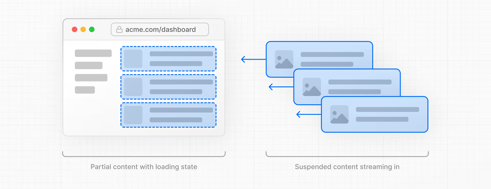
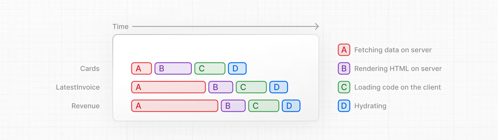

# streaming
Streaming is a data transfer technique that allows you to break down a route into smaller "chunks" and progressively stream them from the server to the client as they become ready.



通过使用流式传输，你可以防止缓慢的数据请求阻塞整个页面。这使得用户可以在不等待所有数据加载完成的情况下，查看和交互页面的某些部分，从而不必等到所有界面元素都就绪后才向用户显示任何内容。



There are two ways you implement streaming in Next.js:
- At the page level, with the loading.tsx file.
- For specific components, with `<Suspense>`.

## 1. loading.tsx
loading.tsx is a special Next.js file built on top of Suspense, it allows you to create fallback UI to show as a replacement while page content loads.

-> nextjs-dashboard/app/dashboard/(overview)/loading.tsx

## 2. Streaming a component with Suspense
```tsx
import { Suspense } from 'react'
import { PostFeed, Weather } from './Components'
 
export default function Posts() {
  return (
    <section>
      <Suspense fallback={<p>Loading feed...</p>}>
        <PostFeed />
      </Suspense>
      <Suspense fallback={<p>Loading weather...</p>}>
        <Weather />
      </Suspense>
    </section>
  )
}
```
另一个例子：-> nextjs-dashboard/app/dashboard/(overview)/page.tsx

By using Suspense, you get the benefits of:
- Streaming Server Rendering: Progressively rendering HTML from the server to the client.
- Selective Hydration: React prioritizes what components to make interactive first based on user interaction.
- Partial Prerendering uses React's Suspense.

**Partial Prerendering**: You may not see a difference in your application in development, but you should notice a performance improvement in production. Next.js will prerender the static parts of your route and defer the dynamic parts until the user requests them.

开启 Partial Prerendering
```tsx
/** next.config.ts */
 
const nextConfig = {
  experimental: {
    ppr: 'incremental',
  },
};
 
export default nextConfig;
```
Next, add the experimental_ppr segment config option to your layout: -> /dashboard/layout.tsx
```tsx
export const experimental_ppr = true;
```