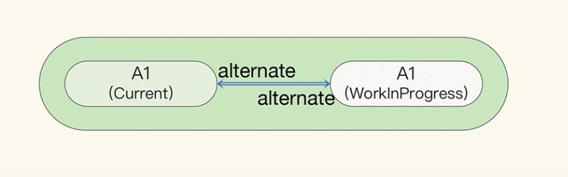

# react vs vue

## reactive
react和vue都是响应式的，state（react需要调用setState、useReducer等方法改变状态）、 props、Context数据发生变化时会重新渲染页面。
而vue直接修改变量（reactive、ref包裹）就行。

从底层实现来看修改数据：在react中，组件的状态是不能被修改的，setState没有修改原来那块内存中的变量，而是去新开辟一块内存；
而vue则是直接修改保存状态的那块原始内存。
所以经常能看到react相关的文章里经常会出现一个词"immutable"，翻译过来就是不可变的。

数据修改了，接下来就要更新视图：react中，调用setState方法后，会自顶向下重新渲染组件，自顶向下的含义是，该组件以及它的子组件全部需要渲染；
而vue使用Object.defineProperty（vue3迁移到了Proxy）对数据的设置（setter）和获取（getter）做了劫持。
也就是说，vue能准确知道视图模版中哪一块用到了这个数据，并且在这个数据修改时，告诉这个视图，你需要重新渲染了。

所以当一个数据改变，react的组件渲染是很消耗性能的——父组件的状态更新了，所有的子组件得跟着一起渲染，它不能像vue一样，精确到当前组件的粒度。

## react fiber
React 组件会渲染出一棵元素树。
每次有 props、state 等数据变动时，组件会渲染出新的元素树，React 框架会与之前的树做 Diffing 对比，将元素的变动最终体现在浏览器页面的 DOM 中。这一过程就称为协调（Reconciliation）。
在 React 的早期版本，协调是一个同步过程，这意味着当虚拟 DOM 足够复杂，或者元素渲染时产生的各种计算足够重，协调过程本身就可能超过 16ms，严重的会导致页面卡顿。
而从 React v16 开始，协调从之前的同步改成了异步过程，这主要得益于新的 Fiber 协调引擎。

Fiber 协调引擎做的事情基本上贯穿了 React 应用的整个生命周期，包括并不限于：
- 创建各类 FiberNode 并组建 Fiber 树；
- 调度并执行各类工作（Work），如渲染函数组件、挂载或是更新 Hooks、实例化或更新类组件等；
- 比对新旧 Fiber，触发 DOM 变更；
- 获取 context 数据；
- 错误处理；
- 性能监控。


在协调过程中存在着各种动作，如调用生命周期方法或 Hooks，这在 Fiber 协调引擎中被称作是工作（Work）。
Fiber 中最基本的模型是 FiberNode，用于描述一个组件需要做的或者已完成的工作，每个组件可能对应一个或多个 FiberNode。
FiberNode 的数据结构大致如下：
```
type Fiber = {
  // ---- Fiber类型 ----

  /** 工作类型，枚举值包括：函数组件、类组件、HTML元素、Fragment等 */
  tag: WorkTag,
  /** 就是那个子元素列表用的key属性 */
  key: null | string,
  /** 对应React元素ReactElmement.type属性 */
  elementType: any,
  /** 函数组件对应的函数或类组件对应的类 */
  type: any,

  // ---- Fiber Tree树形结构 ----

  /** 指向父FiberNode的指针 */
  return: Fiber | null,
  /** 指向子FiberNode的指针 */
  child: Fiber | null,
  /** 指向平级FiberNode的指针 */
  sibling: Fiber | null,
  
  // ---- Fiber数据 ----

  /** 经本次渲染更新的props值 */  
  pendingProps: any,
  /** 上一次渲染的props值 */
  memoizedProps: any,
  /** 上一次渲染的state值，或是本次更新中的state值 */
  memoizedState: any,
  /** 各种state更新、回调、副作用回调和DOM更新的队列 */
  updateQueue: mixed,
  /** 为类组件保存对实例对象的引用，或为HTML元素保存对真实DOM的引用 */
  stateNode: any,

  // ---- Effect副作用 ----

  /** 副作用种类的位域，可同时标记多种副作用，如Placement、Update、Callback等 */
  flags: Flags,
  /** 指向下一个具有副作用的Fiber的引用，在React 18中貌似已被弃用 */
  nextEffect: Fiber | null,

  // ---- 异步性/并发性 ----
  
  /** 当前Fiber与成对的进行中Fiber的双向引用 */
  alternate: Fiber | null,
  /** 标记Lane车道模型中车道的位域，表示调度的优先级 */
  lanes: Lanes
};


type Hook = {
  memoizedState: any,
  baseState: any,
  baseQueue: Update<any, any> | null,
  queue: any,
  next: Hook | null,
};

type Effect = {
  tag: HookFlags,
  create: () => (() => void) | void,
  destroy: (() => void) | void,
  deps: Array | null,
  next: Effect,
};
```

第一次渲染，React 元素树被创建出来后，Fiber 协调引擎会从 HostRoot 这个特殊的元素开始，遍历元素树，创建对应的 FiberNode。


FiberNode 与 FiberNode 之间，并没有按照传统的 parent-children 方式建立树形结构。
而是在父节点和它的第一个子节点间，利用child 和 return 属性建立了双向链表。
节点与它的平级节点间，利用 sibling 属性建立了单向链表，同时平级节点的 return 属性，也都被设置成和单向链表起点的节点 return 一样的值引用。

这样做的好处是，可以在协调引擎进行工作的过程中，避免递归遍历 Fiber 树，而仅仅用两层循环来完成深度优先遍历，
这个用于遍历 Fiber 树的循环被称作 workLoop。workLoop示意代码如下：
```
let workInProgress;

function workLoop() {
  while (workInProgress && !shouldYield()) {
    const child = workWork(workInProgress);
    if (child) {
      workInProgress = child;
      continue;
    }
    
    let completedWork = workInProgress;
    do {
      if (completedWork.sibling) {
        workInProgress = completedWork.sibling;
        break;
      }
      completedWork = completedWork.return;
    } while (completedWork);
  }
}


requestIdleCallback(workLoop);
```
这个循环随时可以跑，随时可以停。这意味着 workLoop 既可以同步跑，也可以异步跑。
当 workLoop 发现进行中的 Fiber 工作耗时过长时，可以根据一个 shouldYield() 标记决定是否暂停工作，释放计算资源给更紧急的任务，等完成后再恢复工作。


<a href="https://developer.mozilla.org/zh-CN/docs/Web/API/Window/requestIdleCallback">requestIdleCallback()</a>方法传入一个函数，
这个函数将在浏览器空闲时期被调用。这使开发者能够在主事件循环上执行后台和低优先级工作，而不会影响延迟关键事件，如动画和输入响应。

但由于兼容性不好，加上该回调函数被调用的频率太低，react实际使用的是一个[polyfill(自己实现的api)](https://juejin.cn/post/7167335700424196127)，而不是requestIdleCallback。

<br>

## 渲染阶段

当组件内更新 state 或有 context 更新时，React 会进入渲染阶段（Render Phase）。
这一阶段是异步的，Fiber 协调引擎会启动workLoop ，从 Fiber 树的根部开始遍历，快速跳过已处理的节点；
对有变化的节点，引擎会为 Current（当前）节点克隆一个 WorkInProgress（进行中）节点，将这两个 FiberNode 的 alternate 属性分别指向对方，并把更新都记录在WorkInProgress 节点上。



你可以理解成同时存在两棵 Fiber 树，一棵 Current 树，对应着目前已经渲染到页面上的内容；另一棵是 WorkInProgress 树，记录着即将发生的修改。

函数组件的 Hooks 也是在渲染阶段执行的。除了useContext ，Hooks 在挂载后，都会形成一个由 Hook.next 属性连接的单向链表，而这个链表会挂在 FiberNode.memoizedState 属性上。
useEffect 这样会产生副作用的 Hooks，会额外创建与 Hook 对象一一对应的 Effect 对象，赋值给 Hook.memoizedState 属性。
此外，也会在 FiberNode.updateQueue 属性上，维护一个由 Effect.next 属性连接的单向链表，并把这个 Effect 对象加入到链表末尾。

<br>

## 提交阶段
当 Fiber 树所有节点都完成工作后，WorkInProgress 节点会被改称为 FinishedWork（已完成）节点，WorkInProgress 树也会被改称为 FinishedWork树。
这时 React 会进入提交阶段（Commit Phase），这一阶段主要是同步执行的。Fiber 协调引擎会把FinishedWork 节点上记录的所有修改，按一定顺序提交并体现在页面上。

提交阶段又分成如下 3 个先后同步执行的子阶段：
- 变更前（Before Mutation）子阶段。这个子阶段会调用类组件的 getSnapshotBeforeUpdate 方法。
- 变更（Mutation）子阶段。这个子阶段会更新真实 DOM 树。
  - 递归提交与删除相关的副作用，包括移除 ref、移除真实 DOM、执行类组件的 componentWillUnmount  。
  - 递归提交添加、重新排序真实 DOM 等副作用。
  - 依次执行 FiberNode 上 useLayoutEffect 的清除函数。
  - 引擎用 FinishedWork 树替换 Current 树，供下次渲染阶段使用。
- 布局（Layout）子阶段。这个子阶段真实 DOM 树已经完成了变更，会调用 useLayoutEffect 的副作用回调函数，和类组件的 componentDidMount 方法。

引擎还会多次异步或同步调用 flushPassiveEffects() 。这个函数会先后两轮按深度优先遍历 Fiber 树上每个节点:
- 第一轮：如果节点的 updateQueue 链表中有待执行的、由 useEffect 定义的副作用，则顺序执行它们的清除函数；
- 第二轮：如果节点的 updateQueue 链表中有待执行的、由 useEffect 定义的副作用，则顺序执行它们的副作用回调函数，并保存清除函数，供下一轮提交阶段执行。

这个flushPassiveEffects() 函数真正的执行时机，是在上述提交阶段的三个同步子阶段之后，下一次渲染阶段之前。
引擎会保证在下一次渲染之前，执行完所有待执行的副作用。

<br>

## 协调引擎的 Diffing 算法在哪里？
其实从渲染到提交阶段，到处都在利用 memoizedProps 和 memoizedState 与新的 props、state 做比较，以减少不必要的工作，进而提高性能。

<br>

## vue3如何在浏览器中跑起来的
->[how vue3 start up in browser](../../vue/vue%20basic/principle/how%20vue3%20start%20up%20in%20browser.md)

<br>

## react不如vue？
我们现在已经知道了react fiber是在弥补更新时“无脑”刷新，不够精确带来的缺陷, 但时也需要遍历fiber树。这是不是能说明react性能更差呢？

并不是。

孰优孰劣是一个很有争议的话题，在此不做评价。
因为vue实现精准更新也是有代价的，一方面是需要给每一个组件配置一个“监视器”，管理着视图的依赖收集和数据更新时的发布通知，这对性能同样是有消耗的；
另一方面vue能实现依赖收集得益于它的模版语法，实现静态编译，这是使用更灵活的JSX语法的react做不到的。

在react fiber出现之前，react也提供了PureComponent、shouldComponentUpdate、useMemo,useCallback等方法给我们，来声明哪些是不需要连带更新子组件。

react因为先天的不足——无法精确更新，所以需要react fiber把组件渲染工作切片；而vue基于数据劫持，更新粒度很小，没有这个压力；

react fiber这种数据结构使得节点可以回溯到其父节点，只要保留下中断的节点索引，就可以恢复之前的工作进度；