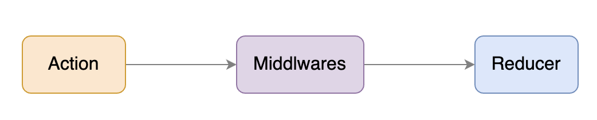

# middleware
简单来说，middleware 可以让你提供一个拦截器在 reducer 处理 action 之前被调用。
在这个拦截器中，你可以自由处理获得的 action。
无论是把这个 action 直接传递到 reducer，或者构建新的 action 发送到 reducer，都是可以的。



在 Redux 中，处理异步逻辑也常常被称为异步 Action。

redux-thunk 是一个中间件，用于处理异步操作。thunkMiddleware 是 redux-thunk 提供的中间件函数，用于增强 Redux 的 store，使其能够处理异步操作，如 AJAX 请求。

redux-thunk源码如下：
```js
function createThunkMiddleware (extraArgument) {
  // 这里将 middlewareAPI 给解构成了 { dispatch, getState }
  return ({ dispatch, getState }) => next => action => {
    if (typeof action === 'function') {
      return action (dispatch, getState, extraArgument)
    }

    return next (action)
  }
}

const thunk = createThunkMiddleware ();
thunk.withExtraArgument = createThunkMiddleware;

export default thunk;
```

它如果发现接受到的 action 是一个函数，那么就不会传递给 Reducer，
而是执行这个函数，并把 dispatch 作为参数传给这个函数，从而在这个函数中你可以自由决定何时，如何发送 Action。

```js
import { createStore, applyMiddleware } from 'redux'
import thunkMiddleware from 'redux-thunk'
import rootReducer from './reducer'

const composedEnhancer = applyMiddleware(thunkMiddleware)
const store = createStore(rootReducer, composedEnhancer)
```
在我们 dispatch action 时就可以 dispatch 一个函数用于来发送请求：
```js
function fetchData() {
  return dispatch => {
    dispatch({ type: 'FETCH_DATA_BEGIN' });
    fetch('/some-url').then(res => {
      dispatch({ type: 'FETCH_DATA_SUCCESS', data: res });
    }).catch(err => {
      dispatch({ type: 'FETCH_DATA_FAILURE', error: err });
    })
  }
}
```
那么在我们 dispatch action 时就可以 dispatch 一个函数用于来发送请求：
```js
import fetchData from './fetchData';

function DataList() {
  const dispatch = useDispatch();
  // dispatch 了一个函数由 redux-thunk 中间件去执行
  dispatch(fetchData());
}
```
可以看到，通过这种方式，我们就实现了异步请求逻辑的重用。
那么这一套结合 redux-thunk 中间件的机制，我们就称之为异步 Action。

所以说异步 Action 并不是一个具体的概念，而可以把它看作是 Redux 的一个使用模式。
它通过组合使用同步 Action ，在没有引入新概念的同时，用一致的方式提供了处理异步逻辑的方案。

## applyMiddleware
```js
export default function applyMiddleware (...middlewares) {
  return createStore => (...args) => {
    const store = createStore (...args)
    let dispatch = () => {
      throw new Error (
        'Dispatching while constructing your middleware is not allowed. ' +
          'Other middleware would not be applied to this dispatch.'
      )
    }
    //middlewareAPI 其实就是拿到 store 的信息
    const middlewareAPI = {
      getState: store.getState,
      dispatch: (...args) => dispatch (...args)
    }
    // 参考上面的 thunk，其实就是传入 store 参数，剩下的部分为 next => action => { ... };
    // 传入这个参数是必须的，因为需要拿到 store 的相关属性，如 thunk 拿了 getState
    // 这里的意思就是每个中间件都能拿到 store 的数据
    const chain = middlewares.map (middleware => middleware (middlewareAPI))
    dispatch = compose (...chain)(store.dispatch)

    return {
      ...store,
      dispatch
    }
  }
}
```
如果现在还有一个 redux-logger 的中间件，调用 applyMiddleware (logger, thunk), 那么走到 compose 逻辑的时候，相当于 调用 logger (thunk (store.dispatch))。这样就完成了中间件的机制。

compose是一个工具：
```js
export default function compose (...funcs) {
  if (funcs.length === 0) {
    return arg => arg
  }

  if (funcs.length === 1) {
    return funcs [0]
  }

  return funcs.reduce ((a, b) => (...args) => a (b (...args)))
}
```
示例：
```js
const f0 = (x) => { console.log (x) }
const f1 = () => { console.log (1) }
const f2 = () => { console.log (2) }
let fArr = [f2, f1, f0];
console.log (compose (...fArr)(100)) // 执行 f2 (f1 (f0 (100))) 输出 100 1 2
```