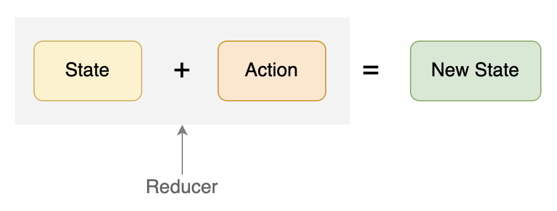

# Redux
Redux is a state management framework that can be used with a number of different web technologies, including React.

类似于 Vue 中的 Vuex 和 Pinia, 进行状态管理

Redux 引入的概念其实并不多，主要就是三个：State、Action 和 Reducer:
- 其中 State 即 Store，一般就是一个纯 JavaScript Object。
- Action 也是一个 Object，用于描述发生的动作。
- 而 Reducer 则是一个函数，接收 Action 和 State 并作为参数，通过计算得到新的 Store。



通过把状态放在组件之外，就可以让 React 组件成为更加纯粹的表现层，那么很多对于业务数据和状态数据的管理，就都可以在组件之外去完成（Reducer 和 Action）。同时这也天然提供了状态共享的能力。两个典型场景：

- 跨组件的状态共享：当某个组件发起一个请求时，将某个 Loading 的数据状态设为 True，另一个全局状态组件则显示 Loading 的状态。
- 同组件多个实例的状态共享：某个页面组件初次加载时，会发送请求拿回了一个数据，切换到另外一个页面后又返回。这时数据已经存在，无需重新加载。设想如果是本地的组件 state，那么组件销毁后重新创建，state 也会被重置，就还需要重新获取数据。

<br>

## 什么时候使用 Redux？
一般情况下，当你的 React 项目足够小，引入 Redux 的成本要大于收益。
只有你预期项目规模会逐渐增大，或者项目已经是大中型的体量了，这时可以考虑引入 Redux。

Redux 鼓励全局只有单一 store，所以比较适合管理全局状态。

尤其有一种情况，当你发现，你不得不把项目中大部分组件的 state 都提升到根组件上时，全局状态会不断膨胀，那你就有可能亟需引入 Redux 了。

<br>

## create Redux store
The Redux store is an object which holds and manages application state. 

- There is a method called createStore() on the Redux object, which you use to create the Redux store. This method takes a reducer function as a required argument.
- You can retrieve the current state held in the Redux store object with the getState() method.

```
const reducer = (state = 5) => {
  return state;
}

// Redux methods are available from a Redux object
// Define the store here:
let store = Redux.createStore(reducer)
let currentState = store.getState()
```

## Redux action
In Redux, all state updates are triggered by dispatching actions.

example: create and deliver action
```
define an action store
const store = Redux.createStore (
  (state = {login: false}) => state
);

// define an action creator
const loginAction = () => {
  return {
    type: 'LOGIN'
  }
};

// Dispatch the action here:
store.dispatch(loginAction()) // 等价于 store.dispatch({ type: 'LOGIN' });

```
总结：使用createStore创建一个store, action就是一个对象，action creator就是一个返回对象的函数，store通过dispatch方法触发一个action.


## Reducer
Reducers in Redux are responsible for the state modifications that take place in response to actions. 
A reducer takes state and action as arguments, and it always returns a new state.

在 Redux 中，所有对于 Store 的修改都必须通过这样一个公式去完成，即使用dispatch(action)通过 Reducer 完成，而不是直接修改 Store.
可以把Reducer看作一个同步函数，修改state。

It is important to see that this is the only role of the reducer. It has no side effects — it never calls an API endpoint and it never has any hidden surprises. 
The reducer is simply a pure function that takes state and action, then returns new state.

Another key principle in Redux is that state is <strong>read-only</strong>. 
In other words, the reducer function must always return a new copy of state and never modify state directly. 

example: Handle Multiple Actions

```
const defaultState = {
  authenticated: false
};

const LOGIN = 'LOGIN'
const LOGOUT = 'LOGOUT'

const authReducer = (state = defaultState, action) => {

  switch (action.type) {
    case LOGIN: 
      return {
        authenticated: true
      }
    case LOGOUT: 
      return {
        authenticated: false
      }

    default:
      return state;

  }

};

const store = Redux.createStore(authReducer);

const loginUser = () => {
  return {
    type: LOGIN
  }
};

const logoutUser = () => {
  return {
    type: LOGOUT
  }
};

store.dispatch(loginUser())
store.dispatch(logoutUser())
```

## Register a Store Listener
Another method you have access to on the Redux store object is store.subscribe(). This allows you to subscribe listener functions to the store, which are called whenever an action is dispatched against the store.


```
const ADD = 'ADD';

const reducer = (state = 0, action) => {
  switch(action.type) {
    case ADD:
      return state + 1;
    default:
      return state;
  }
};

const store = Redux.createStore(reducer);

// Global count variable:
let count = 0;

// increments the global variable count every time when the store receives an action
store.subscribe(() => {
  count++
})

store.dispatch({type: ADD});
console.log(count);
store.dispatch({type: ADD});
console.log(count);
store.dispatch({type: ADD});
console.log(count);
```

## combine multiple reducers
In order to let us combine multiple reducers together, Redux provides the combineReducers() method.

```
const INCREMENT = 'INCREMENT';
const DECREMENT = 'DECREMENT';

const counterReducer = (state = 0, action) => {
  switch(action.type) {
    case INCREMENT:
      return state + 1;
    case DECREMENT:
      return state - 1;
    default:
      return state;
  }
};

const LOGIN = 'LOGIN';
const LOGOUT = 'LOGOUT';

const authReducer = (state = {authenticated: false}, action) => {
  switch(action.type) {
    case LOGIN:
      return {
        authenticated: true
      }
    case LOGOUT:
      return {
        authenticated: false
      }
    default:
      return state;
  }
};

const rootReducer = Redux.combineReducers({
  count: counterReducer,
  auth: authReducer
})

const store = Redux.createStore(rootReducer);
```

## Send Action Data to the Store
You can also send specific data along with your actions. 
```
const ADD_NOTE = 'ADD_NOTE';

const notesReducer = (state = 'Initial State', action) => {
  switch(action.type) {
    // 在Reducer种使用action传递的数据
    case ADD_NOTE:
     return action.text
     break;
    default:
      return state;
  }
};

// 这里增加了text字段用来传递数据, addNoteText就是一个携带数据的action creator
const addNoteText = (note) => {
  return {
    type: ADD_NOTE,
    text: note
  }
};

const store = Redux.createStore(notesReducer);

console.log(store.getState());
store.dispatch(addNoteText('Hello!'));
console.log(store.getState());
```


## Use Middleware to Handle Asynchronous Actions
At some point you'll need to call asynchronous endpoints in your Redux app, so how do you handle these types of requests? Redux provides middleware designed specifically for this purpose, called Redux Thunk middleware. Here's a brief description how to use this with Redux.

To include Redux Thunk middleware, you pass it as an argument to Redux.applyMiddleware().This statement is then provided as a second optional parameter to the createStore() function.

简单来说，middleware 可以让你提供一个拦截器在 reducer 处理 action 之前被调用。在这个拦截器中，你可以自由处理获得的 action。
无论是把这个 action 直接传递到 reducer，或者构建新的 action 发送到 reducer，都是可以的。

Redux 提供了 redux-thunk 这样一个中间件，它如果发现接受到的 action 是一个函数，那么就不会传递给 Reducer，而是执行这个函数，并把 dispatch 作为参数传给这个函数，从而在这个函数中你可以自由决定何时，如何发送 Action。

```
const REQUESTING_DATA = 'REQUESTING_DATA'
const RECEIVED_DATA = 'RECEIVED_DATA'

const requestingData = () => { return {type: REQUESTING_DATA} }
const receivedData = (data) => { return {type: RECEIVED_DATA, users: data.users} }

const handleAsync = () => {
  //  passing dispatch as a parameter to this special action creator.
  return function(dispatch) {
    // Dispatch request action here
    dispatch(requestingData())
    setTimeout(function() {
      let data = {
        users: ['Jeff', 'William', 'Alice']
      }
      // Dispatch received data action here
      dispatch(receivedData(data))
    }, 2500);
  }
};

const defaultState = {
  fetching: false,
  users: []
};

const asyncDataReducer = (state = defaultState, action) => {
  switch(action.type) {
    case REQUESTING_DATA:
      return {
        fetching: true,
        users: []
      }
    case RECEIVED_DATA:
      return {
        fetching: false,
        users: action.users
      }
    default:
      return state;
  }
};

const store = Redux.createStore(
  asyncDataReducer,
  Redux.applyMiddleware(ReduxThunk.default)
);
```
https://cloud.tencent.com/developer/section/1374199

## 不能改变state

example1
```
const ADD_TO_DO = 'ADD_TO_DO';

// A list of strings representing tasks to do:
const todos = [
  'Go to the store',
  'Clean the house',
  'Cook dinner',
  'Learn to code',
];

const immutableReducer = (state = todos, action) => {
  switch(action.type) {
    case ADD_TO_DO:
      // Don't mutate state here or the tests will fail
      return [...todos, action.todo]
    default:
      return state;
  }
};

// action creator
const addToDo = (todo) => {
  return {
    type: ADD_TO_DO,
    todo
  }
}

const store = Redux.createStore(immutableReducer);
```

example2: 删除下标为index的元素并返回
```
const immutableReducer = (state = [0,1,2,3,4,5], action) => {
  switch(action.type) {
    case 'REMOVE_ITEM':
      // Don't mutate state here or the tests will fail
      let res = [...state].slice(0, action.index).concat([...state].slice(action.index + 1))
      console.log(res)
      return res
    default:
      return state;
  }
};

const removeItem = (index) => {
  return {
    type: 'REMOVE_ITEM',
    index
  }
}

const store = Redux.createStore(immutableReducer);
```

example3:
```
const newObject = Object.assign({}, obj1, obj2);
```
This creates newObject as a new object, which contains the properties that currently exist in obj1 and obj2.
```
const defaultState = {
  user: 'CamperBot',
  status: 'offline',
  friends: '732,982',
  community: 'freeCodeCamp'
};

const immutableReducer = (state = defaultState, action) => {
  switch(action.type) {
    case 'ONLINE':
      let res = Object.assign({}, state)
      res.status = 'online'
      return res
    default:
      return state;
  }
};

const wakeUp = () => {
  return {
    type: 'ONLINE'
  }
};

const store = Redux.createStore(immutableReducer);
```