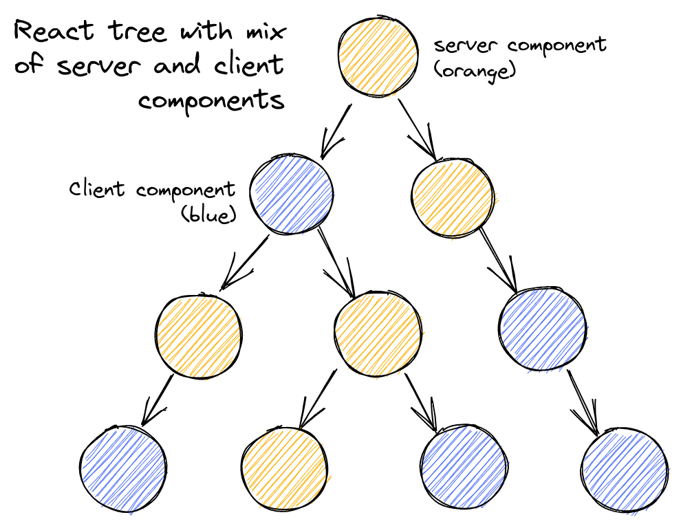

# React Server Component
React Server Components in React 19 are stable and will not break between major versions.

React Server Components allows the server and the client (browser) </strong>to collaborate in rendering</strong> your React application.

Consider the typical React element tree that is rendered for your page, which is usually composed of different React components rendering more React components.

RSC makes it possible for some components in this tree <strong>to be rendered by the server</strong>, 
and some components to be rendered by the browser.



Here’s a quick illustration from the React team, showing what the end goal is: a React tree, where the orange components rendered on the server, 
and blue components are rendered on the client.

<br>

## Isn’t that “server-side rendering”?
React Server Component is not server-side rendering (SSR)!

Using RSC does not require using SSR, and vice versa! SSR simulates an environment for rendering a React tree into raw html; 
it does not differentiate between server and client components, and it renders them the same way!

It is possible to combine both SSR and RSC, though, so that you can do server-side rendering with server components and hydrate them properly in the browser. 
In a future post, we will be talking more about how they work together.

<br>

## Why would we want RSC
There are certain advantages that rendering on the server has over the browser:
- The server has more direct access to your data sources — be they your databases, GraphQL endpoints, or the file system. The server can directly fetch the data you need without hopping through some public API endpoint, and it is usually more closely colocated with your data sources, so it can fetch the data more quickly than a browser can.
- The server can cheaply make use of “heavy” code modules, like an npm package for rendering markdown to html, because the server doesn’t need to download these dependencies every time they’re used — unlike the browser, which must download all used code as javascript bundles.

In short, React Server Components makes it possible for the server and the browser to do what they do best. 
Server components can </strong>focus on fetching data and rendering content</strong>, 
and client components can focus on stateful interactivity, resulting in faster page loads, smaller javascript bundle sizes, and a better user experience.


<br>

## The server-client component divide
Consider the React tree for your page, with some components to be rendered on the server and some on the client. 
Here’s one simplified way to think about the high-level strategy: the server can just “render” the server components as usual, 
turning your React components into native html elements like div and p. 

But whenever it encounters a “client” component meant to be rendered in the browser, <strong>it just outputs a placeholder instead</strong>, 
with instructions to fill in this hole with the right client component and props. 
Then, the browser takes that output, fills in those holes with the client components, and voila! You’re done.

which components are “for server” and which are “for client”?

The React team has defined this based on the extension of the file that the component was written in: 
- if the file ends with .server.jsx, it contains server components; 
- if it ends with .client.jsx, it contains client components. 
- If it has neither, then it contains components that can be used as both server and client components.

This definition is pragmatic — it is easy for both humans and bundlers to tell them apart.

Because server components run on the server, and client components run on the client, there are many restrictions on what each can do. 
But the most important one to keep in mind is that <strong>client components cannot import server components! </strong>

That’s because server components cannot be run in the browser, and may have code that does not work in the browser; 
if client components depended on server components, then we would end up pulling those illegal dependencies into the browser bundles.
```jsx
// ClientComponent.client.jsx
// NOT OK: client components cannot import server components
import ServerComponent from './ServerComponent.server'
export default function ClientComponent() {
  return (
    <div>
      <ServerComponent />
    </div>
  )
}
```

While you can’t import and render server components from client components, you can still use composition — 
that is, the client component can still take in props that are just opaque ReactNodes, 
and those ReactNodes may happen to be rendered by server components. For example:
```jsx
// ClientComponent.client.jsx
export default function ClientComponent({ children }) {
  return (
    <div>
      <h1>Hello from client land</h1>
      {children}
    </div>
  )
}

// ServerComponent.server.jsx
export default function ServerComponent() {
  return <span>Hello from server land</span>
}

// OuterServerComponent.server.jsx
// OuterServerComponent can instantiate both client and server
// components, and we are passing in a <ServerComponent/> as
// the children prop to the ClientComponent.
import ClientComponent from './ClientComponent.client'
import ServerComponent from './ServerComponent.server'
export default function OuterServerComponent() {
  return (
    <ClientComponent>
      <ServerComponent />
    </ClientComponent>
  )
}
```
This restriction will have major implications on how you organize your components to better take advantage of RSC.

<br>

## reference
- https://www.plasmic.app/blog/how-react-server-components-work
- https://zhuanlan.zhihu.com/p/470449193