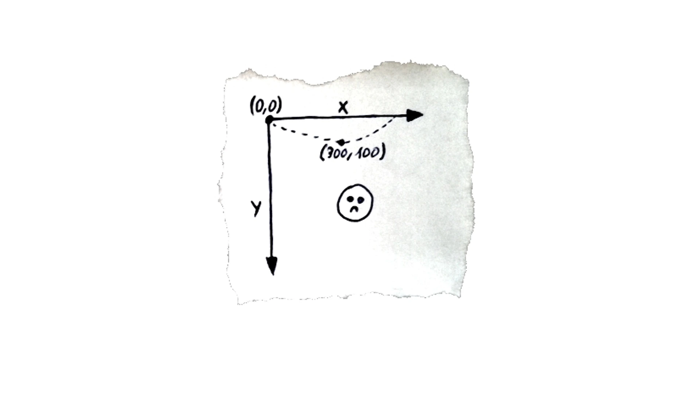

# Canvas
首先，Canvas 是一个非常简单易用的图形系统。Canvas 通过一组简单的绘图指令，就能够方便快捷地绘制出各种复杂的几何图形。

另外，Canvas 渲染起来相当高效。即使是绘制大量轮廓非常复杂的几何图形，Canvas 也只需要调用一组简单的绘图指令就能高性能地完成渲染。这个呀，其实和 Canvas 更偏向于渲染层，能够提供底层的图形渲染 API 有关。那在实际实现可视化业务的时候，Canvas 出色的渲染能力正是它的优势所在。

不过 Canvas 也有缺点，因为 Canvas 在 HTML 层面上是一个独立的画布元素，所以所有的绘制内容都是在内部通过绘图指令来完成的，绘制出的图形对于浏览器来说，只是 Canvas 中的一个个像素点，我们很难直接抽取其中的图形对象进行操作。

## 1. Canvas 元素和 2D 上下文
```
<body>
  <canvas width="512" height="512"></canvas>
  <style>
    canvas {
        width: 256px;
        height: 256px;
    }
  </style>
</body>
```
Canvas 元素上的 width 和 height 属性不等同于 Canvas 元素的 CSS 样式的属性。这是因为，CSS 属性中的宽高影响 Canvas 在页面上呈现的大小，而 HTML 属性中的宽高则决定了 Canvas 的坐标系。为了区分它们，我们称 Canvas 的 HTML 属性宽高为<em>画布宽高</em>，CSS 样式宽高为<em>样式宽高</em>。

在实际绘制的时候，如果我们不设置 Canvas 元素的样式，那么 Canvas 元素的画布宽高就会等于它的样式宽高的像素值，也就是 512px。

上面的例子中，实际的画布宽高就是样式宽高的两倍了。

画布宽高决定了<em>可视区域的坐标范围</em>，所以 Canvas 将画布宽高和样式宽高分开的做法，能更方便地适配不同的显示设备。

比如，我们要在画布宽高为 500 * 500 的 Canvas 画布上，绘制一个居中显示的 100 * 100 宽高的正方形。我们只要将它的坐标设置在  x = 200, y = 200 处即可。这样，不论这个 Canvas 以多大的尺寸显示在各种设备上，我们的代码都不需要修改。否则，如果 Canvas 的坐标范围（画布宽高）跟着样式宽高变化，那么当屏幕尺寸改变的时候，我们就要重新计算需要绘制的图形的所有坐标，这对于我们来说将会是一场“灾难”。

<div style="display: flex; align-items: center; justify-content: center;">
    
</div>

<br>

## 2. Canvas 的坐标系
Canvas 的坐标系和浏览器窗口的坐标系类似，它们都默认左上角为坐标原点，x 轴水平向右，y 轴垂直向下。那在我们设置好的画布宽高为 512*512 的 Canvas 画布中，它的左上角坐标值为（0,0），右下角坐标值为（512,512） 。这意味着，坐标（0,0）到（512,512）之间的所有图形，都会被浏览器渲染到画布上。

<div style="display: flex; align-items: center; justify-content: center;">
    
</div>

如果我们再考虑旋转或者三维运动，这个坐标系就会变成“左手系”。

<div style="display: flex; align-items: center; justify-content: center;">
    
</div>

<br>

## 3. 利用 Canvas 绘制几何图形

获取canvas元素：
```
const canvas = document.querySelector('canvas');
```

获取了 canvas 元素后，我们就可以通过 getContext 方法拿到它的上下文对象。具体的操作就是，我们调用 canvas.getContext 传入参数 2d:
```
const context = canvas.getContext('2d');
```

用 Canvas 上下文绘制图形: 在中心点绘制一个 100 * 100 的正方形
```
const rectSize = [100, 100]; 
context.rect(0.5 * (canvas.width - rectSize[0]), 0.5 * (canvas.height - rectSize[1]), ...rectSize);
```
其中，context.rect 是绘制矩形的 Canvas 指令，它的四个参数分别表示要绘制的矩形的 x、y 坐标和宽高。在这里我们要绘制的正方形宽高都是 100，所以后两个参数是 100 和 100. 这里要减去矩形宽度的一半是为了居中，因为context.rect方法的前两个参数是相对矩形的左上角进行的。

为了居中：我们可以先给画布设置一个平移变换（Translate），然后再进行绘制：
```
// 平移
context.translate(-0.5 * rectSize[0], -0.5 * rectSize[1]);

... 执行绘制

// 恢复
context.translate(0.5 * rectSize[0], 0.5 * rectSize[1]);
```
Canvas 上下文还提供了 save 和 restore 方法，可以暂存和恢复画布某个时刻的状态。其中，save 指令不仅可以保存当前的 translate 状态，还可以保存其他的信息，比如，fillStyle 等颜色信息。 而 restore 指令则可以将状态指令恢复成 save 指令前的设置。
```

context.save(); // 暂存状态
// 平移
context.translate(-0.5 * rectSize[0], -0.5 * rectSize[1]);

... 执行绘制

context.restore(); // 恢复状态
```

我要将正方形填充成红色，这一步通过调用 context.fillStyle 指令就可以完成。然后，我们要调用一个 beginPath 的指令，告诉 Canvas 我们现在绘制的路径。接着，才是调用 rect 指令完成绘图。最后，我们还要调用 fill 指令，将绘制的内容真正输出到画布中。这样我们就完成了绘制:
```
const rectSize = [100, 100];
context.fillStyle = 'red';
context.beginPath();
context.rect(0.5 * (canvas.width - rectSize[0]), 0.5 * (canvas.height - rectSize[1]), ...rectSize);
context.fill();
```

<br>

## 4. 补充说明
- 上面绘制的图形都是静态的，如果要使用 Canvas 绘制动态的图形也很简单，我们可以通过 clearRect 指令，将之前的图形擦除，再把新的图形绘制上去即可。

<br>

## 5. 参考资料
- https://developer.mozilla.org/zh-CN/docs/Web/API/Canvas_API/Tutorial/Basic_usage 