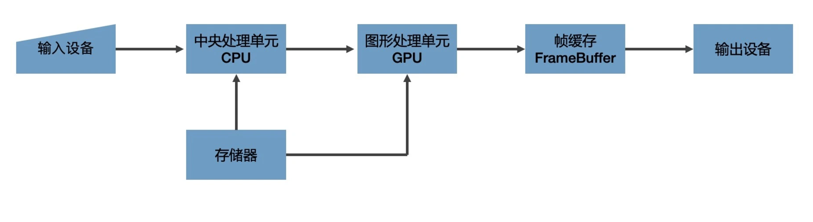
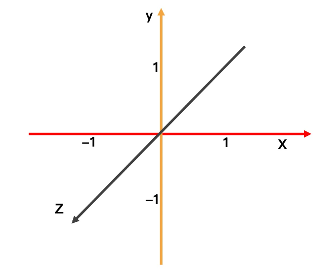

# WebGL
WebGL 这种技术本身就是用来解决最复杂的视觉呈现的,
使用 WebGL 绘图，我们必须要深入细节里。换句话说就是，我们必须要和内存、GPU 打交道，真正控制图形输出的每一个细节。

<br>

## 图形系统如何绘图
几个概念：
- 光栅（Raster）：几乎所有的现代图形系统都是基于光栅来绘制图形的，光栅就是指构成图像的像素阵列。
- 像素（Pixel）：一个像素对应图像上的一个点，它通常保存图像上的某个具体位置的颜色等信息。
- 帧缓存（Frame Buffer）：在绘图过程中，像素信息被存放于帧缓存中，帧缓存是一块内存地址。
- CPU（Central Processing Unit）：中央处理单元，负责逻辑计算。
- GPU（Graphics Processing Unit）：图形处理单元，负责图形计算。



数据经过 CPU 处理，成为具有特定结构的几何信息。然后，这些信息会被送到 GPU 中进行处理。在 GPU 中要经过两个步骤生成光栅信息。这些光栅信息会输出到帧缓存中，最后渲染到屏幕上。

整个过程是一步一步进行的，前一步的输出就是后一步的输入，所以我们也把这个过程叫做渲染管线（RenderPipelines）。

### 对GPU的补充说明
GPU 是由大量的小型处理单元构成的，单个小型处理单元远远没有 CPU 那么强大，但胜在数量众多，可以保证每个单元处理一个简单的任务。即使我们要处理一张 800 * 600 大小的图片，GPU 也可以保证这 48 万个像素点分别对应一个小单元，这样我们就可以同时对每个像素点进行计算了。

<br>

## 用 WebGL 绘制三角形
浏览器提供的 WebGL API 是 OpenGL ES 的 JavaScript 绑定版本，它赋予了开发者操作 GPU 的能力。这一特点也让 WebGL 的绘图方式和其他图形系统的“开箱即用”（直接调用绘图指令或者创建图形元素就可以完成绘图）的绘图方式完全不同，甚至要复杂得多。我们可以总结为以下 5 个步骤:
- 创建 WebGL 上下文
- 创建 WebGL 程序（WebGL Program）
- 将数据存入缓冲区
- 将缓冲区数据读取到 GPU
- GPU 执行 WebGL 程序，输出结果

### 1. 创建 WebGL 上下文
```
const canvas = document.querySelector('canvas');
const gl = canvas.getContext('webgl');
```
有了 WebGL 上下文对象之后，我们并不能像使用 Canvas2D 的上下文那样，调用几个绘图指令就把图形画出来，还需要做很多工作。

### 2. 创建 WebGL 程序
这里的 WebGL 程序是一个 WebGLProgram 对象，它是给 GPU 最终运行着色器的程序，而不是我们正在写的三角形的 JavaScript 程序。

创建这个 WebGL 程序，我们需要编写两个着色器（Shader）。着色器是用 GLSL 这种编程语言编写的代码片段。
```
const vertex = `
  attribute vec2 position;

  void main() {
    gl_PointSize = 1.0;
    gl_Position = vec4(position, 1.0, 1.0);
  }
`;

const fragment = `
  precision mediump float;

  void main()
  {
    gl_FragColor = vec4(1.0, 0.0, 0.0, 1.0);
  }    
`;
```
在 GLSL 中，attribute 表示声明变量，vec2 是变量的类型，它表示一个二维向量，position 是变量名。片元着色器中定义了像素点的颜色，通过设置 gl_FragColor 的值来定义和改变图形的颜色。gl_FragColor 是 WebGL 片元着色器的内置变量，表示当前像素点颜色，它是一个用 RGBA 色值表示的四维向量数据。在上面的代码中，因为我们写入 vec4(1.0, 0.0, 0.0, 1.0) 对应的是红色，所以三角形是红色的。如果我们把这个值改成 vec4(0.0, 0.0, 1.0, 1.0)，那三角形就是蓝色。

WebGL 绘制一个图形的过程，一般需要用到两段着色器，一段叫顶点着色器（Vertex Shader）负责处理图形的顶点信息，另一段叫片元着色器（Fragment Shader）负责处理图形的像素信息。

更具体点来说，我们可以把顶点着色器理解为处理顶点的 GPU 程序代码。它可以改变顶点的信息（如顶点的坐标、法线方向、材质等等），从而改变我们绘制出来的图形的形状或者大小等等。

顶点处理完成之后，WebGL 就会根据顶点和绘图模式指定的图元，计算出需要着色的像素点，然后对它们执行片元着色器程序。简单来说，就是对指定图元中的像素点着色。无论有多少个像素点，片元着色器都可以同时处理。这也是片元着色器一大特点。

WebGL 从顶点着色器和图元提取像素点给片元着色器执行代码的过程，就是我们前面说的生成光栅信息的过程，我们也叫它光栅化过程。所以，片元着色器的作用，就是处理光栅化后的像素信息。

图元是 WebGL 可以直接处理的图形单元，所以其他非图元的图形最终必须要转换为图元才可以被 WebGL 处理。举个例子，如果我们要绘制实心的四边形，我们就需要将四边形拆分成两个三角形，再交给 WebGL 分别绘制出来。


JS中，顶点着色器和片元着色器只是一段代码片段，所以我们要将它们分别创建成 shader 对象:
```
const vertexShader = gl.createShader(gl.VERTEX_SHADER);
gl.shaderSource(vertexShader, vertex);
gl.compileShader(vertexShader);


const fragmentShader = gl.createShader(gl.FRAGMENT_SHADER);
gl.shaderSource(fragmentShader, fragment);
gl.compileShader(fragmentShader);
```
接着，创建 WebGLProgram 对象，并将这两个 shader 关联到这个 WebGL 程序上。
```
const program = gl.createProgram();
gl.attachShader(program, vertexShader);
gl.attachShader(program, fragmentShader);
gl.linkProgram(program);
```
最后，我们要通过 useProgram 选择启用这个 WebGLProgram 对象。这样，当我们绘制图形时，GPU 就会执行我们通过 WebGLProgram 设定的 两个 shader 程序。
```
gl.useProgram(program);
```

### 3. 将数据存入缓冲区

在这个坐标系上显示一个顶点坐标分别是（-1, -1）、（1, -1）、（0, 1）的三角形，因为三角形是二维的，所以我们可以直接忽略 z 轴.

首先，要定义这个三角形的三个顶点。WebGL 使用的数据需要用类型数组定义，默认格式是 Float32Array。Float32Array 是 JavaScript 的一种类型化数组（TypedArray），JavaScript 通常用类型化数组来处理二进制缓冲区。

```
const points = new Float32Array([
  -1, -1,
  0, 1,
  1, -1,
]);

```
类型化数组参考：https://developer.mozilla.org/zh-CN/docs/Web/JavaScript/Reference/Global_Objects/TypedArray

接着，我们要将定义好的数据写入 WebGL 的缓冲区。这个过程我们可以简单总结为三步，分别是创建一个缓存对象，将它绑定为当前操作对象，再把当前的数据写入缓存对象。
```
const bufferId = gl.createBuffer();
gl.bindBuffer(gl.ARRAY_BUFFER, bufferId);
gl.bufferData(gl.ARRAY_BUFFER, points, gl.STATIC_DRAW);
```

### 4. 将缓冲区数据读取到 GPU
上一步已经把数据写入缓存了，但是我们的 shader 现在还不能读取这个数据，还需要把数据绑定给顶点着色器中的 position 变量。
```
const vPosition = gl.getAttribLocation(program, 'position');获取顶点着色器中的position变量的地址
gl.vertexAttribPointer(vPosition, 2, gl.FLOAT, false, 0, 0);给变量设置长度和类型
gl.enableVertexAttribArray(vPosition);激活这个变量
```
经过这样的处理，在顶点着色器中，我们定义的 points 类型数组中对应的值，就能通过变量 position 读到了。

### 5. 执行着色器程序完成绘制
```
gl.clear(gl.COLOR_BUFFER_BIT);
gl.drawArrays(gl.TRIANGLES, 0, points.length / 2);
```
先调用 gl.clear 将当前画布的内容清除，然后调用 gl.drawArrays 传入绘制模式。这里我们选择 gl.TRIANGLES 表示以三角形为图元绘制，再传入绘制的顶点偏移量和顶点数量，WebGL 就会将对应的 buffer 数组传给顶点着色器，并且开始绘制。

我们要记住，不论这个三角形是大还是小，有几十个像素点还是上百万个像素点，GPU 都是同时处理每个像素点的。也就是说，图形中有多少个像素点，着色器程序在 GPU 中就会被同时执行多少次。