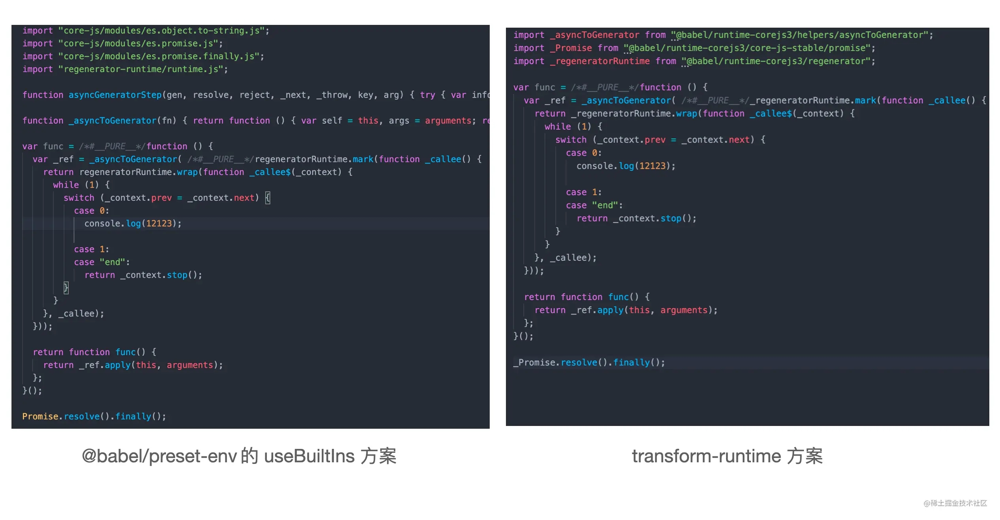

# Babel
Babel 是 JavaScript 编译器，更确切地说是源码到源码的编译器，通常也叫做“转换编译器（transpiler）”。 
意思是说你为 Babel 提供一些 JavaScript 代码，Babel 更改这些代码，然后返回给你新生成的代码。
这个处理过程中的每一步都涉及到创建或是操作抽象语法树，亦称 AST。

## babel demo
```
npm init -y
npm i @babel/cli @babel/core @babel/preset-env
```
各个依赖的作用:
- @babel/cli: 一个允许你在终端使用 babel 的工具，很适合我们练习用。
- @babel/core: babel 核心编译库。
- @babel/preset-env: babel 的预设工具集，基本为 babel 必装的库。

<br>

## .babelrc.json配置说明
### 1. targets
targets 也可以用 <a href="https://github.com/browserslist/browserslist">Browserslist</a> 配置语法
```
{ 
    // ie 不低于 11 版本，全球超过 0.5% 使用，且还在维护更新的浏览器
    "targets": "ie >= 11, > 0.5%, not dead"
}
```
Browserslist 是一个帮助我们设置目标浏览器的工具，不光是 Babel 用到，
其他的编译工具如postcss-preset-env、autoprefix中都有所应用。
对于Browserslist的配置内容，你既可以放到 Babel 这种特定工具当中，也可以在package.json中通过browserslist声明:
```
// package.json
{ 
  "browserslist": "ie >= 11"
}
```
或者通过.browserslistrc进行声明:
```
// .browserslistrc
ie >= 11
```

在实际的项目中，一般我们可以将使用下面这些最佳实践集合来描述不同的浏览器类型，减轻配置负担:
```
// 现代浏览器
last 2 versions and since 2018 and > 0.5%
// 兼容低版本 PC 浏览器
IE >= 11, > 0.5%, not dead
// 兼容低版本移动端浏览器
iOS >= 9, Android >= 4.4, last 2 versions, > 0.2%, not dead
```
具体配置可以参考<a href="https://browserslist.dev/?q=bGFzdCAyIHZlcnNpb25z">browserslist.dev</a>

<br>

### 2. useBuiltIns，
它决定了添加 Polyfill 策略，默认是 false，即不添加任何的 Polyfill。
你可以手动将useBuiltIns配置为entry或者usage.

如果这个字段配置为entry，entry配置规定你必须在入口文件手动添加一行这样的代码:
```
// index.js 开头加上
import 'core-js';
```
终端执行下面的命令进行 Babel 编译:
```
npx babel src --out-dir dist
```
产物输出在dist目录中。
Babel 已经根据目标浏览器的配置为我们添加了大量的 Polyfill 代码，index.js文件简单的几行代码被编译成近 300 行。
实际上，Babel 所做的事情就是将你的import "core-js"代码替换成了产物中的这些具体模块的导入代码。


useBuiltIns: usage这个按需导入的配置，改动配置后执行编译命令:
```
npx babel src --out-dir dist
```
Polyfill 代码主要来自 corejs 和 regenerator-runtime，因此如果要运行起来，必须要装这两个库。

可以发现 Polyfill 的代码精简了许多，真正地实现了按需 Polyfill 导入。
因此，在实际的使用当中，还是推荐尽量使用useBuiltIns: "usage"，进行按需的 Polyfill 注入。

上面我们利用@babel/preset-env进行了目标浏览器语法的降级和Polyfill注入，同时用到了core-js和regenerator-runtime两个核心的运行时库。
但@babel/preset-env 的方案也存在一定局限性:

1. 如果使用新特性，往往是通过基础库(如 core-js)往全局环境添加 Polyfill，如果是开发应用没有任何问题，如果是开发第三方工具库，则很可能会对全局空间造成污染。
   
2. 很多工具函数的实现代码(如上面示例中的_defineProperty方法)，会在许多文件中重现出现，造成文件体积冗余。

<br>

## 更优的 Polyfill 注入方案: transform-runtime

transform-runtime方案可以作为@babel/preset-env中useBuiltIns配置的替代品，
也就是说，一旦使用transform-runtime方案，你应该把 useBuiltIns属性设为 false。
```
npm i @babel/plugin-transform-runtime -D
npm i @babel/runtime-corejs3 -S
```
前者是编译时工具，用来转换语法和添加 Polyfill，
后者是运行时基础库，封装了core-js、regenerator-runtime和各种语法转换用到的工具函数。



transform-runtime 一方面能够让我们在代码中使用非全局版本的 Polyfill，这样就避免全局空间的污染，
这也得益于 core-js 的 pure 版本产物特性；

另一方面对于asyncToGeneator这类的工具函数，它也将其转换成了一段引入语句，不再将完整的实现放到文件中，节省了编译后文件的体积。

另外，transform-runtime方案引用的基础库也发生了变化，不再是直接引入core-js和regenerator-runtime，而是引入@babel/runtime-corejs3。

<br>

## plugins
转换规则会体现为插件的形式，插件是小型 JavaScript 程序，它指示 Babel 如何进行代码转换。

比如，想要将 ES2015+ 语法转换为 ES5，我们可以依赖类似 @babel/plugin-transform-arrow-functions 这样的官方插件.
该插件将代码中的所有箭头函数都将转换为 ES5 兼容的函数表达式.

插件配置时可以指定选项：
```
{
  "plugins": ["pluginA", ["pluginB"], ["pluginC", { "module": "bluebird" }]]
}
```
### 插件执行顺序：
- 插件在预设之前运行。
- 插件排序是从第一个到最后一个。
- 预设顺序是颠倒的（最后一个到第一个）。

### 自定义插件
babel也支持编写自己的插件，来应用你想要的任何转换规则。

<br>

## preset
preset实际就是包含了某些特定能力转换插件的集合，比如：
- @babel/preset-env 用于编译 ES2015+ 语法
- @babel/preset-typescript 用于 TypeScript
- @babel/preset-react 用于 React
- @babel/preset-flow 用于 Flow

自定义预设实际就是将其它预设和插件进行组合：
```
module.exports = function() {
  return {
    plugins: ["pluginA", "pluginB", "pluginC"],
  };
};
```

预设可以包含其它预设和带有选项的插件。
```
module.exports = () => ({
  presets: [require("@babel/preset-env")],
  plugins: [
    [require("@babel/plugin-proposal-class-properties"), { loose: true }],
    require("@babel/plugin-proposal-object-rest-spread"),
  ],
});
```

<br>

## 参考资料
- https://babel.docschina.org/docs/en/
- https://github.com/thejameskyle/babel-handbook