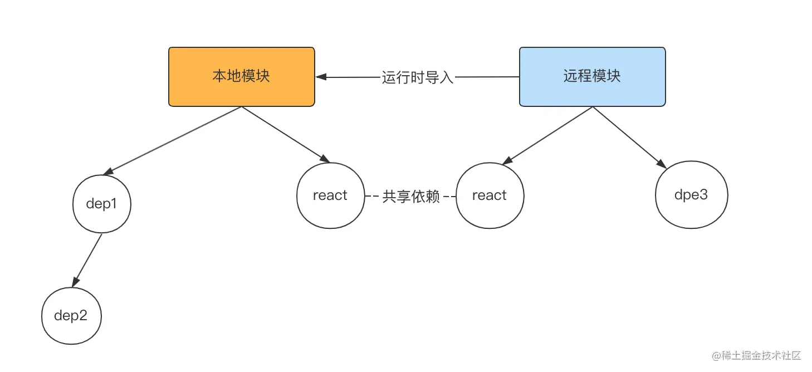

# Module Federation
Module Federation，即模块联邦，用于解决模块复用问题。

模块联邦中主要有两种模块: 本地模块和远程模块。
- 本地模块即为普通模块，是当前构建流程中的一部分
- 远程模块不属于当前构建流程，在<strong>本地模块的运行时进行导入</strong>。
- 同时，<strong>本地模块和远程模块可以共享某些依赖的代码</strong>。



在模块联邦中，每个模块既可以是本地模块，导入其它的远程模块，又可以作为远程模块，被其他的模块导入。


以上就是模块联邦的主要设计原理，现在我们来好好分析一下这种设计究竟有哪些优势:

1. 实现任意粒度的模块共享。这里所指的模块粒度可大可小，包括第三方 npm 依赖、业务组件、工具函数，
甚至可以是整个前端应用！而整个前端应用能够共享产物，代表着各个应用单独开发、测试、部署，这也是一种微前端的实现。

2. 优化构建产物体积。远程模块可以从本地模块运行时被拉取，而不用参与本地模块的构建，可以加速构建过程，同时也能减小构建产物。

3. 运行时按需加载。远程模块导入的粒度可以很小，如果你只想使用 app1模块的 add函数，只需要在 app1的构建配置中导出这个函数，
然后在本地模块中按照诸如import('app1/add')的方式导入即可，这样就很好地实现了模块按需加载。

4. 第三方依赖共享。通过模块联邦中的共享依赖机制，我们可以很方便地实现在模块间公用依赖代码，从而避免以往的external + CDN 引入方案的各种问题。

模块联邦近乎完美地解决了以往模块共享的问题，甚至能够实现应用级别的共享，进而达到微前端的效果。

## vite模块联邦
一个比较成熟的 Vite 模块联邦方案: vite-plugin-federation，这个方案基于 Vite(或者 Rollup) 实现了完整的模块联邦能力。
demo见 host和remote, 基于Vue + ts创建了项目，并安装vite-plugin-federation. host代表本地模块, remote代表远程模块。
```
npm install @originjs/vite-plugin-federation -D
```