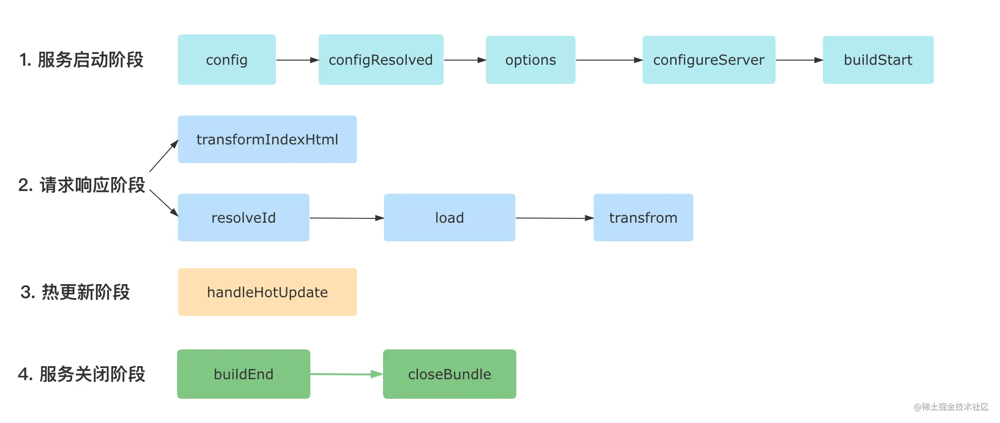
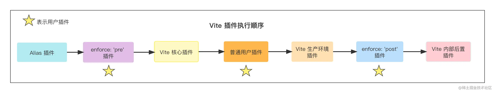

# vite plugin

## 与 Rollup 兼容的钩子
Vite 会调用一系列与 Rollup 兼容的钩子，这些钩子主要分为三个阶段:
- 服务器启动阶段: options和 buildStart钩子会在服务启动时被调用。
- 请求响应阶段: 当浏览器发起请求时，Vite 内部依次调用resolveId、load和transform钩子。
- 服务器关闭阶段: Vite 会依次执行 buildEnd和 closeBundle钩子。

除了以上钩子，其他 Rollup 插件钩子(如moduleParsed、renderChunk)均不会在 Vite 开发阶段调用。

而生产环境下，由于 Vite 直接使用 Rollup，Vite 插件中所有 Rollup 的插件钩子都会生效。

## 独有Hooks
Vite 中特有的一些 Hook，这些 Hook 只会在 Vite 内部调用，而放到 Rollup 中会被直接忽略。

### 1. 给配置再加点料: config
Vite 在读取完配置文件（即vite.config.ts）之后，会拿到用户导出的配置对象，然后执行 config 钩子。在这个钩子里面，你可以对配置文件导出的对象进行自定义的操作，如下代码所示:
```
// 返回部分配置（推荐）
const editConfigPlugin = () => ({
  name: 'vite-plugin-modify-config',
  config: () => ({
    alias: {
      react: require.resolve('react')
    }
  })
})
```
官方推荐的姿势是在 config 钩子中返回一个配置对象，这个配置对象会和 Vite 已有的配置进行深度的合并。不过你也可以通过钩子的入参拿到 config 对象进行自定义的修改，如下代码所示:
```
const mutateConfigPlugin = () => ({
  name: 'mutate-config',
  // command 为 `serve`(开发环境) 或者 `build`(生产环境)
  config(config, { command }) {
    // 生产环境中修改 root 参数
    if (command === 'build') {
      config.root = __dirname;
    }
  }
})
```
在一些比较深层的对象配置中，这种直接修改配置的方式会显得比较麻烦，如 optimizeDeps.esbuildOptions.plugins，需要写很多的样板代码，类似下面这样:

```
// 防止出现 undefined 的情况
config.optimizeDeps = config.optimizeDeps || {}
config.optimizeDeps.esbuildOptions = config.optimizeDeps.esbuildOptions || {}
config.optimizeDeps.esbuildOptions.plugins = config.optimizeDeps.esbuildOptions.plugins || []
```
因此这种情况下，建议直接返回一个配置对象，这样会方便很多:
```
config() {
  return {
    optimizeDeps: {
      esbuildOptions: {
        plugins: []
      }
    }
  }
}
```

### 2. 记录最终配置: configResolved
Vite 在解析完配置之后会调用configResolved钩子，这个钩子一般用来记录最终的配置信息，而不建议再修改配置，用法如下所示:
```
const exmaplePlugin = () => {
  let config

  return {
    name: 'read-config',

    configResolved(resolvedConfig) {
      // 记录最终配置
      config = resolvedConfig
    },

    // 在其他钩子中可以访问到配置
    transform(code, id) {
      console.log(config)
    }
  }
}
```

### 3. 获取 Dev Server 实例: configureServer
这个钩子仅在开发阶段会被调用，用于扩展 Vite 的 Dev Server，一般用于增加自定义 server 中间件，如下代码所示:
```
const myPlugin = () => ({
  name: 'configure-server',
  configureServer(server) {
    // 姿势 1: 在 Vite 内置中间件之前执行
    server.middlewares.use((req, res, next) => {
      // 自定义请求处理逻辑
    })
    // 姿势 2: 在 Vite 内置中间件之后执行 
    return () => {
      server.middlewares.use((req, res, next) => {
        // 自定义请求处理逻辑
      })
    }
  }
})
```

### 4. 转换 HTML 内容: transformIndexHtml
这个钩子用来灵活控制 HTML 的内容，你可以拿到原始的 html 内容后进行任意的转换:
```
const htmlPlugin = () => {
  return {
    name: 'html-transform',
    transformIndexHtml(html) {
      return html.replace(
        /<title>(.*?)</title>/,
        `<title>换了个标题</title>`
      )
    }
  }
}
// 也可以返回如下的对象结构，一般用于添加某些标签
const htmlPlugin = () => {
  return {
    name: 'html-transform',
    transformIndexHtml(html) {
      return {
        html,
        // 注入标签
        tags: [
          {
            // 放到 body 末尾，可取值还有`head`|`head-prepend`|`body-prepend`，顾名思义
            injectTo: 'body',
            // 标签属性定义
            attrs: { type: 'module', src: './index.ts' },
            // 标签名
            tag: 'script',
          },
        ],
      }
    }
  }
}
```

### 5 热更新处理: handleHotUpdate
这个钩子会在 Vite 服务端处理热更新时被调用，你可以在这个钩子中拿到热更新相关的上下文信息，进行热更模块的过滤，或者进行自定义的热更处理。下面是一个简单的例子:
```
const handleHmrPlugin = () => {
  return {
    async handleHotUpdate(ctx) {
      // 需要热更的文件
      console.log(ctx.file)
      // 需要热更的模块，如一个 Vue 单文件会涉及多个模块
      console.log(ctx.modules)
      // 时间戳
      console.log(ctx.timestamp)
      // Vite Dev Server 实例
      console.log(ctx.server)
      // 读取最新的文件内容
      console.log(await read())
      // 自行处理 HMR 事件
      ctx.server.ws.send({
        type: 'custom',
        event: 'special-update',
        data: { a: 1 }
      })
      return []
    }
  }
}

// 前端代码中加入
if (import.meta.hot) {
  import.meta.hot.on('special-update', (data) => {
    // 执行自定义更新
    // { a: 1 }
    console.log(data)
    window.location.reload();
  })
}
```

以上就是 Vite 独有的五个钩子，我们来重新梳理一下:
- config: 用来进一步修改配置。
- configResolved: 用来记录最终的配置信息。
- configureServer: 用来获取 Vite Dev Server 实例，添加中间件。
- transformIndexHtml: 用来转换 HTML 的内容。
- handleHotUpdate: 用来进行热更新模块的过滤，或者进行自定义的热更新处理。

总结一下vite钩子执行顺序：



<br>

## 插件应用位置
默认情况下 Vite 插件同时被用于开发环境和生产环境，你可以通过apply属性来决定应用场景:
```
{
  // 'serve' 表示仅用于开发环境，'build'表示仅用于生产环境
  apply: 'serve'
}
```
apply参数还可以配置成一个函数，进行更灵活的控制:
```
apply(config, { command }) {
  // 只用于非 SSR 情况下的生产环境构建
  return command === 'build' && !config.build.ssr
}
```
同时，你也可以通过enforce属性来指定插件的执行顺序:
```
{
  // 默认为`normal`，可取值还有`pre`和`post`
  enforce: 'pre'
}
```



Vite 会依次执行如下的插件:
- Alias (路径别名)相关的插件。
- 带有 enforce: 'pre' 的用户插件。
- Vite 核心插件。
- 没有 enforce 值的用户插件，也叫普通插件。
- Vite 生产环境构建用的插件。
- 带有 enforce: 'post' 的用户插件。
- Vite 后置构建插件(如压缩插件)。