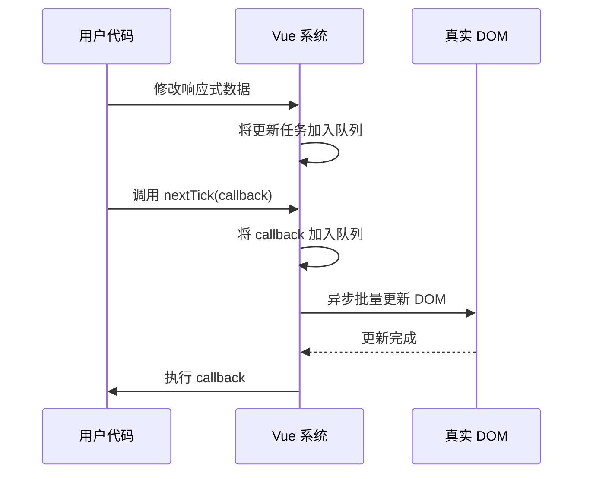

# nextTick
在 Vue.js 中，`nextTick()` 是一个核心 API，用于处理 DOM 更新后的异步操作。理解它的关键在于掌握 Vue 的**异步更新队列机制**。以下是详细解释：

---

### **核心概念**
1. **异步更新机制**：
   - Vue 不会在数据变化后立即更新 DOM，而是将更新操作放入一个异步队列
   - 同一事件循环内的多次数据变更会被合并（避免不必要的重复渲染）
   - DOM 更新会在下一个 "tick"（事件循环周期）执行

2. **`nextTick()` 的作用**：
   - 在下次 DOM 更新循环结束后执行回调函数
   - **确保你的代码在 DOM 更新完成后运行**

---

### **使用场景**
#### 1. 操作更新后的 DOM
```javascript
this.message = "更新后的值";
this.$nextTick(() => {
  // 此时 DOM 已更新
  console.log(document.getElementById("text").innerText); // 输出："更新后的值"
});
```

#### 2. 组件更新后操作
```javascript
this.showChild = true; // 动态创建子组件
this.$nextTick(() => {
  // 子组件已挂载，可访问其 DOM 或方法
  this.$refs.child.doSomething();
});
```

#### 3. 解决异步渲染问题
```javascript
methods: {
  handleClick() {
    this.items.push(newItem); // 添加新数据
    this.$nextTick(() => {
      // 滚动到新增元素位置
      const lastItem = this.$el.querySelector(".item:last-child");
      lastItem.scrollIntoView();
    });
  }
}
```

---

### **工作原理**
1. Vue 将数据变更引起的 DOM 更新放入异步队列
2. `nextTick()` 将回调函数加入同一个队列
3. 在当前事件循环结束后：
   - 先执行 DOM 更新（渲染）
   - 再执行 `nextTick` 回调



---

### **技术实现**
Vue 内部优先使用微任务（microtask）实现：
1. 优先使用 `Promise.then()`
2. 降级方案：`MutationObserver` → `setImmediate` → `setTimeout`

---

### **注意事项**
1. **避免过度使用**：大多数情况下 Vue 的响应式系统会自动处理 DOM 更新
2. **组件内使用**：`this.$nextTick()`
3. **全局使用**：`Vue.nextTick()`
4. **async/await 支持**：
   ```javascript
   async updateData() {
     this.value = "新值";
     await this.$nextTick();
     // DOM 已更新
   }
   ```

---

### **典型误区**
```javascript
// ❌ 错误：DOM 尚未更新
this.message = "hello";
console.log(document.getElementById("msg").textContent); // 输出旧值

// ✅ 正确
this.message = "hello";
this.$nextTick(() => {
  console.log(document.getElementById("msg").textContent); // "hello"
});
```

---

### **总结**
| 关键点                 | 说明                                                                 |
|------------------------|----------------------------------------------------------------------|
| **解决什么问题**       | DOM 更新异步性导致的"获取不到最新 DOM"问题                           |
| **执行时机**           | 当前事件循环结束 → DOM 更新 → 执行回调                               |
| **与 $refs 的关系**    | 动态创建/销毁组件后需用 nextTick 才能访问 $refs                      |
| **性能优化**           | 合并 DOM 更新，避免重复渲染                                          |
| **Vue 2 vs Vue 3**     | Vue 3 中 nextTick 使用更标准的微任务实现，行为一致但内部实现更现代化 |

通过合理使用 `nextTick()`，你可以确保在正确的时机操作 DOM，避免因 Vue 的异步更新机制导致的常见问题。