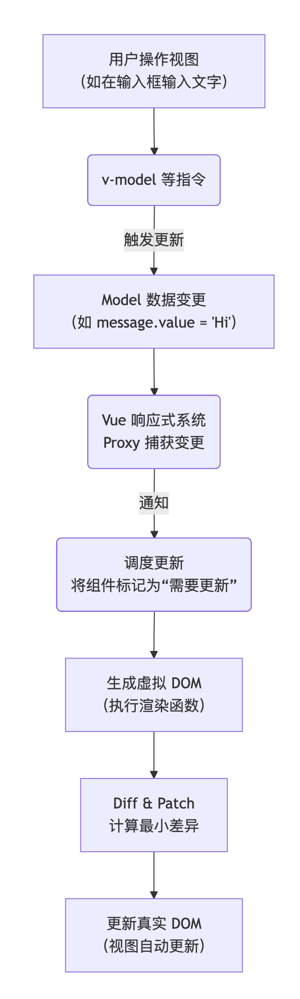

# Vue 3 的 MVVM 模式

首先，要明确一点：**Vue 的设计深受 MVVM 模式的启发，但 Vue 本身并不是一个严格的 MVVM 框架**。官方文档也提到，Vue 的设计参考了 MVVM 模型。所以，我们可以通过 MVVM 的视角来理解 Vue 的核心工作原理，这会非常清晰。

---

### 什么是 MVVM？

MVVM 是 **Model-View-ViewModel** 的缩写，它是一种将用户界面开发与业务逻辑分离的软件架构模式。

- **M - Model（模型）**：代表应用程序的数据和业务逻辑。它通常是从后端 API 获取的数据，或者是前端的纯 JavaScript 对象。
- **V - View（视图）**：用户看到的界面，即 UI 层。在 Web 开发中，就是 HTML 和 CSS。
- **VM - ViewModel（视图模型）**：这是 MVVM 的核心。它是连接 Model 和 View 的桥梁。它负责：
    - 从 Model 中暴露数据（通常经过处理）给 View 显示。
    - 监听 View 上的用户交互（如点击、输入），并执行相应的逻辑来更新 Model。
    - 当 Model 发生变化时，自动通知并更新 View。

**核心思想：数据驱动视图。** 开发者主要关心数据（Model）的变化，而视图（View）的更新由框架（ViewModel）自动完成。

---

### Vue 3 如何实现 MVVM？

我们来把 Vue 3 的各个部分对应到 MVVM 的三个角色上。

#### 1. Model（模型）
在 Vue 中，Model 就是你的**响应式数据**。这可以是通过 `ref` 或 `reactive` 创建的变量。

```javascript
import { ref, reactive } from 'vue'

// 这就是 Model 层
const message = ref('Hello, Vue 3!') // 一个基本类型的数据模型
const user = reactive({ // 一个对象类型的数据模型
  name: 'Alice',
  age: 25
})
```

#### 2. View（视图）
View 就是你的**模板（Template）**，也就是组件的 `<template>` 部分。它负责声明式地将数据渲染到 DOM。

```html
<template>
  <!-- 这是 View 层 -->
  <div>
    <p>{{ message }}</p> <!-- 双大括号语法，将 Model 的数据绑定到 View -->
    <input v-model="message" /> <!-- v-model 指令，实现双向绑定 -->
    <p>Name: {{ user.name }}, Age: {{ user.age }}</p>
    <button @click="user.age++">Increase Age</button> <!-- 监听用户交互 -->
  </div>
</template>
```

#### 3. ViewModel（视图模型）
这是 Vue 框架本身扮演的角色，它是连接 Model 和 View 的“粘合剂”。在 Vue 3 中，ViewModel 的功能主要由以下两部分协作完成：

- **响应式系统 (Reactivity System)**：这是 Vue 3 的核心突破，基于 ES6 的 `Proxy` 实现。
- **模板编译器 (Template Compiler)**：将模板编译成渲染函数。

**ViewModel 的工作流程可以用下图清晰地展示：**



下面我们来详细解释图中的每一步。

##### a. 数据劫持 / 代理 (Data Hijacking/Proxy)
当你用 `ref` 或 `reactive` 创建数据时，Vue 3 使用 **Proxy** 将这些对象包装起来。
- **Proxy** 可以“拦截”或“监听”你对数据的所有操作，比如读取 (`get`)、修改 (`set`)。
- 当你在组件中读取 `message` 时，Vue 的响应式系统会**跟踪**当前正在运行的组件，记录下“这个组件依赖了这个数据”。
- 当你修改 `message.value = ‘Hi’` 时，Proxy 的 `set` 拦截器被触发。

##### b. 依赖追踪与派发更新 (Dependency Tracking & Triggering Updates)
- Vue 知道刚才的修改操作，并且它知道有哪些组件依赖了这个数据（在第1步中追踪到的）。
- 然后，Vue 会**通知**所有依赖这个数据的组件：“你们依赖的数据变了，你们需要重新渲染了！”

##### c. 虚拟 DOM 与差异比对 (Virtual DOM & Diffing)
- 收到通知的组件会重新执行其**渲染函数**（你的模板会被编译成渲染函数）。
- 渲染函数会生成一个新的**虚拟 DOM 树**（一个描述页面结构的 JavaScript 对象）。
- 新的虚拟 DOM 树会和上一次的旧虚拟 DOM 树进行**差异比对 (Diffing)**，找出最小化的变更点。

##### d. 更新视图 (Patching the View)
- 最后，Vue 会根据计算出的差异，高效地更新**真实的 DOM**。这样就完成了从 Model 变化到 View 更新的整个闭环。

**双向数据绑定** 只是这个模式的一个典型体现：`v-model` 指令本质上是 `v-bind:value`（数据从 Model 流向 View）和 `v-on:input`（事件从 View 流回 Model，修改数据）的语法糖。

---

### Vue 3 相对于 Vue 2 在 MVVM 实现上的进步

| 特性 | Vue 2 | Vue 3 | 优势 |
| :--- | :--- | :--- | :--- |
| **响应式核心** | `Object.defineProperty` | **`Proxy`** | **Vue 3 胜出**：Proxy 能直接监听对象和数组的索引、长度变化，无需 `$set`，支持 Map、Set 等新数据类型。 |
| **组件实例** | 每个组件一个大的 Vue 实例 | 更轻量的**组合式 API (Composition API)** | **Vue 3 胜出**：逻辑关注点更易组织和复用，TypeScript 支持更好。 |
| **编译优化** | 全量 Diff | **Block Tree、Patch Flags** 等 | **Vue 3 胜出**：编译时分析静态和动态内容，运行时 Diff 性能极高。 |

### 总结

你可以这样理解 Vue 3 的 MVVM：

1.  **你（开发者）的角色**：主要关心 **Model**（定义数据） 和 **View**（编写模板）。你只需要告诉 Vue：“我的数据长这样（Model），我希望它这样显示在页面上（View），并且当用户这样操作时，数据要这样变。”
2.  **Vue（ViewModel）的角色**：它向你承诺：“好的老板，数据（Model）的变动就交给我来监听了。我向你保证，只要数据一变，页面（View）就会自动、高效地更新。你无需手动操作 DOM。”

这种模式极大地提高了开发效率，让你从繁琐的 DOM 操作中解放出来，专注于数据和业务逻辑。Vue 3 通过更先进的 `Proxy` 和编译时优化，使得这个“自动同步”的过程比 Vue 2 更加精准和高效。