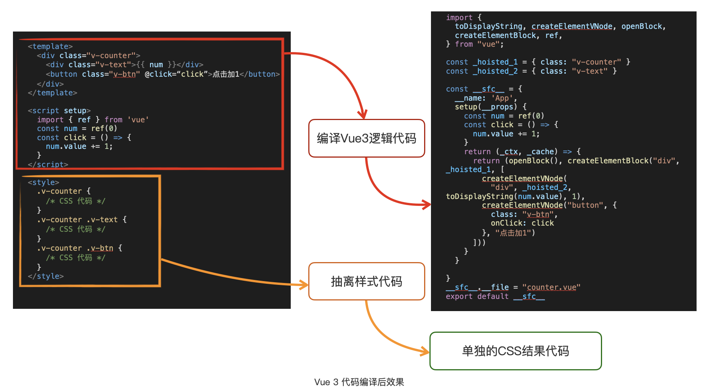

# compilation mechanism
Vue.js 经过编译后产出是 JavaScript 和 CSS 代码，也就是浏览可以直接支持运行的代码。



这个最终结果可以直接在支持 ES Modules 的浏览器环境运行，还可以将其再次经过 ES6+ 语法的编译(比如使用bebal降级)，最后成为能在浏览器直接运行的 ES5 代码。

这个编译后的结果，也就是最原始的 Vue.js 非编译模式的运行方式，也是我们最常用的模式。

---

## Vue.js 非编译模式是如何运行的？
### 1. 使用h函数，见 h.html

h函数定义如下：
```ts
export function h<P>(
  type: Component<P>,
  props?: (RawProps & P) | null,
  children?: RawChildren | RawSlots,
): VNode

export type RawSlots = {
  [name: string]: unknown
  // ...省略
}
```
h函数的优势如下：
- 简化虚拟 DOM 创建：h 函数封装了底层的复杂逻辑（封装了 createElementVNode），使开发者可以更直观地创建虚拟 DOM。
- 统一接口：无论是普通 HTML 元素还是组件，都可以通过 h 函数统一创建。

```js
import { h } from 'vue';

// 创建一个普通的 HTML 元素
const vnode = h('div', { class: 'container' }, [
  h('h1', null, 'Hello World'),
  h('p', null, 'This is a paragraph.')
]);

// 创建一个组件
const MyComponent = {
  setup() {
    return { msg: 'Hello from component!' };
  },
  template: `<div>{{ msg }}</div>`
};

const componentVNode = h(MyComponent);
```

---

### 2. 使用createElementVNode，不推荐，比使用h复杂。
```js
import { createElementVNode as _createElementVNode } from 'vue';

const vnode = _createElementVNode(
  'div',
  { class: 'container' },
  [
    _createElementVNode('h1', null, 'Hello World'),
    _createElementVNode('p', null, 'This is a paragraph.')
  ]
);
```

使用 createElementVNode/createElementBlock 的场景
- 性能优化：在某些极端性能要求下，可以直接调用底层函数以减少封装开销。
- 调试需求：需要深入了解虚拟 DOM 的生成过程时，可以直接使用底层函数。

---

### 3. 使用模版的非编译模式, 见tmp.html

那么这个编译过程会在哪进行呢？答案就是在浏览器里进行编译。
由于是直接写模板代码，代码运行的时候有一个模板的编译过程，也就是会将字符串模板编译成 VNode 的结果，再执行 VNode 的渲染。
对比 h函数 和直接的 VNode 的运行过程多了编译操作，同时使用的运行时也增加了编译代码。

Vue.js 的非编译模式直接可以书写出在浏览器运行的 Vue.js 代码，意味着我们可以跳过开发编译阶段，
直接在浏览器里组装 Vue.js 的代码结构，动态渲染出想要页面功能。

这个模式适用于一切能在浏览器动态搭建的场景，比如低代码搭建页面的场景。
换句话说，Vue.js 的非编译写法可以直接用于低代码的核心解决方案中。

比如，基于非编译的写法可以用来编写低代码平台搭建页面的组件运行时，
阿里等大厂内部的基于 React.js 的低代码场景实现方式，也经常见到基于 React.js 的非编译写法来构造浏览器端的运行时。