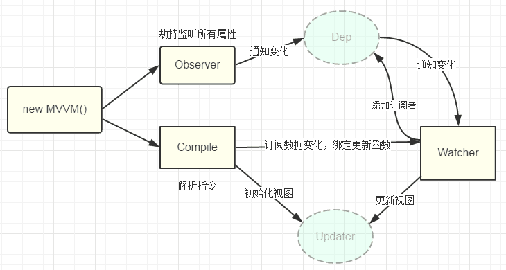

# MVVM
- 开发者在代码中大量调用相同的 DOM API, 处理繁琐 ，操作冗余，使得代码难以维护。
- 大量的DOM 操作使页面渲染性能降低，加载速度变慢，影响用户体验。
- 当 Model 频繁发生变化，开发者需要主动更新到View ；当用户的操作导致 Model 发生变化，开发者同样需要将变化的数据同步到Model 中， 这样的工作不仅繁琐，而且很难维护复杂多变的数据状态。

MVVM 的出现，完美解决了以上三个问题。

MVVM 由 Model，View，ViewModel 三部分构成，Model 层代表数据模型，也可以在Model中定义数据修改和操作的业务逻辑；
View 代表UI 组件，它负责将数据模型转化成UI 展现出来，ViewModel 是一个同步View 和 Model的对象。

在MVVM架构下，View 和 Model 之间并没有直接的联系，而是通过ViewModel进行交互，Model 和 ViewModel 之间的交互是双向的，
因此View 数据的变化会同步到Model 中，而Model 数据的变化也会立即反应到View 上。

- Observer：数据监听器，能够对数据对象的所有属性进行监听，如有变动可拿到最新值并通知订阅者，内部采用Object.defineProperty的getter和setter来实现；
- Compile 指令解析器，它的作用对每个元素节点的指令进行扫描和解析，根据指令模板替换数据，以及绑定相应的更新函数；
- Watcher 订阅者， 作为连接 Observer 和 Compile 的桥梁，能够订阅并收到每个属性变动的通知，执行指令绑定的相应回调函数；
- Dep 消息订阅器，内部维护了一个数组，用来收集订阅者（Watcher），数据变动触发notify 函数，再调用订阅者的 update 方法

Vue2 是采用 Object.defineProperty 的 getter 和 setter，并结合观察者模式来实现数据绑定的。
当把一个普通 Javascript 对象传给 Vue 实例来作为它的 data 选项时，Vue 将遍历它的属性，用 Object.defineProperty 将它们转为 getter/setter。
用户看不到 getter/setter，但是在内部它们让 Vue 追踪依赖，在属性被访问和修改时通知变化。

从图中可以看出，当执行 new Vue() 时，Vue 就进入了初始化阶段，一方面Vue 会遍历 data 选项中的属性，
并用 Object.defineProperty 将它们转为 getter/setter，实现数据变化监听功能；
另一方面，Vue 的指令编译器Compile 对元素节点的指令进行扫描和解析，初始化视图，并订阅Watcher 来更新视图， 
此时Wather 会将自己添加到消息订阅器中(Dep),初始化完毕。

当数据发生变化时，Observer 中的 setter 方法被触发，setter 会立即调用Dep.notify()，Dep 开始遍历所有的订阅者，
并调用订阅者的 update 方法，订阅者收到通知后对视图进行相应的更新。

## reference
https://zhuanlan.zhihu.com/p/23938306